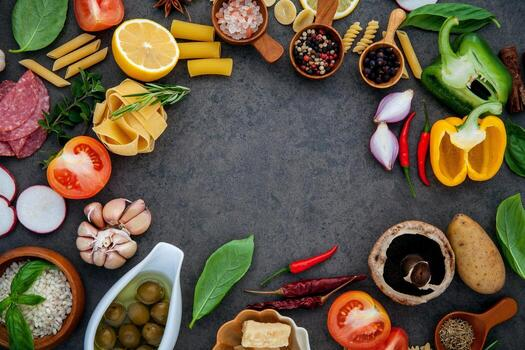

# Recipes Content

A multi-cuisine recipe collection. Around 1,700 recipes across 75 cuisines as markdown, with their images. This repo holds the content; the website that renders it lives in the sibling [`recipes-ui`](https://github.com/KelsierLuthadel/recipe-ui) repo.

## Repo layout

```
recipes-content/
  cuisine/<country>/                ← every cuisine, organised by country
    <slug>.md                       ← a meal (root of the cuisine folder)
    side-dishes/<slug>.md           ← sides
    snacks/<slug>.md                ← finger food / snack-starters
    starters/<slug>.md              ← first-course plates
    desserts/<slug>.md              ← sweet endings
    resources/                      ← hero images for cuisine-root recipes
    resources/thumbs/               ← 400 px thumbs
    side-dishes/resources/...       ← (and the same pattern for each sub-folder)

  tutorials/<course>/               ← long-form cooking courses (bread, BIR
                                      curry, knife skills, etc.)
    <page>.md                       ← one tutorial page per file
    resources/                      ← hero + step photos
    resources/thumbs/

  editorial/<slug>.md               ← curator-published themed collections

  baking/, base-ingredients/,       ← building-block trees: components,
  bread-pasta/, coulis/,              not finished plates
  petit-four/, sauces/, sponge/,
  stocks/, vinaigrette/

  documentation/                    ← AUTHORING.md, RECIPE_TEMPLATE.md
  festival-tags.json                ← festival -> [recipe slugs] map

  LICENSE
  README.md (this file)
```

A recipe's "course" tag is derived from its folder name:

| Folder | Course tag |
|---|---|
| `cuisine/<country>/` (root) | `meals` |
| `cuisine/<country>/side-dishes/` | `sides` |
| `cuisine/<country>/snacks/` | `snack` |
| `cuisine/<country>/starters/` | `starter` |
| `cuisine/<country>/desserts/` | `dessert` |

Don't put a dessert at the cuisine root; it'll show up tagged as a meal.

Building-block trees sit **outside** `cuisine/` because they're components, not plated dishes. Put a sauce in [sauces/](sauces/), a pre-ferment in [bread-pasta/](bread-pasta/), a stock in [stocks/](stocks/). If the thing is something you'd order on a menu, it goes under `cuisine/<country>/`.

## Adding a recipe

The detailed reference is in [documentation/AUTHORING.md](documentation/AUTHORING.md) and the template is [documentation/RECIPE_TEMPLATE.md](documentation/RECIPE_TEMPLATE.md). The short version:

### 1. Pick the folder

Use the layout table above. If the cuisine doesn't have a folder yet, create the directory tree:

```
cuisine/<country>/
cuisine/<country>/resources/thumbs/
cuisine/<country>/side-dishes/resources/thumbs/
cuisine/<country>/snacks/resources/thumbs/
cuisine/<country>/desserts/resources/thumbs/
```

Filenames are kebab-case: `chana-masala.md`, not `Chana Masala.md`. The filename becomes the slug, which appears in URLs.

### 2. Write the markdown

Every recipe follows the same shape:

```markdown
# Recipe Title



*One- or two-sentence italic caption describing the dish.*

**Serves:** 4

**Prep Time:** 15 minutes

**Cook Time:** 30 minutes

## Overview
A short paragraph explaining the technique and what makes the dish work.

## Ingredients

- 1 quantity unit name (with optional parenthetical notes)
- ...

## Method

### Stage 1 - Name
1. Numbered steps using `1.` for every line. The renderer auto-numbers them.

### Stage 2 - Name
1. ...

## Notes
- **Topic:** Useful tips, common pitfalls, why something matters.

## Storage
- How long it keeps and how to reheat or freeze.
```

Only the H1, image, caption, the three metadata fields, and the Method are strictly required. Ingredients is needed for any cookable recipe. Overview is strongly recommended (it surfaces as the card subtitle and the recipe-page intro paragraph).

### 3. Authoring conventions

- **Fractions.** Use unicode glyphs: `1 ½ cups`, `½ teaspoon`. The renderer also accepts `1 1/2` and `1.5`.
- **Units.** Metric (g / ml / cm / °C) is the traditional authoring unit. The site offers a metric / imperial toggle that converts at render time.
- **No em dashes.** Anywhere user-facing. Use ` - ` (hyphen with spaces) or a colon, or rephrase.
- **Image alt text.** Should be the recipe title, not `Name` (the template placeholder).
- **Sub-sections inside Ingredients.** `### Marinade`, `### Sauce`, etc. for multi-component recipes. The shopping-list builder treats each sub-section separately so two `2 tbsp soy sauce` lines in different sub-sections won't merge into `4 tbsp soy sauce`.
- **Equipment sub-section.** A `### Equipment` block inside Ingredients lists non-edible items (a fish slice, a banneton, a Dutch oven). The build excludes these from shopping lists, allergen detection, and ingredient indexing.
- **Stage headings inside Method.** `### Stage 1 - Prep`, `### Stage 2 - Cook`. Optional, but useful for any recipe with more than five steps - the stages become collapsible scroll anchors on the page.

### 4. Add an image and a thumbnail

Put the hero image in the sibling `resources/` folder, named after the recipe slug:

```
cuisine/indian/chana-masala.md            ← the recipe
cuisine/indian/resources/chana-masala.jpg ← the hero
cuisine/indian/resources/thumbs/chana-masala.jpg ← the 400 px thumb
```

Reference the image inside the markdown as `` directly under the H1.

Image conventions:

- **Hero:** JPEG, ≤900 px wide, quality 85. Landscape orientation reads best in the magazine-cover hero block.
- **Thumb:** JPEG, 400 px wide, quality 80. Lives under a sibling `thumbs/` folder.

The image-processing tooling that generates thumbs, resizes oversized heroes, and bulk-fetches missing images lives in [`recipes-ui/documentation/SCRIPTS.md`](https://github.com/KelsierLuthadel/recipe-ui/blob/main/documentation/SCRIPTS.md).

### 5. New cuisine? Add an overview line

If you're adding a country that doesn't have a folder yet, open `recipes-ui/categories.json` (in the sibling repo) and add an entry:

```json
"cuisine/<country>": "Two or three sentences on the cuisine's defining flavours and techniques."
```

The overview appears on the cuisine's category tile on the home page and at the top of the category page. Keep it punchy and characterful, not encyclopaedic.

## Tutorials

Tutorials live in [tutorials/](tutorials/) as one folder per course. Each course has:

- A landing `.md` file matching the folder name (`tutorials/bread/bread.md`, `tutorials/knife-skills/knife-skills.md`).
- One file per topic, named for the topic (`tutorials/bread/proving.md`, `tutorials/eggs/custards.md`).
- A `resources/` folder for hero photos and step images.

Tutorial pages follow the same markdown structure as recipes but with these differences:

- No `**Serves:**` / `**Prep Time:**` / `**Cook Time:**` fields - tutorials aren't cookable artifacts.
- No `## Ingredients` block - tutorials may reference ingredients but don't list a single quantity.
- A warm, friendly italic intro is the convention.
- A "Where Next" section at the bottom cross-links to related tutorial pages (and sometimes to recipes).
- Photos go inline inside the prose rather than under a single hero - tutorials are visual.

Tutorials don't surface in search, Discover, or Recently Viewed - they're reference content reached by browsing from the Learn page on the site.

## Editorial collections

Curator-published themed groups of existing recipes. Live in [editorial/](editorial/) as `<slug>.md` files. The frontmatter is the data; the optional markdown body is an intro paragraph that appears at the top of the collection's page.

```yaml
---
id: friday-night-wins
name: Friday Night Wins
tagline: Quick, big-flavour cooking for the end of the week
cover: cuisine/italian/resources/spaghetti-aglio.jpg
recipes:
  - spaghetti-aglio-olio
  - thai-green-curry
  - ...
---

Optional intro markdown paragraph(s).
```

- `id` - the URL slug. Don't change this once published; it's the link.
- `name` - displayed title.
- `tagline` - one-line description shown on the tile and at the top of the page.
- `cover` - hero image, path relative to the repo root.
- `recipes` - list of recipe filenames (without `.md`). The build resolves them against the recipe tree; unresolvable slugs are silently dropped.

### Seasonal rotation

An editorial collection can additionally claim the home page's "Seasonal pick" slot for part of the year by adding a `seasonalrange:` field:

```yaml
---
name: Spring Refresh
tagline: Light, green, and a little bit indulgent.
publishedAt: 2026-05-15
seasonalrange: 03-01..05-31
---
```

Format is `MM-DD..MM-DD`, inclusive, year-agnostic - the same collection rotates in year after year without re-authoring. Wrapped ranges work too (`12-15..01-10` covers the festive period across year-end).

When today's date matches a seasonal range, that collection takes over the Seasonal pick slot's title, cover, and recipe list. If no editorial collection claims today, the site falls back to a hardcoded Summer BBQ default. Buckets the rotation is designed for: Spring (Mar-May), Summer BBQ (Jun-Aug), Fall harvest (mid-Sep-mid-Nov), Thanksgiving (mid-Nov), Christmas (Dec).

## Festival tags

[festival-tags.json](festival-tags.json) is a hand-curated map of festival slugs to recipe slugs:

```json
{
  "christmas": ["cuisine/british/mince-pies", "cuisine/german/stollen", "..."],
  "diwali": ["cuisine/indian/desserts/jalebi", "..."],
  "passover": ["cuisine/israel/matzo-ball-soup", "..."]
}
```

Each recipe listed under a festival picks up that festival tag at build time. Religion tags (`jewish`, `muslim`, `hindu`, `christian`) are derived from festival membership plus the cuisine: a recipe must be in a recognised foodway cuisine **and** tagged with one of that religion's festivals before it picks up the religion tag.

To add a recipe to a festival, append its slug to the corresponding list. To add a new festival, add a new key with the slug list and add the matching label in `recipes-ui/docs/modules/tags.js`.

## Working on the content

When you've added or changed content, the site needs to rebuild its manifest to pick up the change. That step plus every other automation script (image thumbs, fetch-from-Pexels, fraction normalisation, em-dash sweep, recipe linter, etc.) is documented in the sibling repo:

- **[WORKFLOW.md](WORKFLOW.md)** - add / update / delete a recipe under the SvelteKit (`recipes-ui-next`) build. **Start here if you're authoring recipes today.**
- **[recipes-ui/documentation/SCRIPTS.md](https://github.com/KelsierLuthadel/recipe-ui/blob/main/documentation/SCRIPTS.md)** - every script in either repo, what it does, when to run it (covers the legacy vanilla build).
- **[recipes-ui/documentation/DEVELOPER.md](https://github.com/KelsierLuthadel/recipe-ui/blob/main/documentation/DEVELOPER.md)** - how the build pipeline turns this markdown into the deployed site.
- **[documentation/AUTHORING.md](documentation/AUTHORING.md)** - the full authoring spec (this file is the short version).

## License

See [LICENSE](LICENSE).
