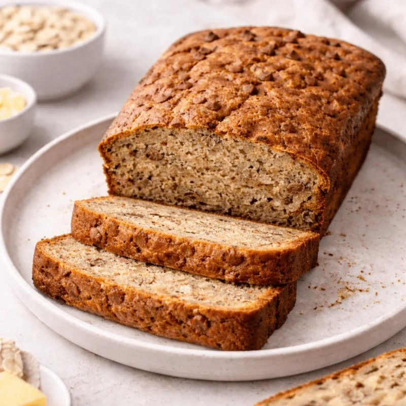

# Banana Bread

*The blackest-banana redemption recipe. Mashed overripe bananas give moisture and sweetness; a touch of cinnamon gives warmth; walnut chunks give crunch. One bowl, no mixer needed.*

**Makes:** 1 loaf (10 slices)

**Prep Time:** 15 minutes

**Cook Time:** 55 minutes

## Overview
Banana bread is the redemption recipe for the four bananas turning black on your counter, a soft moist loaf with deep banana sweetness, a touch of cinnamon warmth and a scatter of walnut crunch through the crumb. One bowl, a fork and a whisk, no mixer needed. The single ingredient detail that matters more than anything is the bananas: yellow ones give a pale dense flat-tasting loaf, but bananas with skins more black than yellow give the deep caramelised banana flavour and the moisture that holds the loaf tender for days. Mash four heavily speckled bananas in a large bowl with a fork (lumps are fine, even welcome), then whisk in the sugar, eggs, melted butter and vanilla till glossy. In another bowl, whisk the dry: flour, baking powder, bicarbonate of soda, cinnamon and salt. Pour the dry into the wet and fold gently with a spatula just till there are no flour streaks left; the moment you stop folding is the moment to stop, because overmixing develops gluten and turns the bread tough. Fold the walnuts through last, pour into a lined 1 kg loaf tin and bake at 175 C for 50 to 60 minutes till a skewer in the centre comes out with moist crumbs but no wet batter; tent with foil at 35 minutes if the top is browning too fast. Cool in the tin 15 minutes (it's fragile while hot), then turn onto a rack and cool completely before slicing. The loaf actually improves overnight wrapped in foil as the flavours marry. Keeps four days at room temperature or freezes three months whole or sliced.

## Ingredients

- 4 very ripe bananas (about 450 g, the blacker the better)
- 175 g caster sugar (or 100 g caster + 75 g brown for deeper flavour)
- 2 eggs (large)
- 100 g unsalted butter (melted, cooled slightly)
- 2 teaspoons vanilla extract
- 250 g plain flour
- 1 teaspoon baking powder
- ½ teaspoon bicarbonate of soda
- 1 teaspoon ground cinnamon
- ½ teaspoon salt
- 100 g walnuts (chopped, optional)

## Method

### Stage 1 - Prep
1. Heat the oven to 175°C (155°C fan).
1. Grease and line a 1 kg loaf tin (about 23 x 13 cm) with parchment paper.

### Stage 2 - Wet ingredients
1. In a large bowl, mash the bananas thoroughly with a fork (some lumps are fine).
1. Whisk in the sugar, eggs, melted butter and vanilla.

### Stage 3 - Dry ingredients
1. In another bowl, whisk the flour, baking powder, bicarbonate of soda, cinnamon and salt.

### Stage 4 - Combine
1. Pour the dry into the wet; fold gently with a spatula until just combined.
1. Stop mixing as soon as no flour streaks remain, overmixing makes a tough loaf.
1. Fold in the walnuts.

### Stage 5 - Bake
1. Pour the batter into the lined tin; smooth the top.
1. Bake for 50-60 minutes; a skewer in the centre should come out with moist crumbs (not wet batter).
1. If the top browns too quickly, tent with foil after 35 minutes.

### Stage 6 - Cool
1. Cool in the tin for 15 minutes, then turn out onto a wire rack.
1. Cool completely (or as long as you can manage) before slicing.

## Notes
- **Black bananas only:** Yellow bananas give pale, dense, flat-flavoured bread. Bananas should be heavily speckled, ideally with skins more black than yellow.
- **Don't overmix:** The most common mistake. Fold gently; lumps are fine. Mix until just combined.
- **Mix sugars:** All caster gives a clean sweetness; some brown sugar gives a fudgy, molasses note.

## Variations
- **Chocolate chip:** Add 100 g dark chocolate chips along with the walnuts.
- **Coffee glaze:** Drizzle a glaze of icing sugar + strong espresso over the cooled loaf.
- **Spiced:** Add ¼ teaspoon nutmeg and ¼ teaspoon ground cardamom to the dry mix.

## Storage
- Keeps 4 days in an airtight tin at room temperature; the flavour deepens.
- Freezes well 3 months whole or sliced. Defrost overnight at room temperature.
