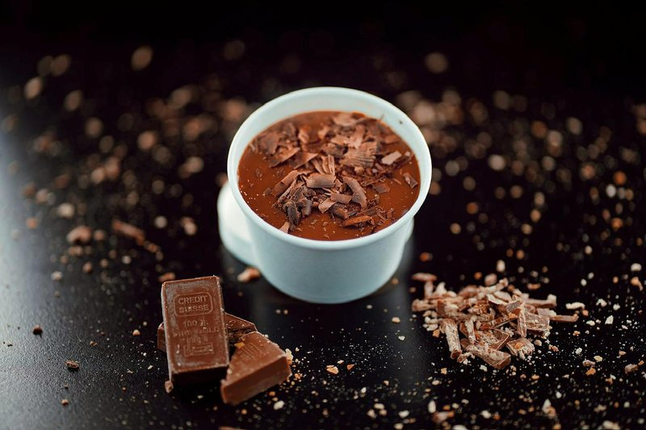

# Chocolate Crème Pâtissière

*A classic French tartlet filling, that also forms the basis of other classic sauces. Add a little cocoa or coffee powder to the custard instead of the vanilla to give you a chocolate or coffee-flavoured cream. If you use cocoa, use a little less flour and add a touch more sugar.*

**Serves:** 750 grams

**Prep Time:** 10 minutes

## Overview
Chocolate crème pâtissière is the building block for chocolate tarts, éclairs, mille-feuille, profiteroles and any pastry that wants a velvety filling deep with chocolate flavour: a regular pastry cream enriched with grated chocolate stirred through while the custard is still hot enough to melt it cleanly. It's the chocolate variant of the workhorse French pastry cream, so the technique is identical, what changes is the chocolate stirred in at the end. Whisk six yolks with a third of the sugar till pale and ribboned, then sift in the flour and mix to a smooth paste; meanwhile bring milk, the remaining sugar and a split vanilla pod to the boil in a saucepan. Pour a third of the hot milk onto the egg-flour mixture in a thin steady stream while whisking constantly (this is the tempering step; rushing it cooks the yolks into clumps), then tip the lot back into the pan and cook over a gentle heat, stirring without stopping, till the custard thickens and gives it a full two minutes of bubbling to cook out the raw flour. Off the heat, stir in 75 g of finely grated chocolate till it melts and disappears into the custard, leaving a glossy dark cream. To stop a skin forming as it cools, either cool fast over an ice bath stirring occasionally, or leave it to cool naturally with a dusting of icing sugar or a few flakes of butter dotted over the surface so the fat seals it. Pipe or spread cold into baked pastry shells. Keeps three days refrigerated under cling film pressed to the surface; whisk briefly to loosen before use.

## Ingredients
- 6 egg yolks
- 125 grams sugar
- 40 grams flour
- 500 ml milk
- 1 vanilla pod (split length-ways)
- 75 grams chocolate (grated)

## Method
1. Place the egg yolks and about one-third of the sugar in a bowl and whisk until they are pale and form a light ribbon. 
1. Sift in the flour and mix well.
1. Combine the milk, the remaining sugar and the split vanilla pod in a saucepan and bring to the boil. 
1. As soon as the mixture bubbles, pour about one-third onto the egg mixture, stirring all the time. 
1. Pour the mixture back into the pan and cook over a gentle heat, stirring continuously. 
1. Heat gently for 2 minutes, then tip the custard into a bowl.
1. Stir in the chocolate until it has completely melted.
1. If needing to cool the custard before using, place the bowl over a larger bowl of iced water, stirring occasionally.
1. If leaving to cool naturally then dust lightly with icing sugar, or dot with flakes of butter to prevent a skin forming as the custard cools.

## Notes
- Chocolate crème pâtissière must reach 2 minutes of gentle heat to fully cook the flour and eliminate any raw flour taste
- The chocolate should be finely grated or chopped to melt smoothly and evenly throughout the custard
- Adding the hot milk to the egg-flour mixture gradually prevents curdling and ensures a silky smooth texture
- A skin forms naturally as the cream cools; prevent this by dusting with icing sugar or dotting with butter

## Serving
- Serve chilled as a filling for tartlets, éclairs, or pastry-based desserts. The cream can be piped directly into pastry shells or spread smoothly with a palette knife. Pairs beautifully with fresh berries, poached pears, or caramelized fruits. Often garnished with cocoa powder or chocolate shavings for added elegance.

## Storage
Store the finished crème pâtissière in an airtight container in the refrigerator for up to 3 days. If you need to prepare it in advance, cover the surface directly with plastic wrap to prevent a skin from forming. The cream can be briefly warmed and stirred to restore its smooth consistency before use.
