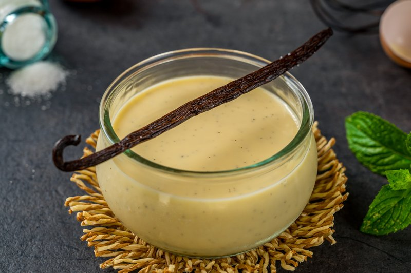

# Crème Anglaise

*Crème anglaise (French for "English cream") is a light pouring custard used as a dessert cream or sauce.*

**Serves:**  750ml

**Prep Time:** 15 minutes

## Overview
Crème anglaise is the building block under half the French dessert canon: a silky pouring custard that drapes warm over soufflés and warm puddings, chills cold under pavlovas and trifles, anchors île flottante, and takes any number of flavour infusions before it sets. It's nothing more than milk, cream, sugar, vanilla and egg yolks, gently cooked together till the eggs thicken the liquid just enough to coat the back of a spoon, and the entire skill lies in not letting it boil; one rolling bubble and the yolks scramble into a grainy curdled mess that no amount of whisking can rescue. Scrape the seeds from a split vanilla pod into the milk, then bring milk, cream, two-thirds of the sugar and the vanilla pod up to the boil in a heavy pan. While that warms, whisk six yolks with the remaining sugar till pale and ribboned. Pour the boiling vanilla milk onto the yolks in a thin steady stream while whisking (this tempers the yolks; rushing it means scrambled custard), then tip the whole mixture back into the pan and cook over a very low heat, stirring constantly with a wooden spatula in slow figure-eights. The custard is ready the moment it thickens just enough to coat the spatula and a finger drawn down the back leaves a clean clear line that doesn't close back; pull it off the heat immediately because it'll keep cooking from residual warmth. Strain through a fine sieve into a bowl set over crushed ice if you want it cold, stirring occasionally to stop a skin forming. The base takes flavour beautifully: stir melted chocolate, espresso powder, sliced ginger, star anise, fresh mint or pistachio paste into the milk before tempering for an infinite family of variations.

## Ingredients
- 250 ml milk
- 250 ml cream
- 125 grams caster sugar
- 1 pod vanilla (split length-ways)
- 6 egg yolks

## Method
1. Scrape the seeds out of the vanilla pod and put them in to the milk.
1. Put the milk, cream, two thirds of the sugar and the vanilla pod into a heavy-based saucepan and slowly bring to the boil.
1. Meanwhile, whisk the egg yolks and remaining sugar together in a heatproof bowl. 
1. Continue to whisk until the mixture becomes pale and has a light ribbon consistency.
1. Pour the boiling milk on to the egg yolks, whisking continuously, then pour the mixture back in to the saucepan.
1. Cook over a very low heat, stirring with a wooden spatula. 
1. Do not let the mixture boil or it will curdle.
1. The crème anglaise is ready when it has thickened slightly, just enough to coat the back of the spatula. 
1. Immediately take off the heat.
1. Unless you are serving the crème anglaise warm, strain through a fine sieve into a bowl set over crushed ice to cool, stirring occasionally to prevent a skin forming.

### Chocolate crème anglaise
1. Stir 60 grams melted good-quality bitter chocolate into the milk as you warm it.

### Coffee crème anglaise
1. Stir 1 tablespoon of instant espresso powder into the hot milk

### Ginger crème anglaise
1. Infuse the milk with 20 grams peeled and finely sliced fresh ginger root rather than vanilla.

### Spiced crème anglaise
1. Infuse the milk with 4 or 5 star anise instead of vanilla.

### Mint crème anglaise
1. Infuse the milk with a bunch of fresh mint instead of vanilla. The freshness of this goes well with berries or truffle cake.

### Pistachio crème anglaise
1. Soak 200 grams of fresh pistachio nuts in water for 24 hours, then crush them in a pestle and mortar to make a paste. 
1. Pour one third of the hot crème anglaise onto the paste, stirring with a whisk, then stir into the rest of the crème anglaise. 
1. Purée in a blender for 3 minutes, and cool over crushed ice. This is superb with poached pears.

## Notes
- **Temperature control:** This custard breaks easily if overheated. Use low heat and stir constantly with a wooden spatula.
- **Vanilla quality:** Use real vanilla pods, the tiny black seeds add thousands of flavor specks that powder cannot replicate.
- **Cooling technique:** Pouring onto crushed ice stops the cooking and prevents a skin from forming.
- **Variations:** All listed variations follow the same method; infuse your chosen flavoring in the milk before adding eggs.
- **Thickness:** The sauce should coat the back of a spoon, it thickens slightly more as it cools.

## Serving
Serve with: Soufflés, fruit tarts, poached fruits, or chocolate desserts
Temperature options: Warm alongside hot desserts; chilled for parfaits and trifles

## Storage
- Keeps 3-4 days refrigerated in an airtight container
- Does not freeze well as texture becomes grainy upon thawing
- Reheat gently over a water bath, whisking constantly, without boiling
- Can be made 1-2 days ahead for entertaining

*Crème anglaise is thought to have origins evolving from ancient Romans who used eggs as thickeners to create custards and creams*
