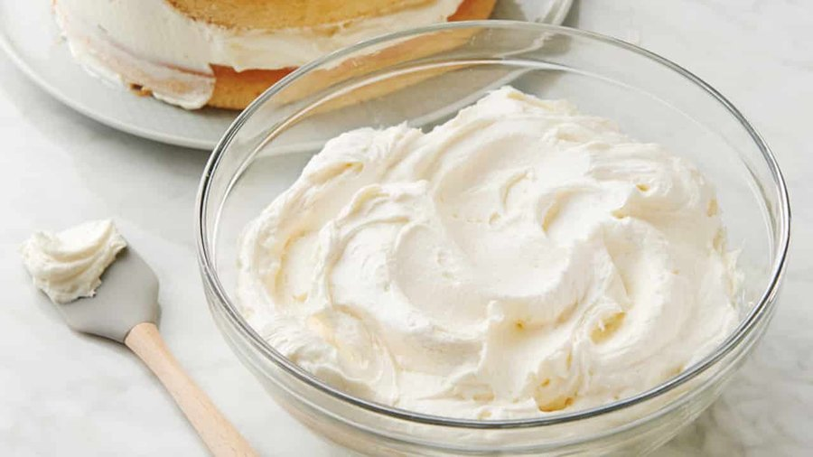

# Crème au Beurre

*Butter-cream made with meringue italienne is a simple, easy to make cream, which can be used in many recipes, including all sorts of biscuit and sponge based desserts. Its great advantage is that it is neither too rich nor too sickly.*

**Serves:** 1.3kg

**Prep Time:** 15 minutes

**Cook Time:** 5 minutes

## Overview
Crème au beurre is the building block for French buttercream fillings and frostings: an Italian-meringue-based buttercream that's much lighter and less cloying than the American confectioners-sugar version, ideal for layering between sponge cakes, piping rosettes and borders, or holding the inside of a millefeuille together. The secret of why it works is the order of operations. First you make a full quantity of Italian meringue (a hot sugar syrup whisked into beaten egg whites till glossy and stable), and then once that meringue has cooled to almost room temperature, you beat in room-temperature butter a little at a time on low speed. The temperature match is everything: the meringue has to be cool because warm meringue melts the butter into a greasy soup, and the butter has to be soft because cold butter beats into lumps that never disperse. Beat for a full five minutes on low after all the butter is in, and the mixture moves through several alarming-looking stages (curdled, broken, soupy) before it suddenly comes together into a thick smooth pale buttercream with a satin sheen. That's the moment it's done. If the meringue was still warm when you started and the buttercream looks oily, chill the bowl for 10 minutes and re-beat. If it looks broken because the butter was too cold, warm the bowl very gently (never above 35 C) and beat again. Flavour with vanilla, melted chocolate, coffee, praline, fruit purée or liqueur after it comes together. Keeps five days refrigerated; bring to room temperature and re-beat briefly before use.

## Ingredients
### Meringue Italienne
- 250 ml water
- 700 grams sugar
- 50 grams glucose
- 9 egg whites

### For the Crème au beurre
- 1 kilogram butter (at room temperature)

## Method
1. Using the ingredients, make one quantity of Meringue Italienne.
1. When the meringue is almost cold, set the mixer on low speed and beat in the butter, a little at a time. 
1. Beat for about 5 minutes until the mixture is very smooth and homogeneous.

## Notes
- The meringue must be almost completely cooled before adding butter; warm meringue will cause the butter to separate and the cream to become greasy
- Add butter gradually while mixing at low speed to ensure smooth, homogeneous incorporation
- Beating for the full 5 minutes is essential for achieving the light, creamy texture that distinguishes quality crème au beurre
- If the mixture appears separated or grainy, gently warm it (not above 35°C) and re-beat until smooth

## Serving
Use crème au beurre as a filling between cake layers, as a frosting for desserts, or piped into decorative borders and rosettes. Flavor variations can be created by adding vanilla, chocolate, coffee, praline, or liqueurs to the finished cream. The cream's smooth texture makes it ideal for creating elegant, professionally-finished desserts.

## Storage
Refrigerate in an airtight container for up to 5 days, or freeze for up to 1 month. Before using refrigerated cream, bring it to room temperature and gently re-beat for 1-2 minutes to restore the light, fluffy texture. The cream may be softer than desired at room temperature; chill briefly if needed before piping.
