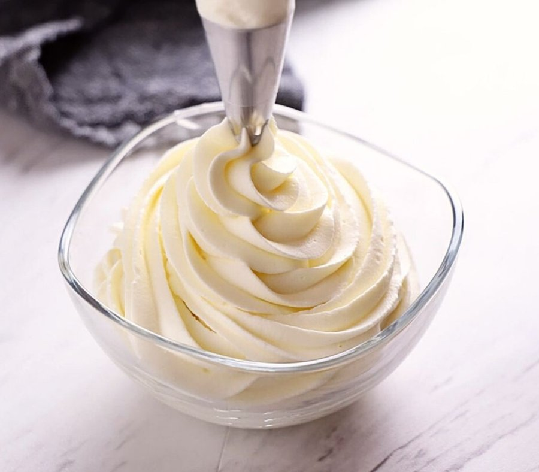

# Crème Chantilly

*Crème Chantilly is used to lighten and enrich numerous creams, the Crème pâtissière in an Alméria for example. It can also be served just as it is and will complement many desserts, fruits or ice creams.*

**Serves:** 600 grams

**Prep Time:** 5 minutes

## Overview
Crème Chantilly is the building block for half the French dessert kitchen: lightly sweetened whipped cream with a hint of vanilla, used straight from a piping bag on top of warm fruit puddings or strawberries, folded into crème pâtissière to lighten it for Alméria and other layered desserts, swirled into mousses, or simply spooned alongside any pavlova or trifle that needs a little airy contrast. The two rules that turn it from cream into Chantilly are temperature and timing. Everything has to be cold (the cream itself, the mixer bowl, the whisk attachment), because cold dairy traps air better and stays stable, and a warm bowl makes the cream weep its butterfat into liquid before it ever holds a peak. Tip 500 ml of well-chilled whipping cream into the chilled bowl with 50 g of sifted icing sugar and a couple of drops of vanilla extract, start on medium speed for a minute or two, then bring the speed up and beat for another three to four minutes till the cream thickens to slightly firmer than ribbon stage and holds soft peaks. Stop the moment it does, because another 30 seconds turns Chantilly into the start of butter and there's no rescue from that. The base takes flavour beautifully. Fold in a third of the Chantilly into melted chocolate cooled to 35 C, then fold that back through the rest for a chocolate Chantilly, or dissolve a tablespoon of coffee extract in hot milk and add as you start whipping for a coffee version. Best used straight away; if it sits in the fridge it separates slightly, but a gentle 30-second re-whip brings it back.

## Ingredients
### For all the creams
- 500 ml whipping cream (well chilled)
- 50 grams icing sugar
- 2 drops vanilla extract (optional)

### For the chocolate cream
- 150 grams  plain chocolate

### For the coffee cream
- 1 tablespoon hot milk
- 1 tablespoon coffee extract (or 2 tablespoons instant coffee)

## Method
### Crème Chantilly
1. Combine the well chilled cream with the sugar and vanilla in a chilled mixer bowl and beat at a medium speed for 1 or 2 minutes. 
1. Increase the speed and beat for 3 or 4 minutes, until the cream begins to thicken. 
1. Do not over beat, or the cream may turn into butter. 
1. It should be a little firmer than ribbon stage.

### Chocolate Chantilly
1. Melt the chocolate in a double boiler, the temperature should not exceed 35°C. 
1. Remove from the heat and whisk in one-third of the plain Crème Chantilly. 
1. Fold gently and delicately into the remaining Crème Chantilly. 
1. Do not overwork the mixture.

### Coffee Chantilly
1. Dissolve the coffee in the hot milk, and allow to cool. 
1. Add it when you beat the cream.

## Notes
- All equipment must be well chilled, including the mixer bowl and beaters, to achieve maximum volume when whipping
- Whip at medium speed initially, then increase to high speed once the cream begins to thicken; avoid over-beating which turns cream to butter
- The target consistency is slightly firmer than ribbon stage, the cream should hold soft peaks
- Dairy cream with higher fat content (at least 35%) produces the most stable whipped cream

## Serving
Serve crème Chantilly chilled alongside fresh fruit compotes, warm desserts, or alone with fresh berries. Use as a filling between cake layers, a topping for warm desserts, or part of more complex cream preparations. Chocolate and coffee variations pair beautifully with both light and rich desserts.

## Storage
Whipped crème Chantilly is best served immediately after preparation. Refrigerate for up to 24 hours; the cream will gradually separate slightly. If separation occurs, gently re-whip for 30 seconds. For longer storage (up to 2 days), cover the surface with plastic wrap to prevent skin formation and protect flavor from absorbing other odors.
