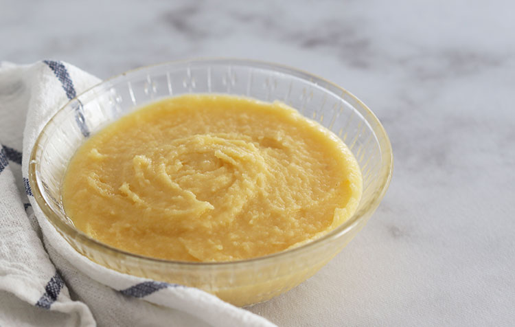

# Crème d'Amande

*An almond-based cream with a delicate, nutty flavor and a slightly creamy texture.*

**Serves:** 1kg

**Prep Time:** 15 minutes

## Overview
Crème d'amande is the building block for frangipane tarts, pithivier fillings, almond croissants and any pastry that wants a smooth nutty cream filling that bakes to a tender almost cake-like layer inside the pastry case. It's a quick beaten cream rather than a custard, so there's no cooking till you bake it: just very soft butter, tant pour tant (equal parts ground almonds and icing sugar sifted together), a touch of flour, eggs and a dash of rum. The butter has to be properly soft. Spreadable, not melted, not oily; cold butter beats into hard lumps that never disperse evenly and the cream will be grainy. Beat the soft butter with a paddle or spatula till loose and pale, then beat in the tant pour tant and flour till smooth, then the eggs one at a time, waiting till each is fully absorbed before adding the next; the mixture goes from a thick paste to a smooth pale-yellow cream over a few minutes of beating. Stir in the rum at the end (Grand Marnier, kirsch or amaretto are good swaps). Use the cream straight away to fill a tart case, top a poached pear in a pithivier, or layer inside a pain aux amandes, then bake; the cream sets to a golden tender layer that's almost cake-like in texture. Keeps four days refrigerated or freezes a month; bring to room temperature and re-beat briefly to loosen if it stiffens up.

## Ingredients
- 250 grams butter
- 500 grams [Tant pour tant](../../base-ingredients/baking/tant-pour-tant.md)
- 50 grams flour
- 5 eggs
- 50 ml rum (optional)

## Method
1. Work the butter with the beater or spatula until very soft. 
1. Still beating, work in the tant pour tant and the flour, then the eggs one by one, beating between each addition. 
1. The mixture should be light and homogeneous. 
1. Stir in the rum.

## Notes
- Soften the butter thoroughly before beginning; it should be spreadable but not melted or oily
- Tant pour tant (equal parts ground almonds and powdered sugar) should be sifted to remove lumps for a smooth, even texture
- Add eggs one at a time to ensure they are fully incorporated; this prevents the mixture from becoming grainy
- The optional rum adds depth; other liqueurs such as Grand Marnier or Kirsch offer interesting flavor variations

## Serving
Use crème d'amande as a filling for flan cases, as a base for tarts, or piped into decorative patterns. Often topped with sliced almonds, fresh fruit, or candied peel. Pairs beautifully with both light and rich desserts.

## Storage
Refrigerate in an airtight container for up to 4 days. The cream can be frozen for up to 1 month; thaw at room temperature and re-beat briefly if the texture appears separated. Bring to room temperature for 30 minutes before piping or spreading.
