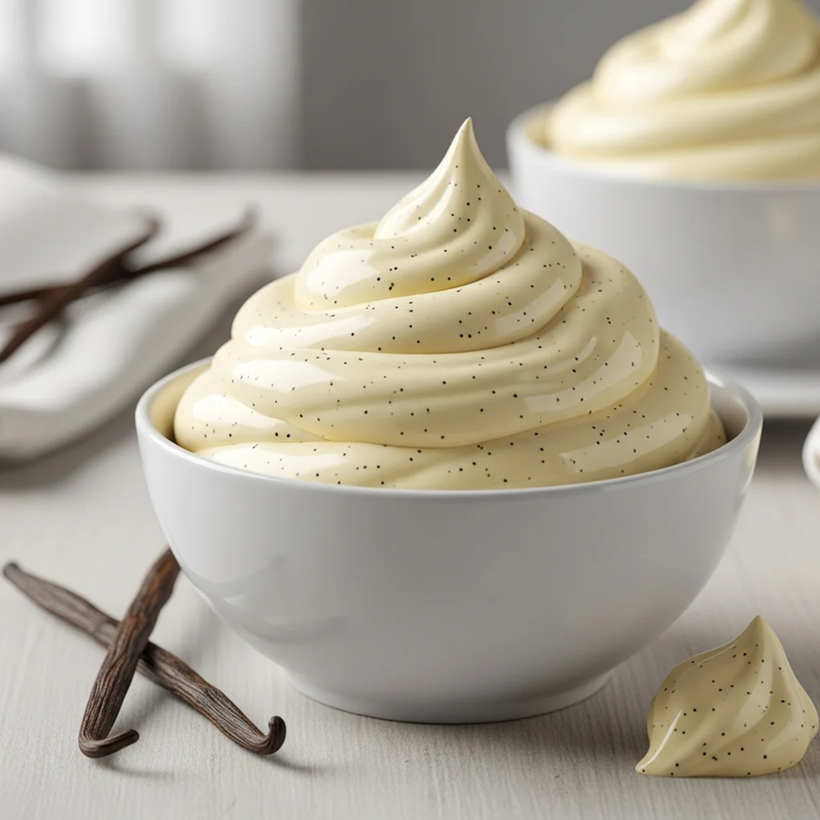

# Crème Mousseline

*A light and luxurious cream combining the structure of crème pâtissière with the richness of butter, creating an exceptionally smooth and creamy filling.*

**Serves:** 1.3kg

**Prep Time:** 10 minutes

**Cook Time:** 8 minutes

## Overview
Crème mousseline is the building block under the Paris-Brest, traditional fraisier and a thousand layered French gateaux: crème pâtissière enriched and lifted with beaten butter into a cream that's lighter and more delicate than buttercream but with the structure and pipeability buttercream gives. It bridges two creams that would otherwise be too rich or too soft on their own. The technique splits the butter into two halves and the timing matters for both. First, the moment the crème pâtissière comes off the heat (and is still warm), beat in one-third of the butter so it melts into the hot custard and the cream cools evenly while the butter stops a skin forming; tip it into a bowl set over an ice bath to bring it down to room temperature, stirring occasionally so it doesn't form crusts. Meanwhile, beat the remaining cold butter in the mixer on low for three minutes till it goes noticeably pale and creamy (this is where the air gets folded in that gives the mousseline its name and lightness), then crank up to maximum speed and add the cooled crème pâtissière a spoonful at a time. Beat for five minutes once it's all in till the cream comes together smooth, glossy and visibly aerated. Now stir in your flavour: caramel, melted chocolate, coffee paste, praline paste or a glug of Grand Marnier. Use straight away to pipe rosettes or fill a Paris-Brest, or refrigerate up to five days and re-beat briefly to loosen before piping.

## Ingredients
- 750 grams [Crème pâtissière](./creme-patissiere.md) (without flavouring)
- 250 grams butter (cut into pieces)
- flavouring of your choice (caramel, chocolate, coffee, praline, Grand Marnier)

## Method
1. As soon as the Crème pâtissière is cooked, take the pan off the heat and beat in one-third of the butter. 
1. Pour into a bowl over cold water and ice, stirring occasionally to prevent a skin from forming.
1. Place the remaining butter in the bowl of the mixer and beat at a low speed for 3 minutes, until rather pale. 
1. Increase the speed to maximum, and add the cooled Crème pâtissière, a little at a time. 
1. Beat for 5 minutes until the cream is perfectly light and creamy.
1. Add the flavouring of your choice, or leave the cream plain. It is now ready to use.

## Notes
- Beating the first portion of butter into the hot custard immediately after cooking helps it cool evenly and prevents skin formation
- The second beating of cold butter (3 minutes at low speed) is crucial for incorporating air and creating the characteristic light texture
- Temperature control is essential; the crème pâtissière must be cool to room temperature before final beating with butter
- Flavor additions such as caramel, chocolate, coffee, or liqueurs should be added after the 5-minute beating to preserve the cream's airy texture

## Serving
- Pipe crème Mousseline into decorative rosettes, borders, and fills. Use as a cake filling or serve dolloped on desserts. Its luxurious texture makes it suitable for elegant plated presentations and special occasion cakes.

## Storage
Refrigerate in an airtight container for up to 5 days. Freeze for up to 1 month before use. Allow frozen cream to thaw at room temperature (2-3 hours) and gently re-beat for 1-2 minutes to restore texture if needed.
