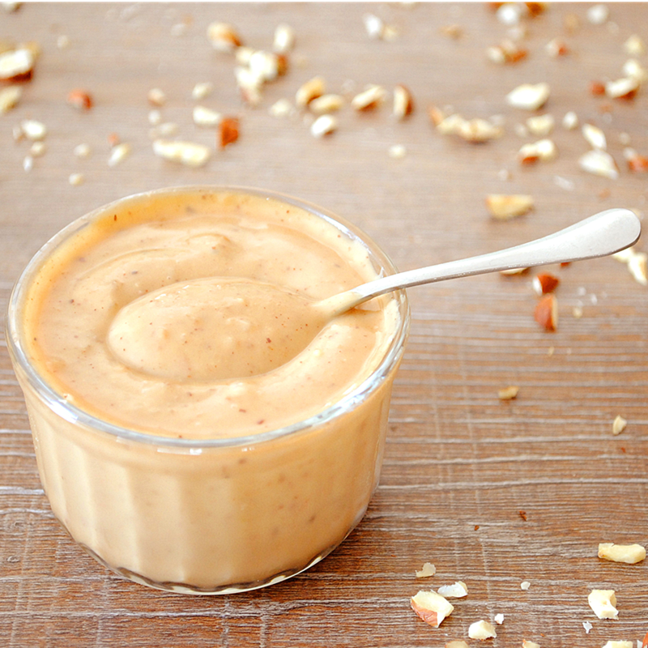

# Crème Pralinée

*This is one of those creams which seems particularly delicious in winter. Its delicate, nutty flavour makes it perfect for filling all kinds of biscuit and sponge based desserts.*

**Serves:** 1 ¼ kg

**Prep Time:** 10 minutes

## Overview
Crème pralinée is the building block for winter and autumn pastry: crème pâtissière flavoured with crushed praline paste then lightened with Chantilly into something between a custard and a mousse, finished at the last moment with caramelised hazelnuts so each spoonful has a crunch through the silk. The flavour leans into roasted nut warmth and is the right cream for chocolate sponges, layered tortes and any pastry that wants a wintery nutty filling rather than the bright vanilla of plain crème pâtissière. Whisk a third of the cold crème pâtissière with the crushed praline first so the paste loosens and disperses evenly (skip this and you'll get streaks of solid praline through the cream), then whisk in the remaining crème pâtissière. Switch to a spatula and fold in the Chantilly in big gentle lifting motions till the cream is uniform and pale; don't keep folding once it's even because every extra fold flattens out the air the Chantilly brought in. The hazelnuts get caramelised separately. Skin them by grilling them till the papery layer cracks, then rub them clean in a tea towel, sprinkle with a pinch of icing sugar and grill again till just amber. Cool completely, then chop or crush coarsely with a rolling pin (you want jagged crunchy fragments, not a uniform powder). Fold them through the cream at the very last moment before serving so they stay crunchy; mix them in too early and they soften within the hour. Keeps 48 hours refrigerated; the Chantilly limits the shelf life and freezing doesn't work for this one.

## Ingredients
- 500 grams [Crème pâtissière](./creme-patissiere.md)
- 500 grams [Crème Chantilly](./creme-chantilly.md)
- 150 grams praline (crushed)
- 100 grams hazelnuts (shelled)
- 1 pinch icing sugar

## Method
1. In a bowl, combine one-third of the Crème pâtissière with the praline and whisk together until thoroughly mixed. 
1. Add the rest of the Crème pâtissière and mix well again using the whisk.
1. Using a spatula, gently fold in the Crème Chantilly.
1. If you want to add hazelnuts to the mixture, first place them under a very hot grill to detach the papery skin, then rub them in a cloth to remove the skin completely. 
1. Arrange the nuts in a grill pan, sprinkle with the icing sugar and replace under the grill until lightly caramelized. 
1. Leave to cool completely.
1. When the nuts have cooled, chop them with a knife, or crush coarsely with a rolling pin.
1. Fold them into the Crème Pralinée at the very last moment so that they remain crunchy.

## Notes
- Praline paste should be thoroughly whisked into one-third of the crème pâtissière first to ensure even flavor distribution
- Crème Chantilly must be folded gently with a spatula using lifting motions to preserve the airiness of the cream
- Caramelized hazelnuts add textural contrast; the caramel should reach a light amber color for optimal flavor
- Adding nuts at the very last moment preserves their crunch; early addition allows them to absorb moisture from the cream

## Serving
- Use crème Pralinée as a filling for cakes, tarts, and mousse-based desserts. Pipe into decorative borders or dollop onto plated desserts. The nutty flavor pairs beautifully with chocolate, vanilla, or fruit-based components.

## Storage
Refrigerate in an airtight container for up to 48 hours; this shorter shelf life accounts for the whipped cream component. Do not freeze, as the Crème Chantilly will not recover well. Add caramelized nuts immediately before final assembly to maintain their crunch.
