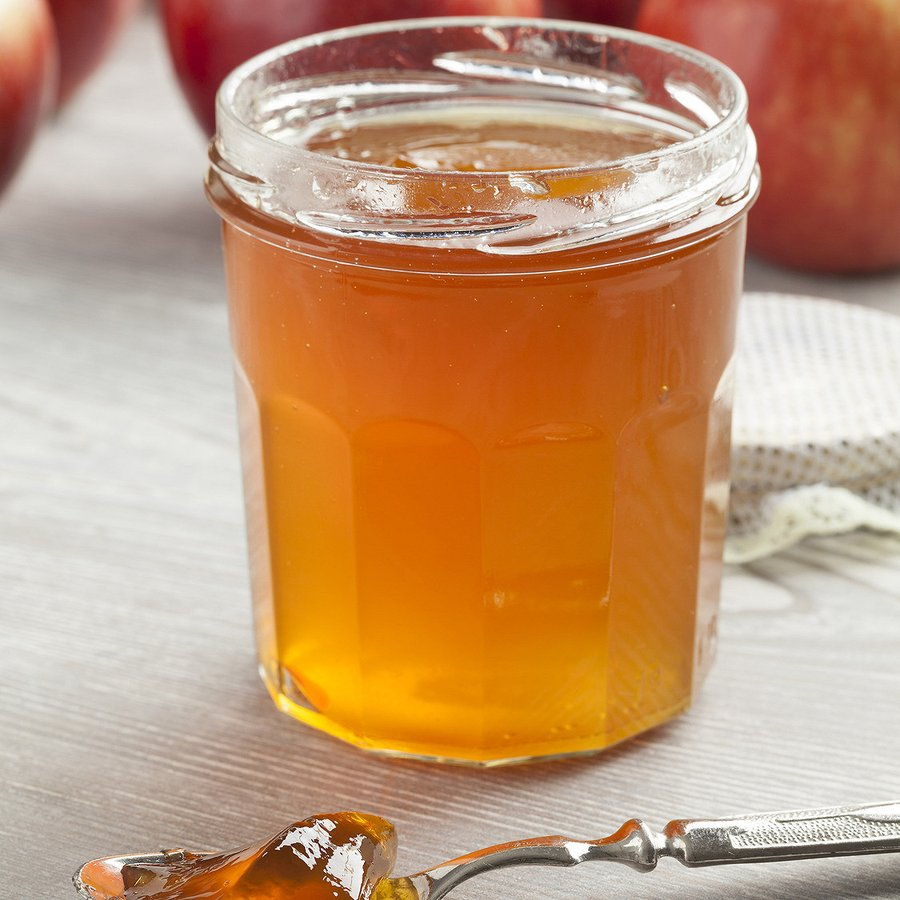

# Gelée de Pommes

*A crystal-clear apple jelly that serves as an elegant glaze and garnish for desserts.*

**Serves:** 500 ml 

**Cook Time:** 7 minutes

**Prep Time:** 15 minutes

## Overview
Gelée de pommes is the building block for the glossy mirror finish that gives a French apple tart, fruit tart or plated dessert its glassy shine: a crystal-clear apple jelly cooked from chopped Cox's apples, sugar syrup and gelatine, then strained slowly through a sieve so what comes out is bright pale-amber and transparent rather than cloudy. The clarity is the whole point. Cox's apples (or another aromatic tart cooking apple) give the right balance of flavour and pectin; a soft sweet eater apple would make a flat-flavoured cloudy jelly. Dissolve sugar in 500 ml water in a wide pan over medium heat, bring to the boil, skim any foam that rises, then drop in 500 g of washed coarsely-chopped apples (core, seeds, skin and all; the pectin is in those parts and they all strain out in a moment). Cover and simmer just seven minutes; that short cook preserves the fresh apple aroma and stops the jelly turning dull or stewed-tasting. While the apples cook, bloom six gelatine leaves in cold water for 20 minutes till soft. Take the pan off the heat, push the apples to one side, drop the squeezed-out gelatine into the clear syrup at the side of the pan and stir gently till fully dissolved (heat from the syrup is enough; don't return to the stove or you'll dull the colour). Strain the lot slowly through a conical sieve into a bowl without pressing or squeezing the apples; gravity alone gives you clear jelly, and any pressure forces fine pulp through and clouds the result. Use the jelly to glaze tarts while still liquid but cool; it sets within minutes once brushed onto the fruit.

## Ingredients
- 500 ml water
- 250 grams sugar
- 500 grams Cox's apples
- 6 leaves gelatine

## Method
1. Pour the water into a large saucepan and add the sugar. Heat until the sugar has dissolved completely and is beginning to boil, stirring with a whisk from time to time. 
1. Skim the surface if necessary.
1. Soak the gelatine leaves in cold water for 20 minutes then drain.
1. Wash the apples and coarsely chop, including the core and drop them into the boiling sugar syrup. 
1. Cover the saucepan and simmer for about 7 minutes. 
1. Take the pan off the heat and push the apples to one side so that you can drop in the drained gelatine and dissolve it. 
1. When it has dissolved, pass the mixture carefully through a conical strainer into a bowl.
1. Use the jelly as a glaze for various desserts when it is cold, but before it begins to set.

## Notes
- Clear, bright apple jelly depends on careful straining; pour the mixture slowly through cheesecloth or a fine strainer without pressing
- Avoid cloudy results by not squeezing the apples through the strainer; let gravity alone drain the liquid
- Simmering for only 7 minutes preserves the fresh apple flavor; overcooking dulls the taste
- Gelatine must be fully dissolved before straining; ensure the mixture is thoroughly incorporated

## Serving
Apply gelée de pommes as a glossy glaze over tarts, fresh fruit, or mousse-based desserts while still liquid. The clear jelly allows the colors beneath to show through beautifully. Often used to decorate plated desserts or as a component in fruit-based terminal presentations.

## Storage
Once set, cover the jelly with plastic wrap and refrigerate for up to 3 days. For longer storage (up to 1 week), ensure the jelly is sealed in an airtight container. Can be gently warmed over low heat to return to liquid state for re-glazing if needed.
