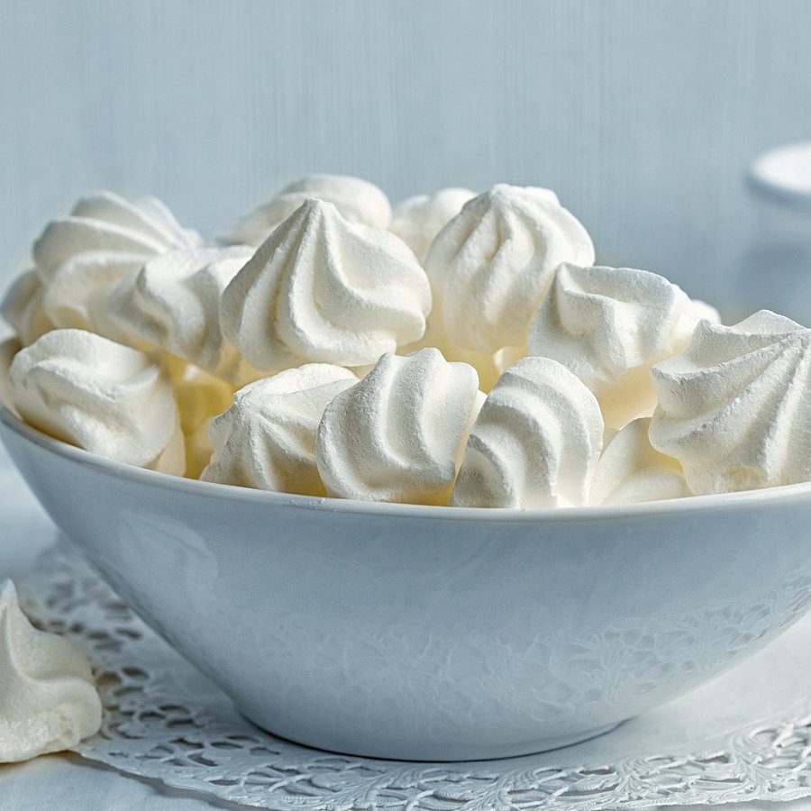

# Meringue Francaise (French Meringue)

*This meringue is light and fluffy, and melts in the mouth.*

**Serves:** For approximately 24 meringue discs or kisses

**Prep Time:** 15 minutes

**Cook Time:** 10 minutes

## Overview
Meringue française is the simplest of the three classical meringues and the building block for piped kisses, baked discs, vacherins, pavlova bases and the structural layers in plated desserts: egg whites whipped with caster sugar, finished with sifted icing sugar folded in, then dried slowly in a low oven till the outside crisps and the inside is just barely chewy. Two things ruin a meringue and both are about cleanliness. Any speck of yolk in the whites or any trace of fat on the bowl or whisk will stop the whites from whipping properly, so wipe the bowl with a cut lemon or a splash of vinegar before you start. Beat four egg whites to soft peaks, then add the caster sugar a spoonful at a time over a full 10 minutes while beating; the mixture goes from foamy to thick and finally to glossy stiff peaks that hold their shape when you lift the whisk. Sift the icing sugar over the top in stages and fold it in gently with a slotted spoon, stopping the moment it disappears (folding more than you need to deflates the bubbles you've built). Pipe or spoon onto parchment-lined trays, slide into an oven that's been preheated to 120 C, then immediately drop the heat to 100 C and dry for one hour 45 minutes till both top and bottom are dry to the touch. The slow low heat is what keeps the meringues white rather than tan; any higher and they brown before they dry. Store somewhere cool and dry in an airtight tin with parchment between layers and they'll keep crisp for a week. Don't put them in the fridge; the humidity makes them go sticky in hours.

## Ingredients
- 4 egg whites
- 125 grams sugar
- 125 grams icing sugar (sifted)

## Method
1. Preheat the oven to 120°C.
1. Whisk the egg whites until soft peaks form. 
1. Beat in the sugar, a little at a time and continue to beat for 10 minutes. 
1. The mixture should be firm and very smooth and shiny. 
1. Gradually sift in the icing sugar, folding it gently into the mixture with a slotted spoon. 
1. Do not overwork the mixture.
1. Pipe or spoon the mixture into a baking parchment or lightly buttered and floured greaseproof paper, using 2 soup spoons or a piping bag fitted with the appropriate nozzle.
1. Lower the oven temperature to 100°C and cook the meringues for 1 hour 45 minutes. 
1. The meringues are ready when the top and bottom are dry. 

### Meringue discs
1. On the baking parchment draw equal circles with a dark pencil, turn over the parchment and use these circles as a guide for the meringues.
1. Use a palette knife to make 4 mm high circles, and use these to construct a tower of cream and fruit meringues.

## Notes
- Ensure egg whites are completely free of yolk and that equipment (bowl, whisk) are immaculately clean and dry; even traces of fat prevent proper whipping
- Beat sugar in gradually (over 10 minutes) to create the thick, glossy meringue; quick addition results in a grainy texture
- Icing sugar must be sifted and folded gently to preserve the airy structure, aggressive stirring deflates the mixture
- The low oven temperature (100°C) dries the meringues slowly; higher heat browns the exterior before the interior dries

## Serving
- Pipe meringue kisses directly onto parchment for simple petit fours, use as structural layers in cream- and fruit-filled desserts, or form into discs for stacking with crèmes and fresh fruit. Meringue towers showcase the airiness and delicate texture beautifully in plated presentations.

## Storage
Meringues are best stored in an airtight container with layers separated by parchment to prevent sticking. Keep in a cool, dry place (not the refrigerator) for up to 1 week. Do not freeze, as moisture loss during thawing destroys the delicate, crispy texture. The meringues absorb moisture from humidity; store with silica gel packets if the environment is damp.
