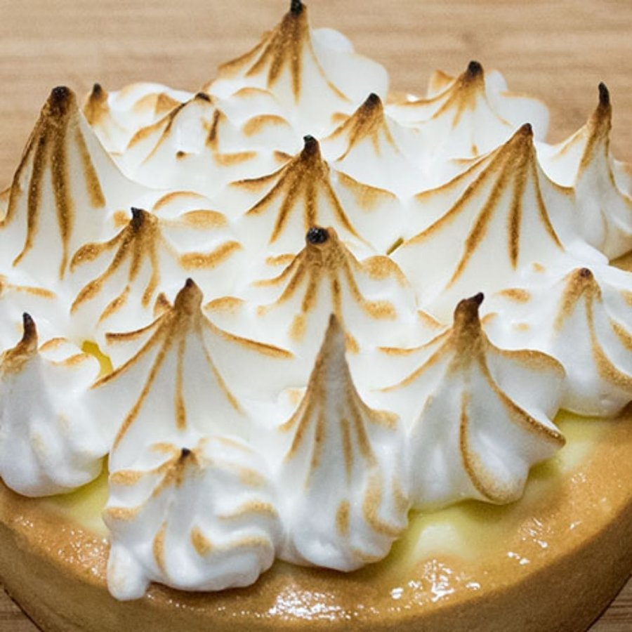

# Meringue Italienne (Italian Meringue)

*This meringue has a soft, rich velvet texture and is perfect for covering tartlets.*

**Serves:** For approximately 1.3 liters of meringue or enough to cover and fill a large tart

**Prep Time:** 15 minutes

**Cook Time:** 15 minutes

## Overview
Italian meringue is the building block of the French pastry kitchen's stable creams and toppings: cooked sugar syrup poured at 121 C into whisking egg whites, which both cooks the whites lightly and pulls the meringue into a glossy silky stable mass that won't weep, deflate or break the way an uncooked French meringue eventually does. That stability is what makes it the right meringue for crème au beurre, crème chiboust, mousses, lemon meringue pie tops you can brown under a grill, and any piped decoration that has to sit out for hours. Pour 80 ml of water into a heavy-bottomed pan, add 360 g of sugar and 30 g of glucose if you have it (the glucose stops sugar crystals forming and gives a smoother meringue), stir to dissolve over moderate heat, then brush down the inside of the pan with a wet pastry brush to wash any stray crystals back into the syrup before they ruin it. Crank the heat to fast-cook and watch the thermometer. The moment the syrup hits 100 C, start whipping six egg whites in the mixer at high speed; you want them stiff and glossy at exactly the same moment the syrup hits 121 C (soft-ball stage). Pull the syrup off the heat, drop the mixer to its lowest speed, and pour the hot syrup in a thin steady stream down the side of the bowl (not onto the moving whisk, where it splatters and crystallises). Once all the syrup is in, beat at low speed for a full 15 minutes till the bowl is completely cool to the touch. That long cool-down is what makes the meringue stable; rushing it ruins the texture. Use straight away, or refrigerate up to two days and re-beat briefly to revive.

## Ingredients
- 80 ml water
- 360 grams sugar
- 30 grams glucose (optional)
- 6 egg whites

## Method
1. Pour the water in a heavy bottomed pan, then add the sugar and glucose, if using. 
1. Place over a moderate heat and stir the mixture with a skimmer until it boils. 
1. Skim the surface and wash down the sugar crystals which form inside the pan with a brush dipped in cold water. 
1. Now increase the heat so that the syrup cooks rapidly. 
1. Insert a sugar thermometer to check the temperature.
1. When the sugar reaches 100°C, beat the egg whites in an electric mixer until stiff. 
1. Keep an eye on the sugar and take the pan off the heat when it reaches 121°C
1. When the egg whites are well risen and firm, set the mixer to the lowest speed and gently pour on the cooked sugar in a thin stream, taking care not to let it run on to the whisks. 
1. Continue to beat at a low speed until the mixture is almost completely cold; this will take about 15 minutes. 
1. The meringue is now ready to use.

## Notes
- The sugar must reach exactly 121°C (soft ball stage); lower temperatures result in loose meringue, higher temperatures create grainy texture
- Begin beating egg whites when sugar reaches 100°C, timing the stiff peaks to coincide with the sugar's readiness
- Pour the hot sugar in a thin stream onto lower-speed whisks; pouring onto the beater shaft risks splattering
- Continue low-speed beating until the meringue cools completely (about 15 minutes); this is essential for proper texture development

## Serving
Use meringue Italienne as a filling for tarts (often spread or piped), as a stable topping for desserts (can be browned under the grill), or as the base for crème au beurre and crème Mousseline. The smooth, velvety texture makes it ideal for elegant piped decorations and professional presentations.

## Storage
Meringue Italienne is best used immediately or within a few hours of preparation. If necessary, refrigerate in an airtight container for up to 2 days; the meringue may weep slightly and separate, but can be gently re-beaten for 1-2 minutes to restore texture. Do not freeze, as thawing causes separation and loss of texture.
