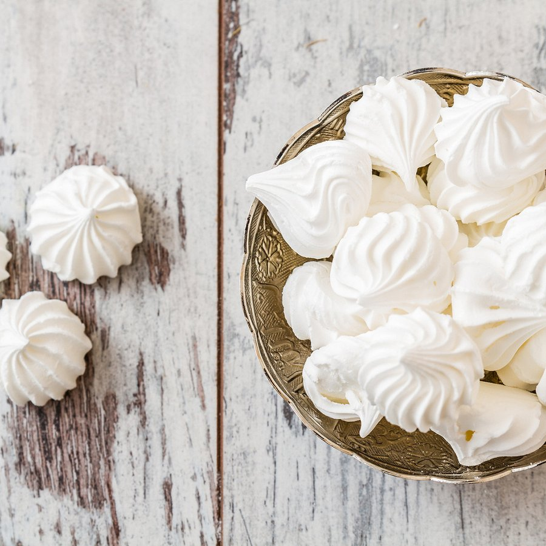

# Meringue Suisse (Swiss Meringue)

*This meringue has a firmer, more solid texture than French meringue and is perfect for making decoration or for desert bases. It is not as delicate and melting as French meringue*

**Serves:** 8 - 10

**Prep Time:** 15 minutes

## Overview
Swiss meringue is the building block for firmer piped decorations, dessert bases that need to hold their shape, and Swiss-meringue buttercream: a more solid stable meringue than the French version, made by warming egg whites and sugar together over a bain-marie before whipping, which dissolves the sugar fully and gently cooks the whites at the same time. The texture is firmer and less melt-in-the-mouth than French meringue, and that's the point; the same firmness that makes it less delicate to eat is what makes it pipe sharply and bake into rigid shells that can be filled. The two key temperatures are 40 C in the bain-marie (warm enough for the sugar to dissolve completely and the whites to be food-safe, but not so hot that the whites start to scramble) and 100 C in the oven (any higher and the meringue tans). Combine four egg whites with 300 g of sugar in a heatproof mixing bowl set over a pan of just-simmering water, whisking continuously till the mixture reaches 40 C and the sugar feels fully dissolved when you rub a drop between your fingertips (gritty means keep going). Lift off the heat and whisk on high speed till the meringue is completely cool, glossy and holds stiff peaks; this can take 10 minutes or more, but the long beat as it cools is where the firm stable structure builds. Pipe immediately into shapes on parchment, slide into an oven preheated to 120 C, then immediately drop to 100 C and dry for one hour 45 minutes till the top and bottom are completely dry to the touch. Make on a dry day if you can; humidity makes meringues sticky. Stores two weeks airtight with desiccant.

## Ingredients
- 4 egg whites
- 300 grams sugar

## Method
1. Preheat the oven to 120°C
1. Combine the egg whites and sugar in a mixing bowl. 
1. Stand the bottom of the bowl in a bain-marie set over a direct heat. 
1. Beat the mixture continuously until it reaches a temperature of about 40°C.
1. Remove the bowl from the bain-marie and continue to beat until the mixture is completely cold.
1. Spoon the mixture onto baking parchment or lightly buttered and floured greaseproof paper, using 2 soup spoons, or use a piping bag fitted with different nozzles to pipe it into various shapes and sizes.
1. Lower the oven temperature to 100°C and cook the meringues for 1 hour and 45 minutes. 
1. They are ready when both the top and the bottom are dry.

## Notes
- **Bain-marie temperature:** Reaching 40°C ensures food safety from raw eggs while developing a silky texture.
- **Beating after heating:** Continued beating after cooling incorporates air and creates the firm peaks necessary for piping.
- **Egg whites:** Use room-temperature eggs for smoother incorporation and better volume.
- **Storage containers:** Use airtight, moisture-proof containers with desiccant packets.
- **Humidity:** Make meringues on dry days; humidity causes stickiness.

## Serving
- **Serve with:** Tarts, bavarians, layered desserts, or on their own with fruit
- **Piping options:** Shells, rosettes, or decorative borders

## Storage
- Keeps up to 2 weeks in a cool, dry place in airtight containers
- Can be made 3-4 days ahead for entertaining
- Does not freeze well, texture becomes grainy
- Keep away from moisture and humidity
- Individual meringues store longer than piped decorations
