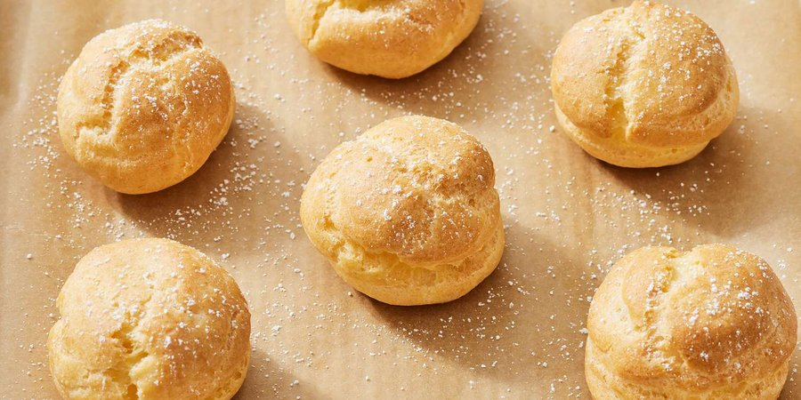

# Pâte à Choux (Choux Pastry)

*Choux pastry is enormously versatile, which makes it a marvelous, indispensable component of all types of cooking and patisserie.*

**Serves:** 22

**Prep Time:** 10 minutes

**Cook Time:** 1 minute

## Overview
Pâte à choux is the building block for éclairs, choux buns, profiteroles, Paris-Brest, religieuses, croquembouche and the savoury cousins like gougères: a pastry with no rising agent at all, lifted purely by steam released from the water in the dough as it hits the hot oven, so the shells puff dramatically and bake into crisp light hollow cases ready to be filled. The technique is unusual because it cooks twice. First, water, milk, butter, salt and sugar boil together in a pan, then sifted flour is dumped in all at once and stirred furiously into a smooth paste. Now the critical step: the pan goes back on the heat for a full minute and you stir constantly while some of the water evaporates from the dough and the paste turns from sticky and shaggy into smooth and dry, just barely coming away from the sides of the pan in a clean ball. Too short and the choux is too wet and won't hold its puff; too long and the dough cracks open as it bakes rather than rising smoothly. Tip the dried-out paste into a bowl, beat in the eggs one at a time with a spatula, fully incorporating each before adding the next; the paste goes glossy and falls off the spatula in a ribbon when ready. Pipe immediately onto parchment in your chosen shape (buns, éclairs, rings for Paris-Brest), bake at 220 C, and after 4 or 5 minutes wedge the oven door slightly open so steam can escape and the shells crisp rather than soften. Bake 10 to 20 minutes depending on size till deep gold and hollow-sounding. Cool, then split and fill with crème pâtissière, Chantilly, ice cream or savoury cheese.

## Ingredients
- 125 ml water
- 125 ml  milk
- 100 grams butter (cut into small pieces)
- 3 grams fine salt
- 5 grams sugar
- 150 grams flour
- 4 eggs

## Method
1. Preheat the oven to 220°C
1. Put the water, milk, diced butter, salt and sugar in a saucepan, set over a high heat and boil for 1 minute, stirring with a spatula. 
1. Take the pan off the heat and, stirring all the time, quickly add the sifted flour.
1. The next stage - the 'drying out' - is vitally important if you want to make good choux paste. 
1. When the mixture is very smooth, replace the pan over the heat and stir with the spatula for 1 minute.
1. The paste will begin to poach and some of the water will evaporate. Be careful not to let the paste dry out too much, or it will crack during cooking and your buns or éclair will not be perfectly smooth. 
1. Tip the paste into a bowl.
1. Immediately beat in the eggs, one at a time, using a spatula. If you do not want to use it immediately, spread one-third of a beaten egg over the surface to prevent a skin forming, which can happen after a few hours.
1. Choose an appropriate plain nozzle to pipe out your chosen shape - small or large choux buns or éclair.
1. Pipe out the paste on baking parchment or a greased baking sheet. 
1. If you like, glaze the shapes and make them lightly with the back of a fork, dipping it into the glaze each time.
1. Bake in a preheated oven, then open the door slightly (1-2 cm) after about 4-5 minutes and leave it ajar. 
1. Cooking time will vary from 10-20 minutes, depending on the size of the buns.

## Notes
- The 'drying out' stage on the heat is essential; it evaporates moisture and allows the paste to develop the structure needed for proper rise
- Stir continuously during the drying stage to cook evenly; the mixture should form a ball that comes away from pan sides
- Add eggs one at a time, ensuring each is fully incorporated before adding the next; this creates a smooth, pipeable consistency
- Opening the oven door slightly after 4-5 minutes allows steam to escape gradually, preventing collapse while ensuring crisping

## Serving
Fill choux buns with crème pâtissière, whipped cream, or ice cream; top with caramel sauce or chocolate glaze. Form éclairs for elegant desserts, or use for savory applications with cheese and herb fillings. Arrange in pyramid (Paris-Brest style) for dramatic presentations, bound with caramel.

## Storage
Choux pastry is best filled and served fresh, though unfilled buns may be stored in an airtight container for 1 day. Refresh in a 180°C oven for 5 minutes to re-crisp. Filled choux should be consumed within 2-4 hours as the crispy exterior absorbs moisture from fillings over time. Do not refrigerate or freeze filled choux.
