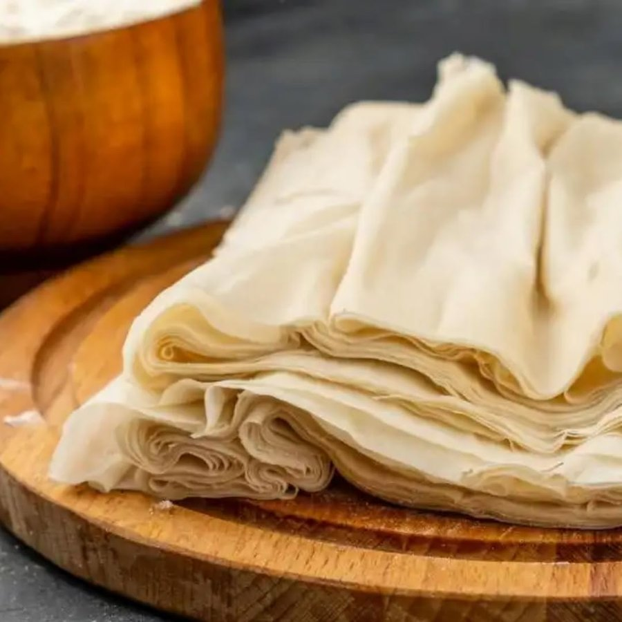

# Filo Pastry

*As with all pastry, mastering filo is very satisfying. The difficulty of rolling the dough to the required thinness of only ½ mm is not insurmountable, but it's certainly a challenge.*

**Serves:** 780 grams

**Prep Time:** 15 minutes

## Overview
Filo (or phyllo) pastry is the building block for baklava, börek, spanakopita, bastilla, strudel and the rest of the eastern Mediterranean and Middle Eastern pastry family: paper-thin transparent sheets of unenriched flour-and-water dough, stacked with butter or oil between every layer, then baked into shattering crackling crisp layers around sweet or savoury fillings. The defining trick is the thinness; you need to be able to read a newspaper through it, which is half a millimetre or less, and that's reached by hand stretching rather than rolling. Make the dough with flour, salt and warm water (50 C), then drizzle olive oil into the running mixer once everything's just amalgamating; mix three or four minutes more till the dough is soft, smooth and only slightly sticky. Divide into 60 g balls and rest them on a cornflour-dusted tray for at least two hours at a cool 14 to 16 C; warm dough is too elastic to stretch thin, and rushing the rest is the most common reason filo tears as you work it. To roll, dust a large round wooden board with cornflour, set a ball in the middle and roll it out to a 14 to 16 cm disc with a long thin wooden pole (a length of doweling, basically); from there, press down on each end of the pole with your hands to stretch the disc sideways, dusting with cornflour as you go to stop it sticking. The moment a sheet reaches the right thinness, lay it on a baking sheet and cover instantly with a damp tea towel; filo dries to a stiff crackable parchment within seconds of exposure to air, so every sheet you make has to be under a damp cloth before you start the next. Use within 24 hours, brushed with melted butter between layers and stacked for whatever you're building.

## Ingredients
- 400 grams plain flour
- 6 grams fine salt
- 330 ml water (heated to 50°C)
- 30 ml olive oil
- cornflour (to dust)

## Method
### Make the dough
1. Combine the flour, salt and water in the bowl of an electric mixer fitter with a dough hook and mix at low speed.
1. As soon as the ingredients start to come to together, pour in the oil in a thin stream.
1. Stop mixing as soon as the dough is amalgamated.
1. Use a spatula to scrape down any dough sticking to the sides of the bowl and the dough hook.
1. Switch the motor to medium speed and work the dough for 3 - 4 minutes.
1. It will almost come away from the bowl when it is fairly soft and slightly sticky,

### Rest the dough
1. Put the dough on the work surface and shape into a ball.
1. Divide the dough into pieces about 60 grams each.
1. Shape each piece again into separate balls and place on a baking sheet dusted with cornflour, spacing them several centimetres apart.
Cover with cling film and leave to rest somewhere fairly cool (14 - 16°C) for at least two hours before using.

### Rolling the pastry
1. Lightly dust a 60 cm round wooden board with cornflour and place a ball of filo in the middle.
1. Using a long thin wooden pole or piece of doweling as a rolling pin, roll into a 14 - 16 cm disc.
1. From the point onwards, press down with your hands on each end of the pole to stretch the pastry sideways.
1. It is essential to keep dusting the top of the filo as you stretch it.
1. As soon as the sheet of filo is the perfect thinness (½ mm), lay it on a baking sheet and immediately cover with a lightly dampened tea towel to prevent it from drying out.
1. Make another sheet of filo using another ball of dough.
1. Dust the first sheet with cornflour, then place the second sheet on top and cover this sheet with the dampened tea towel.
1. Continue this way until you have used all the pastry, covering the final sheet with the dampened tea towel.

## Notes
- Resting the dough at cool temperature (14-16°C) is essential; warm dough becomes too elastic to stretch thin
- Stretching filo by hand (not rolling pins) creates the characteristic thin sheets; use gentle, even pressure and stretch from the center outward
- Dusting cornflour between layers prevents sticking and keeps sheets separate for handling
- Filo dries immediately upon exposure to air; keep unworked dough and finished sheets covered with damp towels at all times

## Serving
Use filo sheets layered with fillings (sweet or savory) and brush generously with melted butter between each layer. Bake until crisp and golden. The transparent, paper-thin layers create visually stunning desserts, sweet varieties showcase caramelized fruits, while savory versions feature cheese and herb fillings.

## Storage
Filo pastry is best used within 24 hours of preparation. Store wrapped in damp tea towels in the refrigerator for up to 24 hours. Keep in a sealed plastic bag to prevent drying. Once layered and assembled, bake immediately. Baked filo items are best consumed fresh but can be stored in an airtight container for 1-2 days.

*Filo pastry dries out very quickly, so it is essential to cover it with a damp tea towel. Once the pastry has been made, it should be kept wrapped up in a damp tea towel and rested in the refrigerator and used within 24 hours.*
*Most recipes call for interleaving layers of filo, these sheets will need to be brushed generously with melted butter whilst assembling the required dish.*
