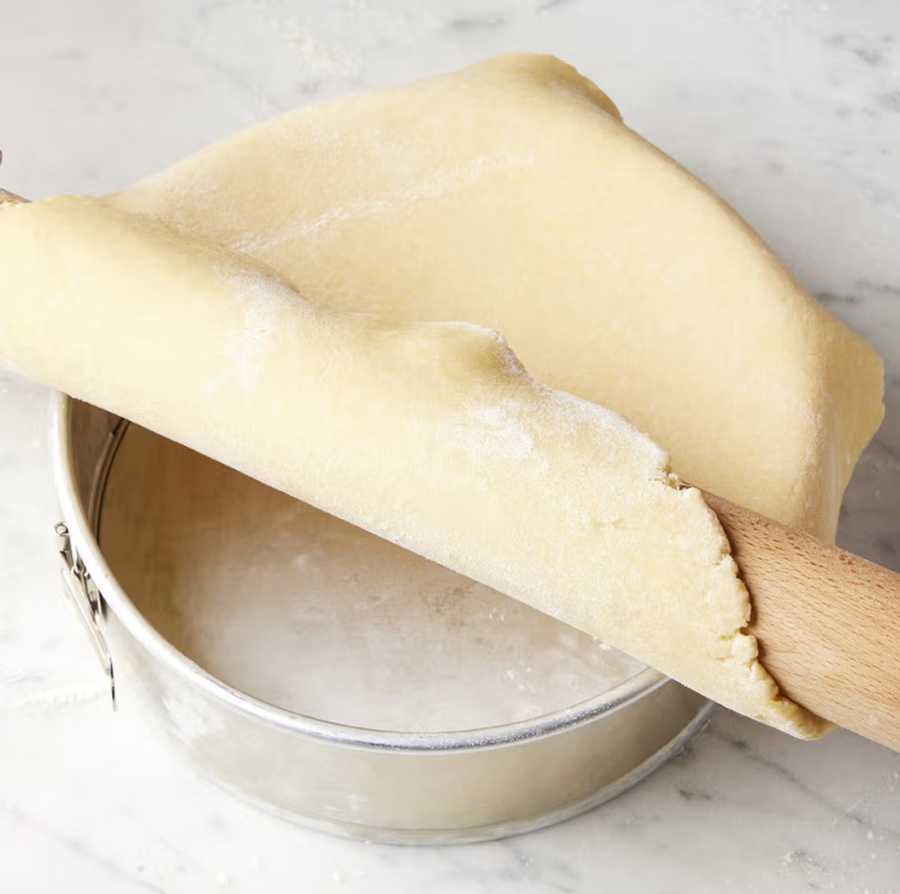

# Pâté à Foncer (Flan Pastry)

*Traditionally this dough is used as a base for flans or tartlets.*

**Serves:** 480 grams

**Prep Time:** 15 minutes

## Overview
Pâte à foncer is the building block for sweet and savoury flans, quiches and tartlets: a tender slightly sweet shortcrust pastry made by rubbing softened butter into flour with the fingertips, then bringing the dough together with a whole egg and a splash of cold water. It's a softer, more pliable dough than a classic shortcrust and rolls into a tart tin without cracking, which makes it the right choice for fluted edges or anything you want to line a deep ring with. The whole game is keeping the dough cool and not overworking it. Tip the flour onto a cool work surface, make a well, drop in soft cubed butter, the whole egg, a teaspoon of sugar and half a teaspoon of salt, then rub the wet ingredients together with the fingertips of one hand while drawing the flour in from the sides with the other. When the mixture looks grainy and almost amalgamated, add 40 ml of cold water and bring it together; knead just four or five times with the heel of your hand to homogenise the dough (any more and the gluten develops and you'll bake tough chewy pastry rather than tender crumbly pastry). Shape into a flat disc, wrap in cling film and rest in the fridge for several hours; this is non-negotiable because warm dough shrinks and tears as you line a tin, while chilled dough rolls smooth and holds its shape. Roll out on a lightly floured surface, line the tin pressing the dough into the corners, prick the base, blind-bake with parchment and dried beans at 200 C for 15 minutes, then fill with crème pâtissière, fruit, savoury custard or anything that suits.

## Ingredients
- 250 grams flour
- 125 grams butter (softened)
- 1 size 3 egg 
- 1 teaspoon sugar
- ½ teaspoon salt
- 40 ml cold water

## Method
1. Place the flour on the work surface and make a well in the centre. 
1. Cut the butter into small pieces and place them in the well, together with the egg, sugar and salt. 
1. Rub in all these ingredients with the fingertips of your right hand, then, with your left hand, draw in the flour a little at a time.
1. When all the ingredients are almost amalgamated, add the water.
1. Knead the dough with the palm of your hand 4 or 5 times until completely mixed.
1. Roll the dough into a ball, flatten the top slightly, wrap in greaseproof paper or polythene and refrigerate for several hours before use.

## Notes
- This dough is delicate and should not be overworked; stop mixing as soon as all ingredients are combined to maintain crumbly texture
- Keep work surface and all ingredients cool; warm conditions cause the butter to soften and the dough to become tough
- Refrigeration is crucial; chilled dough is easier to line tart tins without shrinking or breaking
- The dough can be made 1-2 days in advance and stored wrapped in the refrigerator

## Serving
Line flan tins and tartlet molds with this pastry; bake blind (with dried beans or weights) at 200°C for 15 minutes before adding savory or sweet fillings. The tender pastry base provides elegant contrast to rich fillings like crème pâtissière, chocolate, or savory custards.

## Storage
Wrap unrolled dough and refrigerate for up to 2 days, or freeze for up to 1 month. Thaw frozen dough in the refrigerator before rolling. Once lining a tin, the dough can be refrigerated for up to 12 hours before baking or blind-baking.
