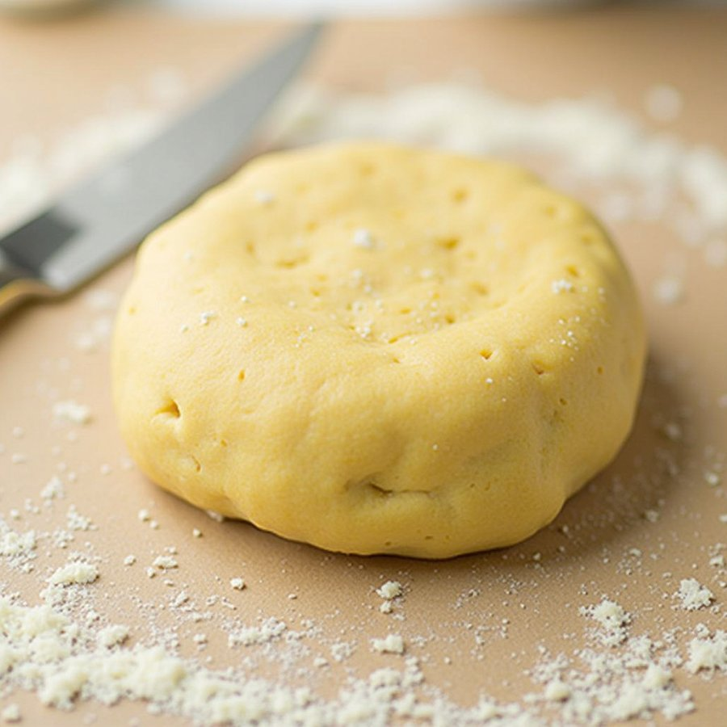

# Pâte Moulée (Raised Pie Pastry)

*This pastry is best made at least two hours in advance, ideally 24 hours before you use it.*

**Serves:** 950 grams

**Prep Time:** 10 minutes

## Overview
Pâte moulée is the building block for raised game pies, pork pies, terrines en croûte and any traditional British or French charcuterie that wants a sturdy savoury pastry case strong enough to hold its shape free-standing once unmoulded. The fat is lard, not butter; lard gives the pastry its tender crumbly texture and the savoury depth that pairs with meat fillings (and butter just can't replicate the flavour or the rigid wall this pastry needs to support a meat terrine without collapse). The dough is rich (a full 200 g of lard to 500 g of flour) and bound with egg yolks rather than whole eggs, which gives a tighter denser pastry that bakes to a snap rather than a flake. Tip the flour onto the work surface, make a well, drop in the salt and softened lard, and rub them together gently with your fingertips while drawing flour in from the sides; when the texture turns fine and grainy, make a fresh well and pour in the egg yolks beaten with cold water. Mix with the fingertips till the dough is well amalgamated, then push it away from you with the heel of your hand four or five times to homogenise (no more, or the gluten builds and the pastry turns chewy rather than crumbly). Shape into a ball, wrap and rest in the fridge for at least two hours, ideally overnight; the rest is when the dough relaxes and the flavour deepens. Take it out an hour before rolling so it's pliable rather than rigid, then roll out and line a raised pie mould, pressing into the corners. Fill with pork, game or terrine forcemeat, top with a pastry lid, crimp the edges, brush with egg wash, vent steam holes and bake till deep gold.

## Ingredients
- 500 grams plain flour
- 20 grams salt
- 200 grams lard (cut into small pieces and softened)
- 5 egg yolks (mixed with 110 ml cold water)

## Method
1. Put the flour on the work surface and make a well.
1. Place the salt and lard in the centre.
1. Use your fingertips to mix and soften the ingredients in the well, gradually drawing in the flour and mixing with your fingertips.
1. When the dough has a fine grainy texture, make a well in the middle.
1. Gradually pour the egg yolks and water mixture into the well, mixing with your fingertips.
1. When the dough is well amalgamated, push it away from you 4 or 5 times with the heel of your hands to make it homogeneous.
1. Roll into a ball, wrap in cling film and refrigerate for at least 2 hours.
1. If it has rested in the refrigerator for a while, take it out an hour before rolling.

## Notes
- Lard is essential to this recipe; it creates the traditional texture and flavor that butter cannot replicate
- The fine grainy texture achieved during mixing determines the final crumbly consistency; do not overwork
- Resting for at least 2 hours (ideally overnight) allows the dough to relax and become more workable
- The dough should be pliable but not warm when rolling; take it from the refrigerator 1 hour before use

## Serving
- Use pâte moulée to line raised pie molds for traditional British meat pies, terrines, or game-filled presentations. The pastry's density and rich flavor provide an ideal framework for savory fillings. Often baked until golden and served warm with accompaniments like aspic glaze.

## Storage
The dough can be refrigerated for 2-3 days wrapped in cling film. Freeze for up to 1 month; thaw in the refrigerator before rolling. Once lining a mold, refrigerate for up to 4 hours before baking. Baked pies can be stored in the refrigerator for 3-4 days.
