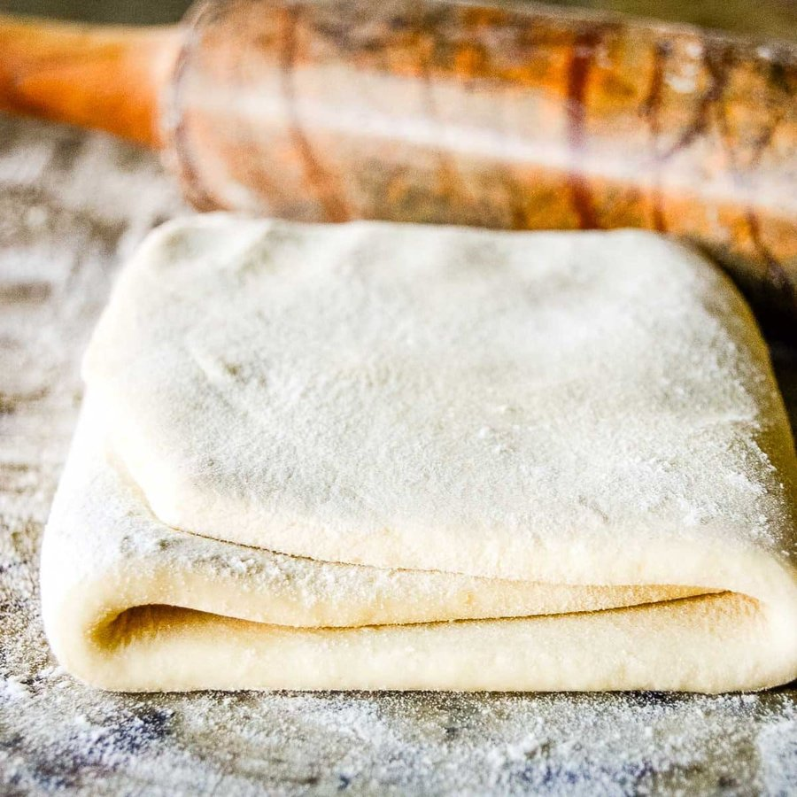

# Rough Puff Pastry

*A quicker French puff: butter cubed into flour and folded by hand, with a series of turns to laminate.*

**Serves:** 1.2kg

**Prep Time:** 10 minutes

## Overview
Rough puff is the building block when you want puff-pastry flake without the two-day classical lamination: a faster shortcut version where cubed cold butter is rubbed into the flour rather than wrapped in a single block, then folded and turned in the standard way to build layers. The trade-off is real but worth it for everyday cooking. You get fewer, less uniform layers (rough puff puffs to maybe 60 percent of the height of classical feuilletage), and the texture is a touch shorter and less even, but the flavour is identical and the technique takes one afternoon instead of two. Use it for sausage rolls, savoury parcels, fruit tarts, palmiers, jalousies and anything where a small loss of dramatic rise is invisible. The dough has equal weights of flour and butter (500 g each), and the butter goes in cold and cubed: tip the flour into a mound, make a well, drop in the butter cubes and the salt, and work the butter through the flour with your fingertips till the cubes break to small flat pieces (don't rub it to fine breadcrumbs the way you would for shortcrust; you want pea-sized lumps of butter still visible because those are what give you the layers later). Add iced water gradually, mix till incorporated without overworking, wrap and refrigerate 20 minutes to firm the butter back up. Now four turns total, done in two sessions: roll out to a 40 by 20 cm rectangle, fold into thirds, quarter-turn, repeat once more, then chill 30 minutes before doing the final two turns. After the fourth turn, rest 30 minutes in the fridge before rolling and using. Keeps two days refrigerated or a month frozen.

## Ingredients
- 500 grams plain flour
- 500 grams butter (very cold, cut into small cubes)
- 1 teaspoon salt
- 250 ml water (ice cold)

## Method
### Preparing the pastry
1. Put the flour in a mound on the work surface and make a well.
1. Put in the butter and salt and work them together with the fingertips of one hand, gradually drawing the flour into the centre with the other hand.
1. When the cubes of butter have become small pieces and the dough is grainy, gradually add the iced water and mix well until it is all incorporated, making sure you don't overwork the dough.
1. Roll it into a ball, wrap it in cling film and refrigerate for 20 minutes.

### The first two turns
1. Flour the work surface and roll out the pastry into a 40 x 20 cm rectangle.
1. Fold it into three and give it a quarter-turn.
1. Roll the block of pastry into a 40 x 20 cm rectangle as before, and fold it into three again.
1. These are the first 2 turns.
1. Wrap the block in cling film and refrigerate it for 30 minutes.

### The last two turns
1. Give the chilled pastry another 2 turns, rolling and folding as before.
1. This makes a total for 4 turns, and the pastry is now ready.
1. Wrap it in cling film and refrigerate for at least 30 minutes before using.

## Notes
- Rough puff requires 4 turns total; fewer turns result in less impressive puffing, while more turns risk toughening the dough
- Keep all ingredients, tools, and work surfaces cool; warm conditions cause butter to soften and incorporate into the dough
- Fold into thirds (not halves like croissant dough) to create the proper layer structure
- Quarter-turn after each fold ensures even pressure distribution across the dough

## Serving
- Use rough puff pastry for vol-au-vents, fruit and cream tarts, strips topped with savory fillings, or sweet configurations with fruit. The pastry's flaky texture makes it ideal for both casual and elegant presentations. Brush with eggwash for golden color before baking.

## Storage
Dough can be refrigerated for 2 days wrapped tightly, or frozen for up to 1 month. Shapes can be cut and frozen before baking; bake directly from frozen, adding 5 minutes to baking time. Baked pastry stores in an airtight container for 1-2 days; refresh briefly in a warm oven to re-crisp before serving.
