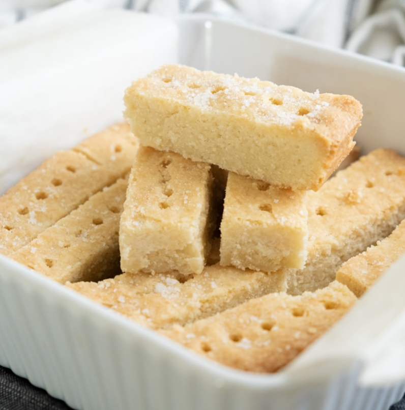

# Pâte Sablée (Shortbread Dough)

*Flour is always the last ingredient to be added to pâte sablée, so that the dough remains crumbly or 'short'.* 

**Serves:** 680 grams

**Prep Time:** 5 minutes

## Overview
Pâte sablée is the building block for the most delicate tart shells and biscuit bases in the French pastry kitchen: a buttery sweet shortbread-textured dough that melts on the tongue and bakes to a crumbly almost biscuit-like base for fruit tarts, petits fours, sablés Bretons and the most refined tartelettes. It's the most fragile of the four classical short pastries (more tender than pâte brisée, more delicate than pâte sucrée) and the technique that makes it work is the order of operations: flour goes in last. Sift the flour onto the work surface and make a well, then work the diced butter in the centre with your fingertips till it's completely soft and smooth (sablée starts from creamed butter, not rubbed-in butter, which is the opposite of shortcrust). Sift the icing sugar over the butter, add the salt and mix in, then drop in the two egg yolks and a drop of vanilla and mix till smooth. Only now do you gradually pull the flour in from the sides; the flour going in last means the gluten gets the absolute minimum of contact with the wet ingredients and the dough stays short and tender rather than developing the chewy gluten network you'd want in bread. Finish with two or three quick pushes from the heel of your hand, no more, and wrap and rest in the fridge for several hours before rolling. The dough softens fast in a warm kitchen because of its high butter content, so chill the work surface if it gets sticky, and work quickly. Roll between sheets of cling film if it's tearing, line tartlet moulds, prick the base, blind-bake at moderate heat till golden, and fill with crème pâtissière, fruit and gelée.

## Ingredients
- 250 grams flour(sifted)
- 200 grams butter
- 100 grams icing sugar(sifted)
- 1 pinch salt
- 2 egg yolks
- 1 drop vanilla essence

## Method
1. Sift the flour onto the work surface and make a well in the centre. 
1. Dice the butter and place it in the well, then work it with your fingertips until very soft.
1. Sift the icing sugar onto the butter, add the salt and work into the butter. 
1. Add the egg yolks and mix well. Gradually draw in the flour and mix until completely amalgamated.
1. Add the vanilla essence and rub into the dough 2 or 3 times with the palm of your hand.
1. Cover with polythene, and refrigerate for several hours before use.

## Notes
- The dough must remain cool throughout; cold hands, work surface, and ingredients are essential for success
- Add flour only to the final mixture, and do not overwork once flour is added; aggressive mixing develops gluten and toughens the dough
- Working quickly is critical when rolling, especially in warm kitchens; chill the work surface and dough if it becomes soft
- The dough softens rapidly due to its high butter content; multiple brief chilling periods may be necessary during rolling

## Serving
- Use to line tartlet molds for pétit fours, as a base for tarts with light fillings (fruit or cream), or cut into decorative shapes for petit fours secs. The delicate crumb pairs beautifully with light fillings and creams. Often glazed or dusted with icing sugar for finished presentations.

## Storage
Wrap unrolled dough and refrigerate for up to 2 days, or freeze for up to 1 month. Thaw frozen dough in the refrigerator before rolling. Cut shapes can be frozen on a tray, then transferred to a container for up to 1 month; bake directly from frozen, adding 2-3 minutes to baking time. Baked pastry items store in an airtight container for 3-4 days.

*Once you have added the flour, do not overwork the dough, or it will become too elastic.*
*This recipe is very delicate; if you are using the dough to line a flan tin or to make sablés, you must work very fast, without over-handling the dough, as it softens extremely quickly.*
*Rolled out and cut into different shapes, this dough is perfect for petits fours secs.*
