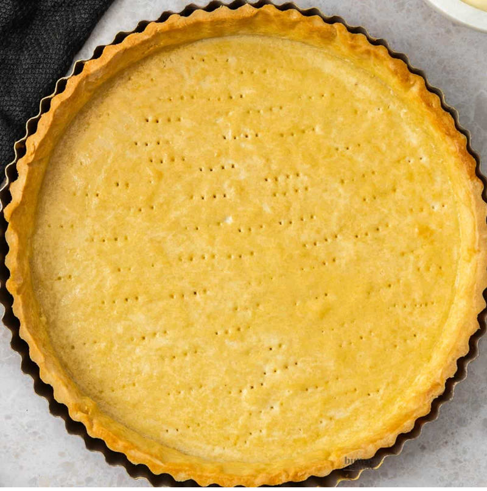

# Pâte Sucrée (Sweet Short Pastry)

*France's sweet shortcrust: cold butter rubbed into flour and icing sugar, bound with egg yolk. The crisp base for fruit tarts and tartlets.*

**Serves:** 520 grams

**Prep Time:** 15 minutes

## Overview
Pâte sucrée is the building block for the great French fruit tarts and dessert tarts: a sweet shortcrust with a tender crisp crumb that's closer to a biscuit than to bread, made to support the gloss and weight of a strawberry tart with crème pâtissière, a chocolate tart, a tarte au citron or any dessert that wants a dough that bakes biscuity rather than flaky. The sugar in the dough makes it richer than pâte brisée and gives it the slightly snappy crisp bite you want under a soft creamy filling. The mixing technique is the French well again, but the order matters: butter creamed soft first, then sugar and salt, then eggs, with flour drawn in last. Mound the flour on a cool work surface, push a well into the middle, drop in cubed butter and work it with your fingertips till completely softened (not melted, just creamed soft and smooth). Mix in the sifted icing sugar and a pinch of salt, then beat in two room-temperature eggs (cold eggs split the butter and you get a grainy dough that bakes pebbly). Pull the flour in gradually from the sides till the dough is amalgamated, then work it two or three times with the heel of your hand till smooth, no more. Shape into a flat disc, wrap and rest in the fridge for several hours; chilling firms the butter and lets the gluten relax so the dough rolls clean without tearing or shrinking back. Roll out on a lightly floured surface, line a tart tin, prick the base, blind-bake with parchment and dried beans till the shell is dry and just barely golden, then fill with crème pâtissière topped with glazed fresh fruit, chocolate ganache or lemon curd.

## Ingredients
- 250 grams flour
- 100 grams butter
- 100 grams icing sugar (sifted)
- 1 pinch salt
- 2 size 4 eggs (at room temperature)

## Method
1. Put the flour on the work surface and make a well in the centre. 
1. Cut the butter into small pieces, place them in the centre, then work with your fingertips until completely softened.
1. Add the sugar and salt, mix well together, then add the eggs and mix. 
1. Gradually draw the flour into the mixture.
1. When everything is thoroughly mixed, work the dough 2 or 3 times with the palm of your hand until it is very smooth.
1. Roll the dough into a ball, flatten the top slightly, wrap in greaseproof paper or polythene and refrigerate for several hours before use.

## Notes
- Unlike pâte sablée, flour is not the last ingredient; the dough is more cohesive and less delicate
- Ensure the butter is completely softened before adding eggs, preventing a grainy texture
- The dough becomes smooth with palm-of-hand working; this is normal for this recipe and differs from crumbly doughs
- Chilling is essential; the dough must be cold before rolling to prevent sticking

## Serving
Use pâte sucrée for elegant fruit tarts topped with crème pâtissiére and glazed fresh fruit. The sweet pastry base pairs beautifully with light, fruity fillings. Also suitable for chocolate tarts or cream-based desserts. Line tartlet molds for individual petit fours.

## Storage
Wrap unrolled dough and refrigerate for 2-3 days, or freeze for up to 1 month. Thaw frozen dough in the refrigerator before rolling. Once lining a tin, the dough can be refrigerated for up to 12 hours before blind-baking or filling. Blind-baked shells store in an airtight container for 2 days.
