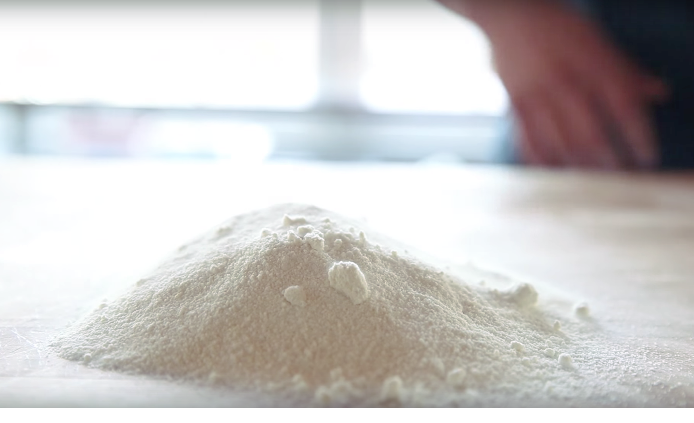

# Tant Pour Tant

*Tant pour tant (French for "half and half") is equal parts almond meal and icing sugar ground together to create a fine, uniform powder. This foundation is essential in French pastry work, used in macarons, sponges, and fine cakes.*

**Yield:** Varies by proportions used (example: 100g almonds + 100g icing sugar = 200g tant pour tant)

**Prep Time:** 15 minutes

## Overview
Tant pour tant is the building block under macarons, biscuit joconde, financiers, génoise variations and any French pastry that wants the soft almond character of nut flour without the oiliness that pure ground almonds bring in: equal weights of ground almonds and icing sugar processed together to a fine even powder. The reason it works isn't decorative; the icing sugar absorbs the natural oils that the almonds release as you grind them, which is what keeps the powder dry and uniform rather than turning into a damp paste. Skip the icing sugar and grind almonds on their own and you'll end up with almond butter every time. Weigh the two ingredients precisely (icing sugar and ground almonds have very different densities, so volume doesn't work here) and tip them into a food processor. Pulse, don't grind continuously, because long runs heat the bowl and the almonds release more oil; you want short pulses of two or three seconds till the mixture turns into a fine even powder, around 2 to 3 minutes of pulsing in total. Pass the mixture through a fine sieve into a clean bowl, discard any coarse almond pieces left behind (they're a sign of underprocessed batches and would ruin a macaron shell), then sieve a second time; the second sift is what separates a good macaron from a pebbly one. Store in an airtight container at room temperature and use within two weeks, because the almond oils oxidise over time and old tant pour tant tastes flat and sometimes faintly rancid. For variations, swap the almonds for pistachios or hazelnuts at the same 1:1 ratio.

## Ingredients
- 100 grams ground almonds (almond meal, not almond flour)
- 100 grams icing sugar (confectioner's sugar, finely powdered)
- Water (none needed)

## Method

### Stage 1 - Combine Dry Ingredients
1. Measure equal weights of ground almonds and icing sugar (using a scale is essential for precision).
1. Pour both into a food processor fitted with a steel blade.
1. Pulse several times to begin combining the ingredients.

### Stage 2 - Process to Fine Powder
1. Continue processing with steady pulses (not continuous grinding) for 2-3 minutes.
1. The friction will release natural oils from the almonds.
1. The icing sugar will absorb these oils, creating a uniform, dry mixture.
1. Process until the mixture resembles fine breadcrumbs or sand, completely uniform with no visible almond pieces.

### Stage 3 - Sift Twice
1. Pass the processed mixture through a fine sieve (or finest sieve you have) into a clean bowl.
1. Discard any large almond particles that remain in the sieve; these indicate incomplete grinding.
1. Pour the sifted mixture back into the sieve and sift again (a second sift is essential for macarons).
1. The goal is the finest possible powder without any grit.

### Stage 4 - Storage
1. Store in an airtight container at room temperature.
1. Use within 2 weeks for best results (almond oils can oxidize over time).

## Notes
- **Weight Precision:** Use a scale, not volume; icing sugar and almonds have different densities.
- **Almond Meal vs. Flour:** Almond meal is coarser; use it, not pre-sifted almond flour. The grinding process is part of the creation.
- **Double Sift Importance:** Critical for macarons; a second sift removes large particles that disrupt macaron structure.
- **Oil Release:** The friction during processing releases almond oils, which is why the mixture stays dry, the sugar absorbs them.
- **Freshness:** Oxidized oils from old tant pour tant create off-flavors and dense results; always use freshly prepared or very recent batches.

## Variations
**Praline Tant pour Tant:** Replace half the almonds with ground praline paste for deeper almond flavor.
**Pistachio Version:** Replace almonds with ground pistachios (1:1 with icing sugar).
**Hazelnut:** Use equal parts ground hazelnuts and icing sugar by weight.

## Serving
Use in: Macaron shells, Gênoise sponge, almond-based cakes, entremets, pastry creams with almond
Temperature: Room temperature (use dry, not moistened)
Amount: Per specific recipe (typically 100-150g tant pour tant per macaron or dessert recipe)

## Storage
- Store in an airtight container at room temperature for up to 2 weeks
- Can be refrigerated for up to 4 weeks (bring to room temperature before use)
- Do not freeze; thawing introduces moisture
- For longer storage, freeze the separated ingredients (almonds and icing sugar) individually, then make tant pour tant fresh as needed
