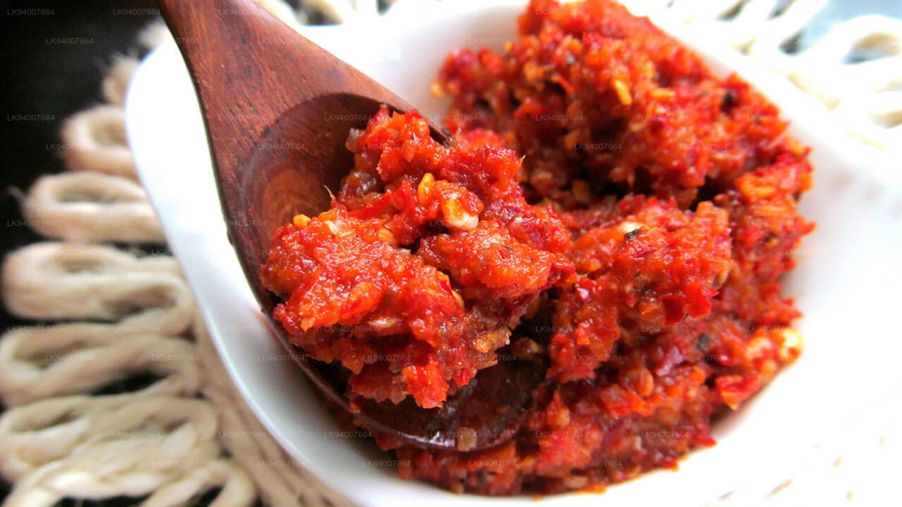

# Balti Masala Paste

*A wet balti paste: dry-roasted whole spices ground with garlic, ginger and oil.*

**Prep Time:** 5 minutes

**Yield:** Approximately 675-700 grams

**Cook Time:** 10 minutes

## Overview
Balti masala paste is the building block for British-Indian Balti curries, the wet spice base you spoon out of a jar and bloom in hot oil to start every Balti house dish: pre-ground Balti masala powder rehydrated with vinegar, then cooked into a thick oil-glossed paste that keeps for months in sealed jars in the fridge. It's the practical, batch-prep paste; rather than grinding spices fresh for every curry, you make this in a single afternoon, jar it, top with a layer of oil, and have the foundation for 20 curries waiting in the fridge. The vinegar isn't just for flavour; the acidity acts as a natural preservative, and the layer of oil on top of each jar seals the surface against air and mould. Tip 200 g of Balti masala powder into a large bowl and stir in 200 ml of white wine vinegar, then add water gradually with a spoon till the mixture is a creamy heavy-cream consistency. Rest at room temperature for 10 minutes so the powder hydrates fully and the flavour develops. Heat 200 ml of vegetable oil in a karahi or wok over medium till shimmering, tip the hydrated paste into the hot oil all at once and stir continuously for around 5 minutes (the stirring is non-negotiable, the paste will burn on the bottom in seconds if you stop). The water cooks out and the paste tightens. Off the heat after 5 minutes, rest 3 to 4 minutes; if oil rises clearly to the top of the paste, you're done. If not, add a tablespoon or two more oil and stir over heat another minute till it separates. Spoon hot into sterilised jars, top each with a thin layer of hot oil to seal, lid tightly and refrigerate.

## Ingredients

### Base Pastes & Liquids
- 200 grams Balti masala powder (pre-made spice blend)
- 200 ml white wine vinegar
- 200 ml vegetable oil
- Water (as needed for consistency)

### For Storage & Serving
- vegetable oil (for sealing jars)
- Sterilized jars (for bottling)

## Method

### Stage 1 - Hydrate Spice Powder
1. Place the Balti masala powder in a large bowl.
1. Add the white wine vinegar.
1. Gradually add water, mixing with a spoon as you go, until the mixture reaches a creamy paste consistency.
1. The paste should be pourable but thick, like heavy cream.
1. Leave the mixture to stand at room temperature for at least 10 minutes.
1. This resting allows the spice powder to fully hydrate and develop flavor.

### Stage 2 - Cook the Paste
1. Heat the vegetable oil in a large karahi, wok, or heavy-bottomed frying pan over medium heat until shimmering.
1. Carefully add the entire hydrated paste to the hot oil.
1. Immediately begin stirring continuously to prevent sticking to the bottom of the pan.
1. Continue stir-frying, never stopping your stirring, as the water content cooks out.
1. This should take approximately 5 minutes, though timing varies by heat level.
1. Stir constantly throughout the cooking time.

### Stage 3 - Test for Doneness
1. After 5 minutes of continuous stirring, remove the pan from the heat.
1. Allow the paste to rest for 3-4 minutes.
1. The key sign of completion is whether oil floats clearly to the top of the paste.
1. If oil separates nicely and floats on top, the paste is done and ready to bottle.
1. If you don't see clear oil separation, add a little more oil (about 1-2 tablespoons) and return to heat.
1. Stir for another minute or so until oil clearly separates, then remove from heat.

### Stage 4 - Jar & Preserve
1. Prepare sterilized glass jars (wash and dry, or run through a dishwasher).
1. Carefully spoon the hot paste into clean jars, filling to within 1 cm of the top.
1. Heat up a small amount of additional vegetable oil in a pan (about 50 ml).
1. Once the paste has cooled to warm, pour a thin layer of the hot oil over the top of the paste to seal it.
1. The oil acts as a barrier against air and bacteria, preventing mold.
1. Seal the jars tightly with lids.
1. Refrigerate for storage.

## Notes
- **Vinegar Preservation:** The acid in the vinegar acts as a natural preservative when the jar is properly sealed with oil on top.
- **Oil Separation:** This is the sign that water has evaporated and the spices are properly "cooked." If you skip this, the paste will mold.
- **Sterile Jars:** Essential for food safety when storing paste long-term. Any bacteria or contaminants will grow in the sealed jar.
- **Oil Seal:** The oil layer must completely cover the paste surface; gaps will allow mold to develop. Check after a few days.
- **Storage Inspection:** Check the sealed jars every few days for the first week. If mold appears on the surface, discard immediately.
- **Temperature:** This paste must always be refrigerated; room temperature storage risks bacterial growth despite the vinegar preservation.

## Variations
**Spicier:** Use a hotter Balti masala powder (if available) or add 1 teaspoon chilli powder to the paste during cooking.
**With Tomato:** Replace up to 50 ml vinegar with tomato purée for deeper savory notes.
**Cider Vinegar:** Use cider vinegar instead of white wine vinegar for slightly different tang.

## Serving
Use in: Balti curries, British-Indian curries, curry sauces
Typical ratio: 3-4 tablespoons paste per 400 ml water or stock (curry liquid is thinner than Indian curries)
Cooking: Fry the paste in oil briefly with onions before adding liquid and curry ingredients
Temperature: Requires cooking in hot oil before use

## Storage
- Refrigerate in sealed jars with oil overlay for up to 2 months
- The oil seal acts as a preservative once the jar is opened, don't disturb it excessively
- Always use clean spoons when removing paste from the jar (no contamination from wet utensils)
- If mold appears, discard the entire jar
- Do not freeze; freezing damages the emulsion between oil and spices
- Check regularly during the first 1-2 weeks for any sign of spoilage

*The Balti is a mild, well-spiced paste that forms the base for most British-Indian Balti curry dishes. Using vinegar as the binding liquid (rather than all water) naturally preserves the paste in sealed jars, a practical advantage for batch preparation.*
