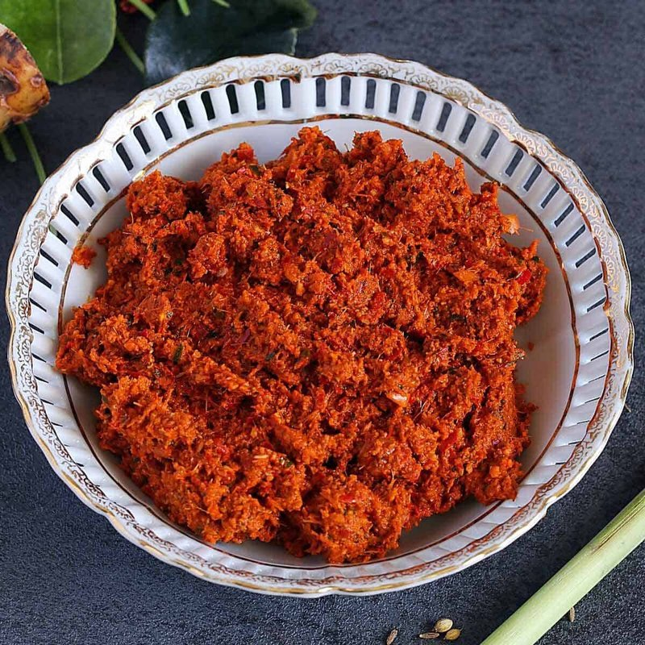

# Panang Curry Paste

*Thailand's panang curry paste: dried red chillies, lemongrass, galangal, kaffir lime peel and roasted peanuts pounded into a thick.*

**Makes:** Approx. 250 ml (1 cup)

**Prep Time:** 40-60 minutes

**Cook Time:** 5 minutes

## Overview
Panang curry paste is the milder, sweeter, peanut-tinged cousin to red curry paste, built on the same dried red chillies and Thai aromatics but with a generous handful of roasted peanuts pounded through and a higher ratio of fragrant ingredients to chilli. The mortar work is the dish; toast the cumin and coriander, then pound chillies, garlic, shallots, galangal, fresh chillies, lemongrass, coriander root, lime zest, kaffir lime leaves and roasted peanuts together for 40 to 60 minutes till smooth and buttery, finishing with shrimp paste. A small food processor with a splash of water substitutes if you don't have the time, though the texture suffers. The peanuts are essential here; leave them out only if you have an allergy. Stores two weeks refrigerated in an airtight jar; freezes two months in small portions.

## Ingredients
### Whole spices
- 1 generous tbsp cumin seeds
- 1 generous tbsp coriander seeds
- 1 ½ tsp white pepper

### Chillies and aromatics
- 12 dried red bird’s eye chillies, soaked in water for 30 minutes and cut into small pieces
- 12 garlic cloves, roughly chopped
- 2 shallots (medium), finely chopped
- 1 thumb-sized piece galangal, thinly sliced
- 2 fresh red chillies, thinly sliced
- 1 lemongrass stalk, tough outer part removed and thinly sliced
- 10 thick coriander stalks (about 1 generous tbsp)
- ½ lime (zest)
- 4 lime leaves, stems removed and finely chopped

### Nuts and paste
- 3-4 tbsp roasted peanuts
- 1 tsp shrimp paste

## Method

### Stage 1 - Toast and grind spices
1. Heat pan over medium-high heat; toast cumin, coriander until fragrant but not smoking.
1. Transfer to pestle and mortar; cool and pound to powder with white pepper.

### Stage 2 - Pound to paste
1. Add bird’s eye chillies; pound to paste.
1. Add garlic, shallots, galangal, fresh chillies, lemongrass, coriander stalks, lime zest, lime leaves, and peanuts.
1. Pound 40-60 mins until smooth and buttery.

### Stage 3 - Add shrimp paste
1. Add shrimp paste; pound to incorporate.

## Notes
- Peanuts are essential; omit only if allergic.
- Use mortar and pestle for best flavor.
- Keeps 2 weeks refrigerated; freezes 2 months.

## Serving
- Not served directly; used in Panang curries.

## Storage
- Refrigerate 2 weeks in airtight container.
- Freeze up to 2 months; thaw before use.
