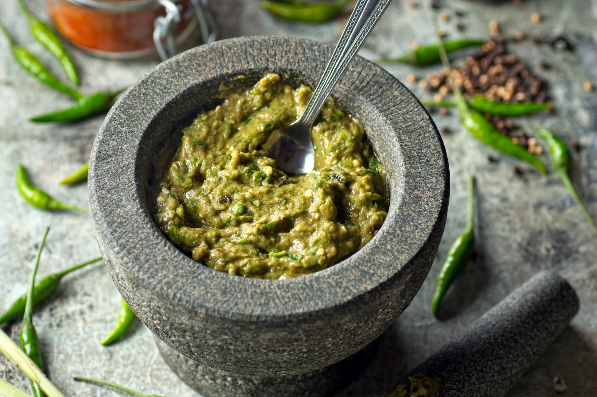

# Quick Thai Green Paste

*Thailand's green curry paste: fresh green chillies, lemongrass, galangal, kaffir lime, garlic.*

**Prep Time:** 20 minutes

**Yield:** Approximately 230-250 grams

## Overview
Thai green curry paste is the building block for Thailand's most iconic and deceptively-hot curry: a vivid herb-bright pale-green paste of fresh green chillies, lemongrass, galangal, coriander leaves and stems, garlic, shrimp paste and ground spices, designed to fry in coconut cream into the sweetly-spicy curry that takes chicken, fish, beef or aubergine equally well. The green comes from the fresh herbs, not from any colouring, and it fades fast as the chlorophyll oxidises, so make it shortly before cooking. Unlike red paste, which leans on toasted dried spices, green is fresh-driven and the heat builds rather than hits; the cool herbs at the start can mask the chilli load behind. Pound the chopped fresh aromatics in a stone mortar till smooth, drizzling in peanut oil to bind. Work in the ground coriander, cumin, crushed peppercorns and turmeric, then the warmed shrimp paste, then salt to taste. Fry straight away in coconut cream before adding the rest of the milk and your protein; the colour and aromatics fade within hours. For the traditional version with more chillies and Thai basil pounded through, see [Thai Green Curry Paste](thai-green-paste-traditional.md).

## Ingredients

### Fresh Aromatics & Herbs  
- 4 fresh green chillies (large, de-seeded for moderate heat; keep seeds for authentic spiciness)
- 1 onion (medium, finely chopped)
- 1 tablespoon fresh garlic (minced)
- 8 tablespoons fresh coriander (chopped, including stems)
- 2 pieces lemon grass (tender portions, finely sliced)
- 1 tablespoon fresh galangal (chopped)

### Spices & Flavor
- 2 teaspoons ground coriander
- 1 teaspoon ground cumin
- 1 teaspoon black peppercorns (crushed)
- 1 teaspoon ground turmeric
- 1 teaspoon shrimp paste (wrapped and warmed)
- Fine sea salt (to taste)

### Oil
- 2 tablespoons peanut oil

## Method

### Stage 1 - Prepare Green Ingredients
1. Wash the fresh green chillies.
1. If you prefer milder heat, carefully remove the seeds and white pith from inside.
1. Roughly chop the chillies.
1. Roughly chop the onion into chunks.
1. Mince the garlic finely.
1. Slice the tender lower portions of lemongrass very thinly.
1. Chop the galangal into small pieces.

### Stage 2 - Grind Fresh Base
1. Place the chopped green chillies, onion, garlic, fresh coriander, lemongrass, and galangal into a large mortar.
1. Using a pestle, grind steadily and methodically until the mixture becomes a smooth, uniform paste.
1. This requires patience and consistent pressure; crushing (not heating) is the goal.
1. Gradually add the peanut oil as you grind, working it in slowly to bind the paste.

### Stage 3 - Add Ground Spices
1. Add the ground coriander, ground cumin, crushed peppercorns, and turmeric to the fresh paste.
1. Stir and grind thoroughly to distribute the spices evenly.
1. The paste should be vibrant green and completely uniform in color.

### Stage 4 - Incorporate Shrimp Paste
1. Warm the shrimp paste by wrapping it in foil and holding it briefly over a flame, or by warming in a dry pan for 10-15 seconds.
1. Add the warmed shrimp paste to the paste.
1. Grind and mix thoroughly until fully incorporated.
1. Add salt to taste (start with 1 teaspoon and adjust).

## Notes
- **Heat Level:** Green curry is traditionally hot. If you want mild heat, remove all chilli seeds. For authentic spice, leave seeds in.
- **Fresh Herbs:** The fresh coriander and lemongrass are essential to green curry's character; don't substitute dried versions.
- **Shrimp Paste Aroma:** It's pungent raw, but the aroma mellows during cooking and becomes a crucial umami component.
- **Green Color:** The vibrant green color comes from fresh coriander and fresh green chillies; if the paste seems dull, you may have oxidized the herbs (use immediately).
- **Mortar & Pestle:** Absolutely essential; food processors heat the paste and produce mushiness.
- **Freshness:** This paste is at its best used within a few hours of making.

## Variations
- **Maximum Heat:** Include all chilli seeds for traditional Thai-level spice.
- **Creamier:** Add 1-2 tablespoons coconut cream during grinding for a richer paste.
- **Extra Fresh:** Add fresh Thai basil in the final moments of grinding.
- **With Lime:** Add 1 teaspoon lime zest for brightness.

## Serving
- **Use in:** Thai green curries, curry soups, curry-braised vegetables
- **Typical ratio:** 2-4 tablespoons per 400 ml coconut milk (green curry is typically spicier than red, so quantity varies by heat tolerance)
- **Technique:** Fry briefly in hot oil or a bit of coconut cream before adding liquid
- **Temperature:** Use immediately after making

## Storage
- This fresh-herb paste keeps refrigerated for only 3-4 days maximum
- The green color fades and herbs oxidize quickly; best used same day
- For freezing, portion into ice cube trays, freeze solid, then transfer to freezer bags for up to 2 months
- Thaw frozen paste at room temperature before using
- Do not keep at room temperature; bacterial growth risk with fresh herbs and oil

*Don't let the pale green color fool you, a green curry can be devastatingly hot if prepared the traditional way. Fresh green chillies and herbs create brightness that builds heat throughout the meal.*
