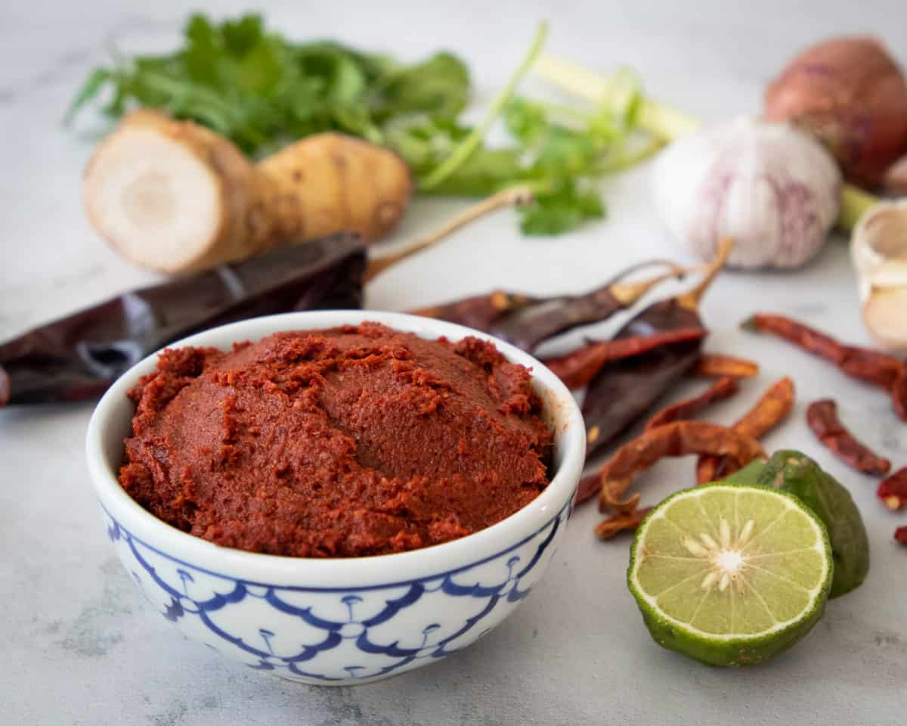

# Southern Thai Red Curry Paste (Kruang Kaeng Tai)

*A southern Thai red curry paste built for water-based curries: more dried chillies, more turmeric, no coconut milk to soften the edges. The hottest of the Thai red pastes, eaten with rice and bitter greens.*

**Prep Time:** 20 minutes

**Cook Time:** 5 minutes

**Yield:** Approximately 200 grams

## Overview
Southern Thai red curry paste is the building block for the hottest Thai curries on the map: thin water-based brick-red curries like kaeng tai and kaeng pa that come out of the southern peninsula, where the cooking leans on dried chilli and fresh turmeric rather than coconut milk to round things off. Where the central Thai paste uses shallots and coconut cream to soften the chilli heat, the southern paste doubles the dried chillies, adds fresh turmeric for the typical yellow-tinged red, and is engineered to be cooked in water or fish stock without a single splash of coconut milk to mellow it. The paste is properly fierce on its own; taste a quarter teaspoon diluted in a tablespoon of water before deciding how much to use, especially if you're new to southern Thai cooking. Slit and deseed 25 dried long red chillies (keep the seeds in for serious heat, leave out for fierce but manageable), soak 15 minutes in hot water till pliable. Toast the white and black peppercorns in a dry pan for a minute and grind to a powder. In a large stone mortar, pound the bruised lemongrass, galangal, fresh turmeric and a pinch of salt for 4 to 5 patient minutes till the lemongrass fibres break down completely (a food processor produces a watery purée and ruins the texture, so this is hand-work all the way). Add the garlic, shallots, kaffir lime zest and coriander root, pound again till smooth, then work in the chillies a handful at a time as the colour shifts from green to deep brick red. Finally pound in the ground peppercorns, the warmed shrimp paste and the remaining salt. Wear gloves; capsaicin from 25 chillies will sting your hands for hours otherwise.

## Ingredients

### Dried chillies
- 25 dried long red chillies (sometimes called dried prik chee fa)
- 10 small dried bird's eye chillies (prik haeng, optional, for serious heat)
- 1 cup hot water (to soak)

### Fresh aromatics
- 3 lemongrass stalks (tender lower portions only)
- 30 g fresh galangal (peeled, sliced and bruised)
- 30 g fresh turmeric (peeled, sliced) or 1 tsp ground turmeric
- 6 garlic cloves (peeled)
- 100 g shallots (finely chopped)
- Zest of 1 kaffir lime (or 4 kaffir lime leaves, finely chopped)
- Stems from 6 fresh coriander sprigs

### Spices and seasoning
- 1 tsp white peppercorns
- 1 tsp black peppercorns
- 1 tbsp shrimp paste (about 15 g)
- 1 tsp fine sea salt

## Method

### Stage 1 - Soften the chillies
1. Slit each dried chilli lengthways and shake out the seeds (keep them in for higher heat).
1. Place the deseeded chillies in a bowl and pour over the cup of hot water. Weight them down with a small plate so they stay submerged. Soak for 15 minutes, until pliable.
1. Drain, reserving 2 tbsp of the soaking liquid. Chop the chillies roughly.

### Stage 2 - Prepare the aromatics
1. Slice the tender lower portion of the lemongrass into thin rings (discard the woody upper portions). Bruise the slices with the side of a knife to release oils.
1. Peel the galangal with the edge of a spoon and slice thinly. Bruise the slices.
1. Peel and slice the fresh turmeric the same way. (Wear gloves; fresh turmeric stains.)
1. Wrap the shrimp paste in a small square of foil and warm it briefly over a flame or in a dry pan for 15-20 seconds, until aromatic. Unwrap.

### Stage 3 - Pound the paste
1. Toast the white and black peppercorns in a dry pan over medium heat for 1 minute, until fragrant. Grind to a powder in a mortar or spice grinder.
1. In a large stone mortar, pound the lemongrass, galangal, turmeric and a pinch of the salt to a rough paste. Work steadily; the fibres in lemongrass need to break down properly. This takes 4-5 minutes by hand.
1. Add the garlic, shallots, lime zest and coriander stems. Pound again until smooth.
1. Add the soaked chillies a handful at a time, pounding between each addition. The mixture will go from rough purée to deep brick-red paste.
1. Work in the ground peppercorns, then the warmed shrimp paste, then the remaining salt. Add the reserved chilli-soaking liquid a teaspoon at a time only if the paste resists further pounding; you want a thick, sticky paste, not a wet one.
1. The finished paste should be smooth enough to drop from a spoon in a slow ribbon. Aim for 5-8 minutes total pounding time after the chillies go in.

## Notes
- **A food processor is a poor substitute.** The blades heat the aromatics and produce a watery purée rather than a pounded paste. If you must use one, run it in short pulses with frequent scraping, and accept that the texture will be wrong.
- **The seeds carry most of the heat.** Removing them gives a paste that is still very hot but lets you taste the aromatics. Leaving them in produces a paste used by the spoon-tip rather than the spoonful.
- **Fresh turmeric is worth seeking out.** Frozen works (thaw, drain). Ground turmeric is the last resort and lacks the earthy, slightly bitter quality of fresh.
- **Toasted shrimp paste is non-negotiable.** Raw gapi is sharp and unpleasant; a brief warming over a flame transforms it.
- **Wear gloves while pounding.** Capsaicin from 25 dried chillies will sting your hands for hours otherwise.

## Variations
- **Without shrimp paste:** for a vegetarian version, substitute 2 tsp light soy sauce plus 1 tsp white miso. The flavour is slightly different but works.
- **With finger root (krachai):** a 30 g piece of fresh finger root, sliced and pounded with the galangal, gives the paste a sharper, more medicinal edge that is traditional in certain southern fish curries.
- **Less hot:** reduce the dried chillies to 15 (still meaningful heat) and omit the bird's eyes.

## Serving
Use in: southern Thai water-based curries (kaeng tai, kaeng som, kaeng pa), bitter-green stir-fries with pork belly, fish stews, and as a rub for grilled mackerel.

Typical ratio: 2 tbsp paste per 500 ml water or fish stock. Fry the paste briefly in 2 tbsp neutral oil before adding the liquid, to bloom the chillies and toast the spices. Do not finish with coconut milk; the paste is engineered to stand alone in water.

## Storage
- Refrigerate in an airtight glass jar with a thin layer of oil over the surface. Keeps 1 week.
- Freezes very well: portion into ice-cube trays, freeze, transfer to a bag. Keeps 3 months without losing heat or aroma.
- The fresh turmeric will stain everything it touches. Use a glass jar rather than plastic.
