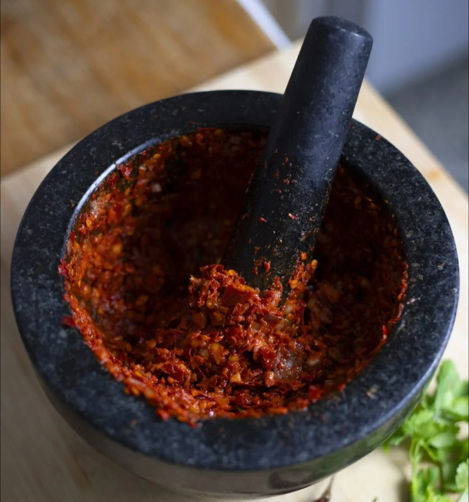

# Traditional Thai Red Curry Paste (Kruang Kaeng Phet)

*The proper Bangkok-style red curry paste: dried long red chillies softened in water, pounded with lemongrass, galangal, coriander root, kaffir lime, garlic and shallots into a deep brick-red paste with the seven traditional ingredients no central Thai cook would skip.*

**Prep Time:** 25 minutes (plus 15 minutes for the chillies to soak)

**Cook Time:** 2 minutes

**Yield:** Approximately 200 grams

## Overview
Traditional Thai red curry paste (kruang kaeng phet daeng) is the building block under the lacquered red coconut curries that define Thai restaurant cooking worldwide: chicken in red curry, duck red curry, phanaeng, jungle curry. The Bangkok recipe leans on seven non-negotiable ingredients: dried long red chillies, lemongrass, galangal, kaffir lime, coriander root, garlic and shrimp paste, with shallots, white peppercorns and toasted coriander and cumin rounding it out. Everything goes through a stone mortar, nothing shortcuts. The paste is designed to fry in the thick cream skimmed off an unshaken can of full-fat coconut milk; the cream heats till the oil splits, the paste blooms in it, and the result is the deep red glossy base you finish with palm sugar, fish sauce and lime. Hotter than the fresh-chilli version it often replaces on western shelves because dried chillies concentrate the heat, but also deeper and more aromatic. Soak deseeded dried chillies till pliable. Pound lemongrass, galangal, kaffir lime zest and coriander root for 4 to 5 minutes till the fibres break down, then work in garlic, shallots, chillies, ground toasted spices and warmed shrimp paste till smooth and deep red-brown.

## Ingredients

### Dried chillies
- 15 dried long red chillies (sometimes called dried prik chee fa or California-style dried chillies)
- 1 cup hot water (to soak)

### Fresh aromatics (the traditional seven)
- 3 lemongrass stalks (tender lower portions only, finely sliced)
- 20 g fresh galangal (peeled, sliced thinly and bruised)
- Zest of 1 kaffir lime (or 4 kaffir lime leaves, very finely chopped)
- 2 tbsp finely chopped coriander root (not stems; the white root proper, sometimes sold attached to the herb)
- 8 garlic cloves (peeled)
- 75 g shallots (finely chopped, about 3 small Thai shallots)
- 1 tbsp shrimp paste (about 15 g)

### Spices
- 1 tsp coriander seeds
- ½ tsp cumin seeds
- 1 tsp white peppercorns
- 1 tsp fine sea salt

## Method

### Stage 1 - Soften the chillies
1. Slit each dried chilli lengthways with kitchen scissors. Shake out the seeds for a moderate-heat paste; leave some in for a hotter paste.
1. Place the chillies in a bowl, pour over the hot water, weight them down with a small plate to keep them submerged, and soak 15 minutes, until soft and pliable.
1. Drain. Squeeze each chilli gently to expel excess water and chop roughly.

### Stage 2 - Toast and grind the spices
1. Heat a small dry pan over medium heat. Add the coriander seeds and toast 60 seconds, shaking the pan, until fragrant.
1. Add the cumin and toast a further 30 seconds. The aroma should be warm and nutty.
1. Tip the toasted seeds into a mortar or spice grinder along with the white peppercorns. Grind to a fine powder.

### Stage 3 - Warm the shrimp paste
1. Wrap the shrimp paste in a small square of foil. Hold it briefly over a gas flame, turning once, or warm it in a dry pan for 15-20 seconds, until pungent and aromatic. Unwrap and set aside.

### Stage 4 - Pound the paste
1. In a large stone mortar, combine the lemongrass, galangal, kaffir lime zest, coriander root and a pinch of the salt. Pound steadily with the pestle for 4-5 minutes, until the lemongrass fibres are completely broken down and the mixture is a rough green paste. (This is the longest single step and there is no shortcut. Lemongrass that is not properly pounded gives a stringy curry.)
1. Add the garlic and pound for 1 minute, until incorporated.
1. Add the shallots and pound for 1 minute.
1. Add the soaked chillies a small handful at a time, pounding well between each addition. The paste will shift from green to deep red as the chilli flesh breaks down. This takes 3-4 minutes.
1. Add the ground coriander, cumin and peppercorn. Pound for 30 seconds.
1. Add the warmed shrimp paste and remaining salt. Pound for a final 1-2 minutes, until the paste is uniform, smooth and a deep red-brown.

The finished paste should be thick enough to mound on a spoon and just sticky enough that a small scoop holds its shape briefly before settling. Total pounding time after the chillies go in: 5-7 minutes.

## Notes
- **Coriander root, not stem.** The white root proper has a deeper, earthier flavour than the green stem. A bunch of coriander sold with roots attached gives you both. If you cannot find rooted coriander, double the stems and add a pinch of ground coriander.
- **Dried long red chillies, not bird's eyes.** The long type (dried prik chee fa) has the brick-red colour and fruity depth this paste needs. Bird's eyes give heat but not colour or aroma.
- **Stone mortar over food processor, every time.** The pestle bruises and breaks the fibres; the processor blade slices them. A pounded paste fries cleanly into the coconut cream; a blended one releases water and seizes the oil split.
- **Toasted shrimp paste is non-negotiable.** Raw gapi smells of ammonia; a brief warming transforms it into something rich and complex.
- **Heat in this paste is a function of dried chilli seeds.** Most of the heat sits in the seed and inner ribs. Removing them gives a paste with full chilli flavour and moderate heat; leaving them in produces something noticeably hotter. Start with seeds out; you can always add a small bird's eye later.
- **Wear gloves.** Pounding 15 dried chillies leaves capsaicin on your hands that will sting for hours.

## Variations
- **For tom kha gai and other coconut soups:** reduce the chilli to 8 dried long reds and increase the galangal to 30 g. This shifts the paste toward the soup application without abandoning the structure.
- **For phanaeng curry:** add 30 g raw peanuts (skinned and roasted briefly) to the pounding, after the chillies go in. The peanuts thicken the paste and give the phanaeng its characteristic body. Phanaeng is sometimes referred to as red curry's richer cousin.
- **Vegetarian:** substitute the shrimp paste with 2 tsp light soy sauce plus 1 tsp brown miso, added at the end. The umami profile is different but works.

## Serving
Use in: classic red curry with chicken, beef or duck; phanaeng (with the peanut variation); jungle curry; red curry seafood stir-fries; massaman variants where a red base is appropriate.

The traditional technique:
1. Open a can of full-fat coconut milk without shaking. Spoon the thick cream off the top into a wide pan.
2. Heat the cream over medium heat until the oil splits out and the cream starts to look slightly broken.
3. Stir in 2-3 tbsp of paste per 400 ml coconut milk. Fry 60-90 seconds, until the paste deepens in colour and oil pools around the edge.
4. Add the protein, then the remaining thin coconut milk, then bring to a gentle simmer. Add palm sugar, fish sauce and lime juice to taste at the end.

## Storage
- Refrigerate in an airtight glass jar with a thin layer of oil over the surface. Keeps 5-7 days at peak flavour.
- For longer storage, portion into a silicone ice-cube tray (1 tbsp per cube), freeze solid, then transfer to a ziplock bag. Keeps 3 months without losing colour or aroma.
- Frozen paste goes straight into the hot coconut cream; no thawing needed.

*Authentic does not mean difficult. It means using the right ingredients in the right order with the right tool. A first batch will take an hour; the second will take half that; by the fifth you will not understand why anyone buys the jarred stuff.*
