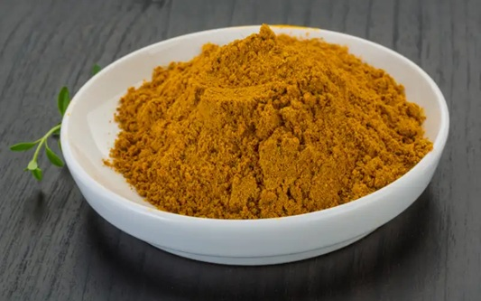

# Base Curry Powder

*The BIR base curry powder: turmeric, paprika, cumin, coriander, fenugreek and chilli ground together.*

**Prep Time:** 5 minutes

**Makes:** about 50 g

## Overview
The foundation spice blend of the British-Indian restaurant (BIR) kitchen: coriander, cumin, turmeric, paprika, chilli powder, garlic powder and ginger powder mixed together into a balanced all-purpose curry powder that goes into most curry-house dishes. The mix is the workhorse spice blend that every British curry house uses as the base for jalfrezi, madras, dopiaza, balti and dozens of other dishes; from this single jar a kitchen can build dozens of different finished curries by adjusting the chilli, the tomato base and the finishing spices. Pre-ground supermarket curry powder is the everyday home cook's substitute, but a freshly mixed blend tastes brighter and more aromatic, and keeps for two or three months in a sealed jar. The exact ratio varies between curry-house kitchens; this is a widely accepted middle version that works as a default starting point.

## Ingredients
- 2 tbsp coriander powder
- 1 tbsp cumin powder
- 1 tbsp turmeric
- 1 tbsp paprika
- 1 tsp chilli powder
- 1 tsp garlic powder
- 1 tsp ginger powder

## Method
1. Combine all ingredients in a bowl.
2. Mix thoroughly until uniform.
3. Store in an airtight container.

## Notes
- Mild, balanced, and versatile.
- Forms the backbone of most curries.

## Serving
- Use 1-2 tsp per curry as a base layer of flavour.

## Storage
- Store in an airtight container in a cool, dry place for up to 6 months
- Keep away from direct sunlight and moisture
