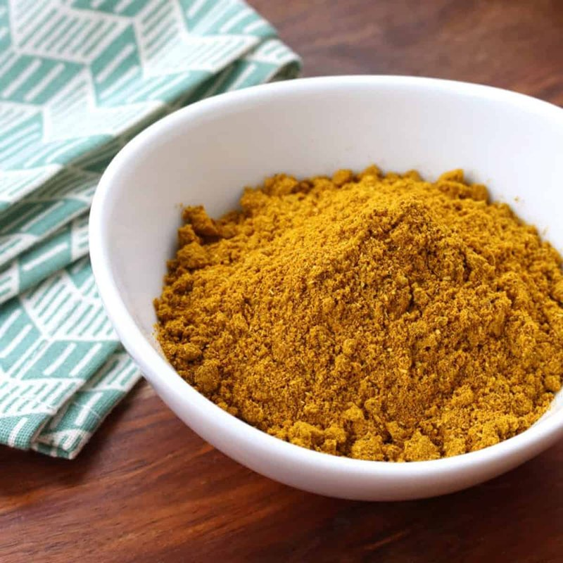

# Classic Curry Powder

*The classic British curry powder: toasted coriander, cumin, fenugreek, turmeric and dried chilli ground together.*

**Prep Time:** 10 minutes

**Yield:** Approximately 115 grams (makes 20-25 curry portions)

## Overview
Classic curry powder is the building block of British-Indian home cooking: the workhorse dry spice blend you fry with onions at the start of a curry, with the immediately recognisable coriander-cumin-turmeric profile that defined the kind of curry your grandmother made. Unlike garam masala (which gets stirred in at the end) or tandoori paste (which is rubbed onto meat before grilling), curry powder is the foundation blend, designed to bloom in hot oil and become the flavour bones of the sauce. The heat level is entirely up to you and depends on what you do with the chillies before they hit the pan. Deseed them all and remove the white membranes for a mild curry, leave seeds in for moderate heat, or leave the chillies whole for fiery. Place the dried red chillies, coriander seeds, cumin, fenugreek, mustard seeds and black peppercorns in a dry heavy pan over medium heat and shake constantly for 5 to 7 minutes till everything turns fragrant and noticeably darker. Watch carefully because the moment they smoke they turn bitter, and burnt curry powder ruins every curry it touches. Tip onto a cool plate to halt the roast, let cool completely to room temperature so the warm spices don't clump in the grinder (10 to 15 minutes), then grind in a spice grinder or mortar and pestle to a fine even powder. Stir in the ground turmeric and ginger thoroughly so the colour and warmth distribute evenly through the blend. Store in an airtight jar in a cool dark place; the powder is good for around 6 months before the aromatics fade. Use 2 to 4 teaspoons per curry portion depending on how loud you want the spice.

## Ingredients

### Whole Spices
- 8 dried red chillies (deseeded for milder blend)
- 7 tablespoons coriander seeds
- 4 tablespoons cumin seeds
- 2 teaspoons fenugreek seeds
- 2 teaspoons black mustard seeds
- 2 teaspoons black peppercorns

### Ground Spices to Add After Roasting
- 1 tablespoon ground turmeric
- 1 teaspoon ground ginger

## Method

### Stage 1 - Prepare Chillies
1. Take each dried red chilli in your hands.
1. For milder curry: snap or cut off the top of each chilli and remove all seeds and white membranes.
1. For moderate heat: remove seeds but leave some membrane intact.
1. For fiery curry: leave chillies whole with all seeds.
1. Measure remaining whole spices.

### Stage 2 - Dry Roast
1. Place a heavy-bottomed pan over medium heat with no oil.
1. Add the chillies, coriander seeds, cumin seeds, fenugreek seeds, mustard seeds, and peppercorns.
1. Immediately begin shaking the pan continuously as the spices heat.
1. After 4-5 minutes, the spices will be aromatic and noticeably darker.
1. Continue for another 1-2 minutes if the aroma isn't deep enough.
1. Never allow the spices to smoke; that indicates burning and bitterness.
1. Transfer immediately to a cool surface to stop cooking.

### Stage 3 - Cool Completely
1. Allow roasted spices to cool to room temperature (10-15 minutes).

### Stage 4 - Grind to Powder
1. Tip roasted spices into a mortar or spice grinder.
1. Grind thoroughly to a fine, smooth powder.
1. Work in batches if necessary.
1. The result should have no visible spice fragments.

### Stage 5 - Add Ground Spices & Mix
1. Stir in the turmeric and ginger.
1. Mix very thoroughly to ensure even distribution.

### Stage 6 - Store
1. Use immediately or transfer to an airtight jar protected from strong light and heat.
1. Label with the date; this powder is best used within 6 months.

## Notes
- **Chilli Seed Removal:** The single biggest factor in heat level. Remove all seeds for mild curry; keep seeds for hot curry.
- **Constant Pan Shaking:** Essential to prevent hot spots and burning. Never leave it unattended.
- **Cooling First:** Absolutely necessary before grinding; warm spices will clump and oil-coat the grinder.
- **Storage:** The powder loses aromatic potency after 6 months; don't keep longer.
- **Personalization:** Adjust chilli heat, add extra cinnamon for sweetness, or extra turmeric for color depth based on preference.

## Variations
**Spicier:** Keep all chilli seeds; add 1 extra dried chilli.
**Sweeter:** Add 1 cinnamon stick and ½ teaspoon ground cinnamon after roasting.
**Extra Warmth:** Increase ground ginger to 2 teaspoons.
**Milder & Aromatic:** Remove all chilli seeds; add ½ teaspoon ground cardamom after grinding.

## Serving
Use in: Classic British-Indian curries, chicken curries, vegetable curries, sauce bases
Typical ratio: 2-4 teaspoons per curry portion depending on heat preference
Application: Fry in oil with onions and aromatics before adding liquid
Temperature: Best activated by hot oil for flavor blooming

## Storage
- Store in airtight jar in cool, dark place away from light and heat
- Keeps well for 6 months; after that, flavor fades gradually
- Does not require refrigeration
- Check aroma before using in important dishes
- Make fresh every 6-8 months for optimal flavor
- Label with preparation date

*This is the classic British-Indian curry powder, the foundation for generalized curry dishes. Roast, grind, and store to create the aromatic base that transforms a simple dish into something memorable.*
