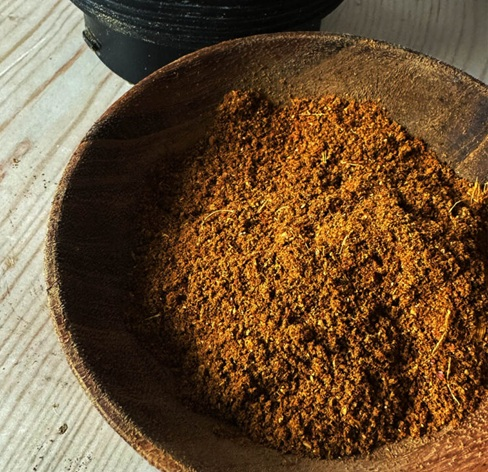

# Dhansak Spice Mix

*A Parsi-inspired dhansak spice mix: coriander, cumin, fenugreek.*

**Prep Time:** 5 minutes

**Makes:** about 30 g

## Overview
The British curry-house dhansak spice blend: coriander, cumin, turmeric, paprika, cinnamon and mustard powder mixed together as the foundation for the sweet-sour-savoury dhansak curry. Dhansak is one of the original Parsi-Indian dishes, traditionally a slow-cooked lentil-and-meat stew eaten by the Zoroastrian community on Sundays and at funerals (the wedding-day taboo is real), but the British curry-house version dropped the lentils and reinvented the dish as a sweet-and-sour pineapple-flecked curry that bears little resemblance to the Bombay original. This blend supports both versions: the cinnamon and mustard powder push toward the sweet-sour profile, the coriander-cumin-paprika base toward the savoury depth. Lighter than a madras mix and warmer than a korma. Keeps two or three months in a sealed jar; better the fresher it is.

## Ingredients
- 2 tsp coriander
- 1 tsp cumin
- 1 tsp turmeric
- 1 tsp paprika
- ½ tsp cinnamon
- ½ tsp mustard powder

## Method
1. Mix all spices together.
2. Store in an airtight container.

## Notes
- Works particularly well with lentils and sweet-sour profiles.

## Serving
Use 2 tsp per dhansak.

## Storage
- Store in an airtight container in a cool, dry place for up to 6 months
- Keep away from direct sunlight and moisture
