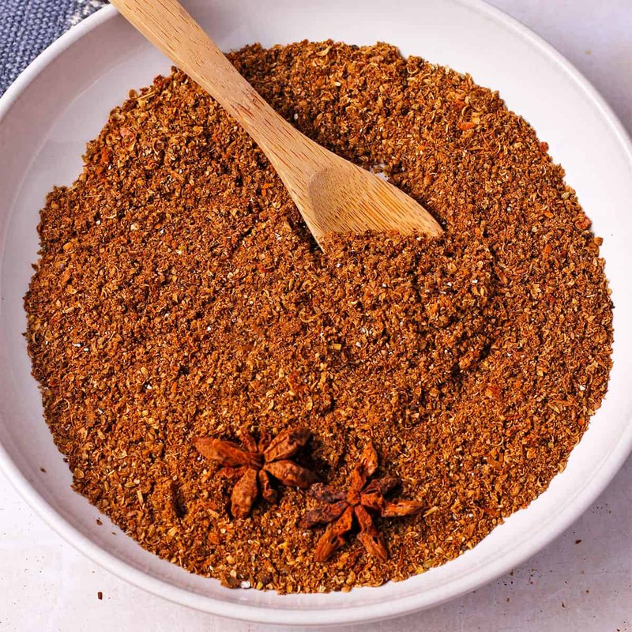

# Garam Masala (Kashmiri)

*The Kashmiri garam masala: a more delicate blend with fennel, dried rose petals and a heavier hand of cardamom. Less heat, more perfume.*

**Prep Time:** 10 minutes

**Yield:** Approximately 200 grams (makes 30+ curry portions)

## Overview
Kashmiri garam masala is the building block for the elegant aromatic finishing spice of north Indian palace cookery, distinguished from the classic by what it leaves out as much as what it puts in. There are no chillies here; the warmth comes purely from green cardamom, cinnamon, clove, mace and pepper, and the perfume comes from dried rose petals, aniseed and optional saffron stamens. It's a finishing blend, stirred in at the very end of cooking or sprinkled across a finished pilaf or curry just before serving; never added at the start, because the long heat would destroy the delicate floral and citrus aromatics that make Kashmiri cooking distinctive. Place all the ingredients (coriander seeds, white cumin seeds, aniseed, broken cinnamon stick, green cardamom seeds, cloves, dried mint leaves, bay leaves, and the optional rose petals and saffron) in a dry heavy pan over medium heat and shake the pan continuously for 4 to 6 minutes till the spices turn fragrant and noticeably darker. Watch the rose petals; they're fragile and burn first, so if they start crisping too fast, pull the pan off. The moment the kitchen fills with a deep floral-warm aroma, tip onto a cold plate to halt the roast. Cool to room temperature (around 15 minutes) so warm spices don't clump in the grinder, then grind in small batches in a spice grinder or mortar to a fine even powder. Store in an airtight glass jar in a cool dark place; the spices mature and meld over 1 to 2 weeks, so make it ahead if you can. Use to finish biryanis, kormas, white curries, fragrant pilafs and Kashmiri-style yoghurt-based gravies; half to one teaspoon per serving sprinkled at the end is plenty.

## Ingredients

### Whole Spices  
- 4 ½ tablespoons coriander seeds
- 2 ½ tablespoons white cumin seeds
- 5 teaspoons aniseed
- 1 cinnamon stick (broken into pieces)
- 1 ½ tablespoons green cardamom seeds
- 1 tablespoon cloves
- 1 ½ teaspoons dried mint leaves
- 6 bay leaves

### Optional Luxurious Additions
- 1 tablespoon dry rose petals (optional but recommended)
- 1 teaspoon saffron stamens (optional but authentic)

## Method

### Stage 1 - Prepare Spices
1. Break the cinnamon stick into small pieces (1-2 cm each).
1. Lightly crush the cardamom seeds to expose seeds inside.
1. Measure all ingredients.

### Stage 2 - Dry Roast
1. Place a large wok or heavy-bottomed pan over medium heat with no oil.
1. Add all ingredients: coriander seeds, cumin seeds, aniseed, cinnamon pieces, cardamom, cloves, mint, bay leaves, and optional rose petals and saffron.
1. Immediately begin shaking the pan continuously as spices heat.
1. After 3-4 minutes, the spices will become fragrant and visibly darker.
1. Continue for another 1-2 minutes until the aroma is noticeably aromatic.
1. Do not allow smoking; remove from heat immediately.
1. Allow to cool slightly before grinding.

### Stage 3 - Cool Completely
1. Transfer to a cool surface and allow to reach room temperature (10-15 minutes).

### Stage 4 - Grind to Powder
1. In batches, add roasted spices to a mortar and grind with pestle to fine powder.
1. Alternatively, use a spice grinder in small batches.
1. Work until you have a consistent, fine powder.

### Stage 5 - Mix & Combine
1. After grinding all batches, combine all ground powder in a bowl.
1. Stir thoroughly for 1-2 minutes to ensure even distribution of all spices and delicate elements (rose petals, saffron).

### Stage 6 - Store
1. Transfer to airtight jar in cool, dark place.
1. Label with date.
1. Store away from light and heat.
1. The spices will develop better flavor over 1-2 weeks.

## Notes
- **Kashmiri Philosophy:** This is a finishing blend emphasizing elegance over heat. Cardamom, cinnamon, and cloves provide warmth; rose and saffron add luxury.
- **Rose Petals & Saffron:** These are optional but mark authentic Kashmiri recipes. They add floral notes and pale color that distinguish this from classic garam masala.
- **Grinding in Batches:** The delicate rose petals and saffron require careful handling. Grinding in small batches prevents over-processing.
- **Application Timing:** Add 1-2 minutes before end of cooking or sprinkle over finished dishes; never cook for extended time.
- **Maturation:** Leave for 1-2 weeks before using if possible; flavors meld and intensify.

## Variations
**Extra Aromatic:** Add ½ teaspoon additional dried mint.
**Heavier:** Add ½ teaspoon ground ginger after grinding for earthiness.
**Richer Color:** Increase rose petals to 1 ½ tablespoons.
**More Saffron:** Increase saffron to 1 ½ teaspoons for deeper color and aroma.

## Serving
Use in: Kashmiri curries, fragrant rice pilafs, finishing spice for soups and stews
Typical ratio: ½-1 teaspoon sprinkled per serving
Application: Add 1-2 minutes before serving or sprinkle over finished dish
Temperature: Never cook for extended time; add near end of cooking only

## Storage
- Store in airtight jar in cool, dark place away from light and heat
- Keep away from moisture
- Properly stored remains flavorful for 8-10 months
- Check aroma after 6 months before using in important dishes
- Rose petals and saffron fade with time and light exposure
- Make fresh every 8-10 months for optimal quality
- Label with preparation date
- Does not require refrigeration

*Garam masala is one of the keys to Northern Indian, Moghul, and Pakistani cooking. This Kashmiri version emphasizes fragrance over fire, featuring rose petals and optional saffron for luxurious warmth. Garam means "hot" and masala means "spices", this one heats from the inside out.*
