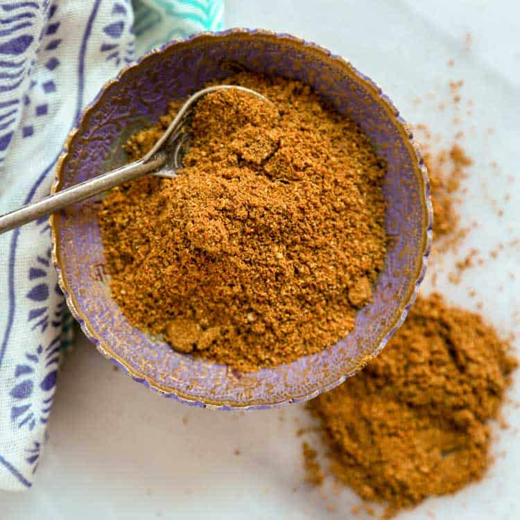

# Malayan Curry Powder

*A Malaysian-Chinese curry powder: turmeric, coriander, cumin and fennel scented with cinnamon and star anise.*

**Prep Time:** 15 minutes

**Yield:** Approximately 60 grams (makes 12-15 curry portions)

## Overview
Malayan curry powder is the building block for Malaysian-Chinese chicken and fish curries: an Indian-derived blend reworked with Sichuan peppercorns, star anise and nutmeg so the profile leans aromatic and slightly numbing rather than fiery. The Sichuan pepper gives the distinctive tingling quality (ma) that pairs beautifully with chicken and white fish, while cinnamon, cloves and nutmeg keep it deeply fragrant without burn. Dry-roast the chillies, cloves, cinnamon, coriander, fennel and Sichuan peppercorns till the kitchen fills with peppery aroma, cool, then grind. Stir in freshly grated nutmeg, ground star anise and turmeric after grinding. Bloom briefly in hot oil with aromatics, 2 to 3 teaspoons per portion. The volatile aromatics fade fast: use within 3 months airtight.

## Ingredients

### Whole Spices
- 2 dried red chillies (deseeded for milder blend)
- 6 white cloves
- 1 cinnamon stick (small, broken into pieces)
- 1 teaspoon coriander seeds
- 1 teaspoon fennel seeds
- 2 teaspoons Sichuan peppercorns

### Ground Spices to Add After Roasting
- ½ teaspoon freshly grated nutmeg
- ½ teaspoon freshly ground star anise
- 1 teaspoon ground turmeric

## Method

### Stage 1 - Prepare Ingredients
1. Snap or cut the tops off dried chillies and remove seeds (for milder blend).
1. Break cinnamon stick into small pieces.
1. Grate fresh nutmeg (not pre-ground if possible).

### Stage 2 - Dry Roast
1. Place a heavy-based frying pan over medium heat with no oil.
1. Add chillies, cloves, cinnamon pieces, coriander seeds, fennel seeds, and Sichuan peppercorns.
1. Continuously toss spices as they heat for 4-5 minutes.
1. They will give off a rich, distinctive aroma; Sichuan pepper will smell peppery and numbing.
1. Remove from heat and allow to cool.

### Stage 3 - Cool Completely
1. Transfer to a cool surface; allow 10 minutes cooling.

### Stage 4 - Grind to Powder
1. Tip roasted spices into a mortar and grind to fine powder.
1. Sift to remove any large pieces.
1. The powder should be fine and consistent.

### Stage 5 - Add Ground Spices & Mix
1. Stir in nutmeg, star anise, and turmeric.
1. Mix thoroughly for 1-2 minutes.

### Stage 6 - Use
1. Use immediately for best flavor.
1. Can be stored in an airtight jar away from light and heat for up to 3 months.

## Notes
- **Sichuan Pepper:** Creates the signature numbing sensation that distinguishes this from Indian blends. Don't omit.
- **Delicate Application:** This blend is best with chicken and fish; it would be overpowered by robust meats.
- **Nutmeg & Star Anise:** Even small amounts significantly flavor the final blend; measure carefully.
- **Fresh Nutmeg:** Pre-ground nutmeg loses potency quickly; grating fresh is vastly superior.

## Variations
**For Fish:** Reduce chillies to 1; slightly increase fennel to 1 ½ teaspoons.
**Spicier:** Keep chilli seeds; use 3 chillies total.
**Earthier:** Add ½ teaspoon ground coriander seed after grinding.

## Serving
Use in: Malayan chicken curries, fish curries, aromatic poultry dishes
Typical ratio: 2-3 teaspoons per curry portion
Application: Fry in oil with aromatics before adding liquid
Temperature: Works best fried in hot oil for flavor bloom

## Storage
- Best used immediately but keeps in airtight jar 3 months
- Store away from light and heat
- Does not require refrigeration
- Flavor fades after 3 months

*This spice blend is excellent for poultry, especially chicken, and works beautifully with robust fish curries. The balance of warm spices with Sichuan pepper creates a distinctive regional character that separates Malaysian cooking from Indian curry traditions.*
