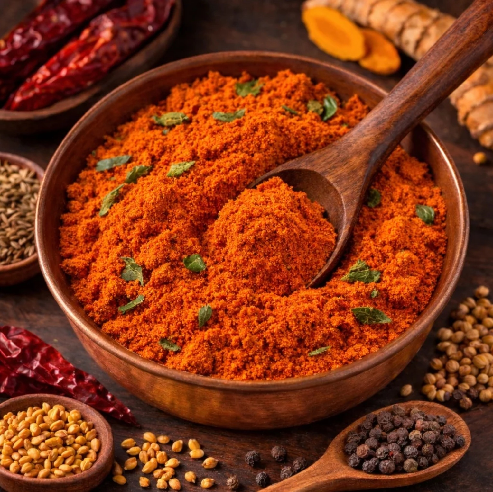

# Sambar Powder

*South India's sambar powder: dry-roasted lentils ground with coriander, cumin, fenugreek, chilli and curry leaves.*

**Prep Time:** 10 minutes

**Cook Time:** 4 minutes

**Yield:** Approximately 105 grams (makes 20-25 curry portions)

## Overview
Sambar powder is the building block for south Indian lentil and vegetable cookery: a Tamil spice blend that's unlike any northern curry powder because it includes roasted split lentils (urad dhal, channa dhal and mung dhal) ground in with the spices. The lentils do two jobs: they add a savoury earthy depth that's distinctly south Indian, and the ground starch acts as a subtle thickener that gives sambar its characteristic body without flour or cornflour. Roast in two stages because lentils brown faster than seed spices and burn before the spices are fragrant if you put them together. First, deseed and dry-roast the dried red chillies with coriander seeds, cumin, peppercorns and fenugreek in a dry pan over medium heat for 4 to 5 minutes till everything darkens and the kitchen smells deeply toasted; tip into a bowl to cool. Clean and dry the pan, return to medium heat and add the urad dhal, channa dhal and mung dhal; toast for 3 to 4 minutes shaking constantly till the lentils turn a shade darker and smell nutty (they catch quickly so don't walk away). Cool everything completely, then grind to a fine powder in a mortar or spice grinder; the lentils break down into a slightly grainy texture that disappears once the powder hits hot oil. Sieve and re-grind any large pieces. Stir in the turmeric thoroughly so the colour goes uniform. Use 2 to 3 teaspoons per portion in sambar, kuzhambu, vegetable curries and any south Indian lentil stew; unlike most curry powders, sambar powder doesn't need blooming in hot oil first because the lentils carry their own flavour through long simmering. Stores 6 to 8 months airtight in a cool dark place.

## Ingredients

### Whole Spices
- 8 dried red chillies (deseeded for milder blend)
- 6 tablespoons coriander seeds
- 2 tablespoons cumin seeds
- 2 teaspoons black peppercorns
- 2 teaspoons fenugreek seeds

### Legumes to Roast Separately
- 2 teaspoons white split gram beans (urad dhal)
- 2 teaspoons yellow split peas (channa dhal)
- 2 teaspoons yellow mung beans (mung dhal)

### Ground Spice to Add After Roasting
- 1 ½ tablespoons ground turmeric

## Method

### Stage 1 - Prepare Chillies & Spices
1. Snap or cut tops off dried chillies and remove seeds.
1. Measure all whole spices and legumes.

### Stage 2 - Dry Roast Spices (First Phase)
1. Place a heavy-bottomed pan over medium heat with no oil.
1. Add chillies, coriander seeds, cumin seeds, peppercorns, and fenugreek seeds.
1. Continuously stir and shake the pan as they heat for 4-5 minutes.
1. They'll become aromatic and visibly darker.
1. Pour into a bowl to cool at room temperature (about 5 minutes).

### Stage 3 - Toast Legumes (Second Phase)
1. Return the same pan to medium heat (clean and dry).
1. Add the urad dhal, channa dhal, and mung dhal.
1. Toast continuously, shaking the pan frequently, for 3-4 minutes.
1. The legumes will change color slightly and become fragrant.
1. Watch carefully; they burn easily. Remove as soon as fragrant.
1. Transfer to the bowl with roasted spices; allow to cool completely.

### Stage 4 - Grind to Powder
1. Combine cooled spices and legumes in a mortar.
1. Grind thoroughly to a fine, smooth powder.
1. The result should be consistent with no visible lentil pieces.
1. Sift to remove any large particles; re-grind larger pieces.

### Stage 5 - Add Turmeric & Mix
1. Stir in the ground turmeric.
1. Mix very thoroughly for 1-2 minutes to ensure even distribution.

### Stage 6 - Store
1. Use immediately or store in airtight jar away from direct light and heat.
1. Label with date; best used within 6-8 months.

## Notes
- **Legume Roasting Separate:** The legumes toast much faster than whole spices; roasting them separately prevents burning.
- **Thickening Power:** The ground legumes provide body and thickening, making this powder ideal for soups and braised dishes, not just curry sauces.
- **Dhal Types:** Urad, channa, and mung dalhs are traditional; don't substitute other legumes.
- **Heat Adjustment:** Deseed chillies for milder sambar; leave seeds for hotter.

## Variations
**Milder Version:** Thread 4 chillies and remove all seeds.
**Thicker Consistency:** Add 1 additional teaspoon of mung dhal to the roasting.
**Extra Aromatic:** Add 1 teaspoon coriander seeds to the seed-spice roasting.

## Serving
Use in: South Indian vegetable curries, sambar soup, lentil dishes, braised vegetable combinations
Typical ratio: 2-3 teaspoons per portion depending on dish
Application: Fry in oil with vegetables; add liquid and ingredients
Temperature: Can be stirred in during cooking (doesn't require blooming like some powders)

## Storage
- Store in airtight jar in cool, dark place away from light and heat
- Best used within 6-8 months
- Does not require refrigeration
- The roasted legumes begin to lose potency and absorb moisture over time; make fresh quarters for optimal quality
- Check for clumping or moisture before each use

*This distinctive South Indian blend combines whole spices with roasted lentils (dhal), creating a complex powder that flavors vegetable and lentil combinations while simultaneously thickening braised dishes and spicy broths. Sambar is essential to South Indian cooking.*
