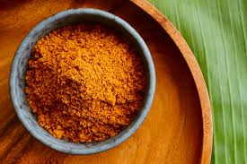

# Singapore Curry Powder

*Singapore's curry powder: a Tamil-Malay blend of coriander, cumin, fennel, turmeric and dried chilli.*

**Prep Time:** 10 minutes

**Yield:** Approximately 75 grams (makes 15-20 curry portions)

## Overview
Singapore curry powder is the building block for Singapore-style chicken curries, fish curries and the noodle dishes that draw on the island's Tamil-Malay-Chinese culinary crossroads: an Indian-foundation blend with extra cinnamon and cardamom for sweetness and more chilli heat than typical Indian curry powder, balanced into something more complex than either tradition alone. The signature is the interplay between the sweet warm spices (cinnamon, cardamom, clove) and the chilli heat; that combination is what makes Singapore curry distinct from a north Indian curry and from a Thai paste. Snap the tops off the dried red chillies and remove the seeds for a milder blend (or leave whole for spicier), break the cinnamon stick into small pieces and lightly crush the cardamom pods to expose the seeds. Place the whole spices (coriander, cumin, fennel, chillies, peppercorns, cinnamon pieces, cardamom pods, cloves) in a dry heavy pan over medium heat and toss continuously for 5 to 6 minutes till everything turns fragrant and noticeably darker. Tip onto a cool plate to halt the roast and let everything cool to room temperature (around 15 minutes; warm spices clump in the grinder). Once cool, snap open the cardamom pods and extract the seeds, discard the pods (the husks would give a fibrous texture in the final blend). Grind everything (including cardamom seeds) in a spice grinder or mortar to a fine consistent powder, sieve, and re-grind larger pieces. Stir in the ground turmeric thoroughly to even out the colour. Best used fresh or within 2 to 3 months; the volatile aromatics from the cardamom and cinnamon fade faster than seed-spice powders. Use 2 to 4 teaspoons per portion, fried in hot oil with aromatics before adding liquid.

## Ingredients

### Whole Spices
- 3 dried red chillies (deseeded for milder, whole for spicier)
- 6 tablespoons coriander seeds
- 1 tablespoon cumin seeds
- 1 tablespoon fennel seeds
- 2 teaspoons black peppercorns
- 1 cinnamon stick (broken into pieces)
- 4 green cardamom pods
- 6 cloves

### Ground Spice to Add After Roasting
- 2 teaspoons ground turmeric

## Method

### Stage 1 - Prepare Whole Spices
1. Snap or cut tops off dried chillies; remove seeds for milder blend (leave whole for spicier).
1. Break cinnamon stick into small pieces.
1. Lightly crush cardamom pods to expose seeds.

### Stage 2 - Dry Roast
1. Place a large heavy-based pan over medium heat with no oil.
1. Add coriander, cumin, and fennel seeds along with chillies and peppercorns.
1. Add cinnamon pieces, cardamom pods, and cloves.
1. Continuously stir and toss the spices as they heat for 5-6 minutes.
1. The spices will become aromatic and noticeably darker.
1. Do not allow smoking; remove from heat immediately if that occurs.
1. Transfer to cool surface and allow to reach room temperature.

### Stage 3 - Prepare for Grinding
1. Once completely cool, break cinnamon into smaller pieces if needed.
1. Remove seeds from cardamom pods, discarding the pods.
1. Leave remaining spices intact.

### Stage 4 - Grind to Powder
1. Tip all roasted spices including cardamom seeds into a mortar or spice grinder.
1. Grind thoroughly to a fine, consistent powder.
1. Work in small batches if using a grinder.
1. Sift to remove larger particles; re-grind as needed.

### Stage 5 - Add Turmeric & Mix
1. Stir in turmeric.
1. Mix very thoroughly for 1-2 minutes to ensure even distribution.

### Stage 6 - Use
1. Use immediately for best flavor and aroma.
1. Can store in airtight jar away from light if needed.

## Notes
- **Cinnamon & Cardamom:** These sweet spices balance the chilli heat and distinguish this from South Indian powders.
- **Chilli Heat Adjustment:** Removing seeds cuts heat significantly; leave seeds for authentic spicier version.
- **Freshness Premium:** This powder is best used immediately or within 1-2 months; flavor fades quickly compared to other blends.

## Variations - Fish/Seafood Version
Reduce complexity for delicate proteins:
- 2 dried red chillies (deseeded)
- 6 tablespoons coriander seeds
- 1 tablespoon cumin seeds
- 2 tablespoons fennel seeds (increased for freshness)
- 1 teaspoon fenugreek seeds
- 1 teaspoon black peppercorns
- 2 teaspoons ground turmeric

Roast and grind as above.

**Other Variations:**
- **Spicier:** Keep chilli seeds; increase to 4-5 chillies total.
- **Sweeter:** Add 1 additional cinnamon stick to roasting.
- **Earthier:** Add ½ teaspoon fenugreek seeds to initial roasting.

## Serving
Use in: Singapore curry dishes, Southeast Asian chicken curries, seafood preparations, noodle-based curries
Typical ratio: 2-4 teaspoons per portion depending on heat preference and protein type
Application: Fry in hot oil with aromatics before adding liquid and ingredients
Temperature: Best activated by blooming in hot oil

## Storage
- Best used immediately but keeps in airtight jar 2-3 months
- Store away from direct light and heat
- Does not require refrigeration
- Flavor fades relatively quickly compared to other spice powders
- Check aroma before using in important dishes after 2 months
- Label with preparation date

*Chillies are a key ingredient in this vibrant curry powder designed for Southeast Asian cooking. The blend balances heat with aromatic warmth, making it ideal for chicken curries and seafood preparations.*
