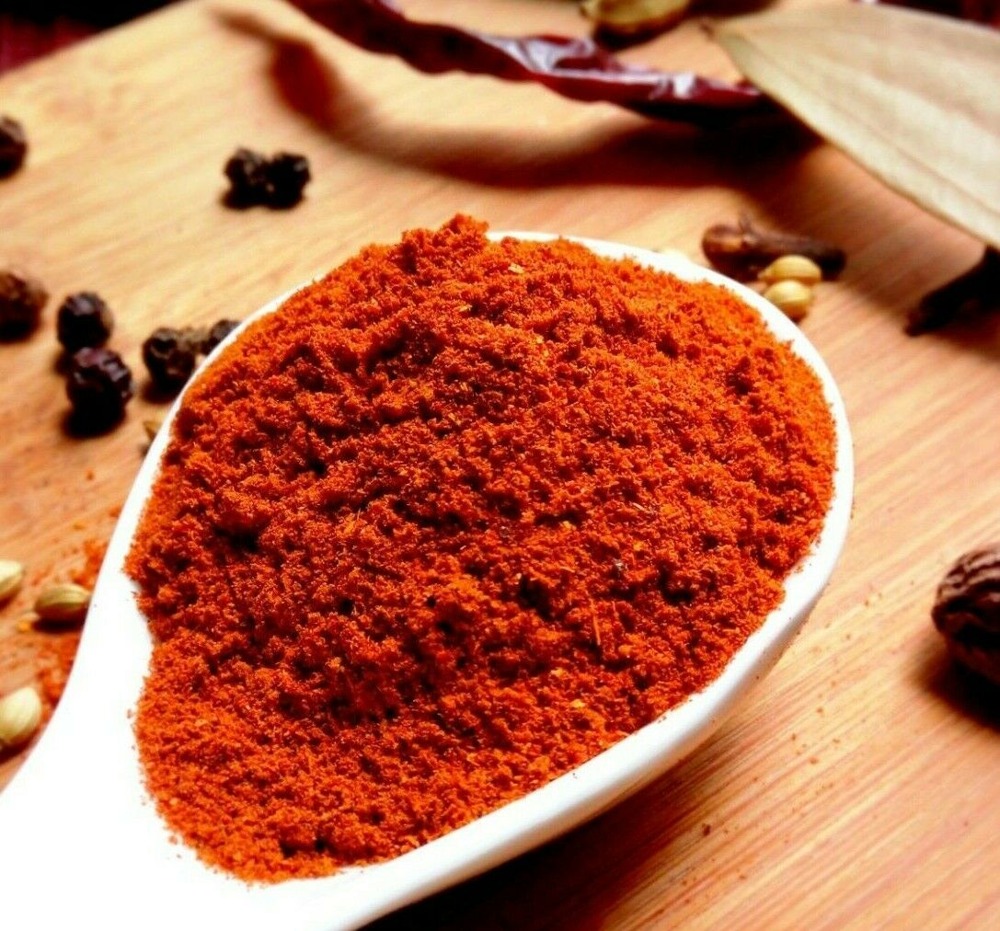

# Tandoori Masala

*A tandoori spice mix: paprika, Kashmiri chilli, ginger, garlic, cumin and amchoor. The deep-red rub for marinated meats hitting the tandoor.*

**Prep Time:** 8 minutes
**Cook Time:** 2 minutes

## Overview
The deep-red spice blend that defines tandoori cooking: coriander, cumin, mustard seeds, cinnamon or cassia, mace, Indian bay leaves, ginger, garlic powder, Kashmiri chilli, paprika, amchoor (dried mango powder) and salt, all roasted and ground together. The blend goes into yogurt-based marinades for tandoori chicken, lamb tikka, paneer tikka and anything else heading for the tandoor (or the home oven's hottest setting); Kashmiri chilli and paprika give the unmistakable glowing red-orange colour, the amchoor provides the natural sour edge. Most commercial tandoori masalas rely on salt, citric acid powder, low-grade ground spices and synthetic red food colouring; this homemade version uses freshly roasted whole spices and gets the tangy edge from amchoor rather than from acid powder, with far brighter, deeper flavour as a result. Keeps three months in a sealed jar.

**Makes:** 120g (1 ¼ cups)
## Ingredients
- 3 tbsp coriander seeds
- 3 tbsp cumin seeds
- 1 tbsp black mustard seeds
- 5cm (2in) piece of cinnamon stick or cassia bark
- Small piece of mace
- 3 dried Indian bay leaves (cassia leaves)
- 1 tbsp ground ginger
- 2 tbsp garlic powder
- 2 tbsp dried onion powder
- 2 tbsp amchoor (dried mango powder)
- 1 tbsp (or more) red food colouring powder (optional)

## Method

### Stage 1 - Roast Whole Spices
1. Roast the coriander seeds, cumin seeds, black mustard seeds, cinnamon, mace, and bay leaves in a dry frying pan over medium-high heat until warm to the touch and fragrant.
2. Move them around in the pan as they roast, being careful not to burn them.
3. If they begin to smoke, remove from heat immediately.

### Stage 2 - Cool & Grind
1. Tip the warm spices onto a plate and leave to cool completely.
2. Grind to a fine powder in a spice grinder or pestle and mortar.

### Stage 3 - Mix & Colour
1. Add ground ginger, garlic powder, onion powder, and amchoor to the ground spices.
2. Stir in red food colouring powder (if using). The masala will not look overly red like commercial brands.
3. Mix thoroughly.

## Notes
- **Colour note:** Food colouring powder becomes redder when stirred into a sauce, so don't overdo it.
- **Without colouring:** Omit the food colouring powder for a more natural appearance, the spices are flavorful enough without it.
- **Amchoor substitute:** If amchoor is unavailable, use a pinch of citric acid powder or extra lemon zest.

## Storage
- Store in an airtight container in a cool, dark place
- Use within 2 months for optimal flavour
