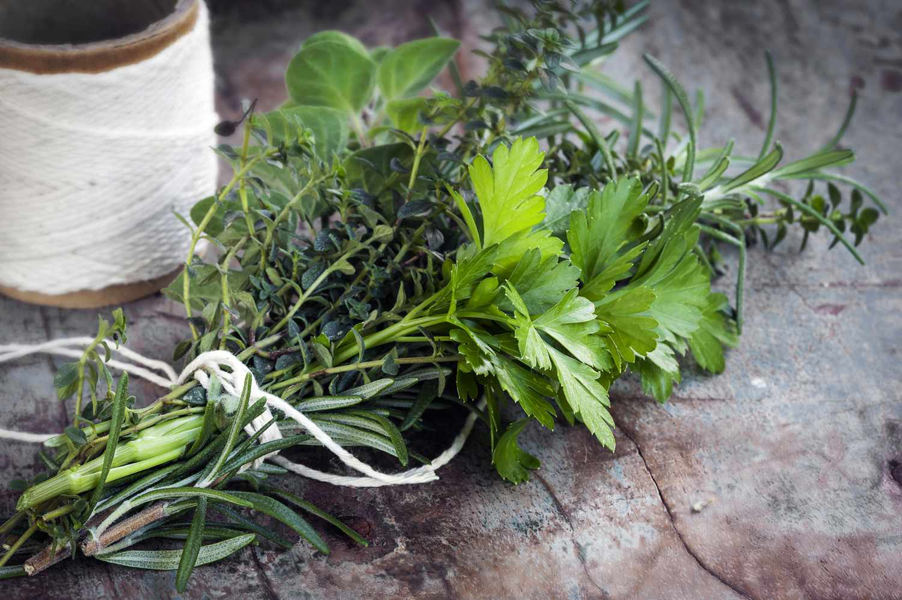

# Bouquet Garni

*The bouquet garni (French for "garnished bouquet") is a bundle of herbs tied together with string. It infuses stocks, soups, and stews with subtle flavor during cooking, then is removed before serving.*

**Yield:** 1 bouquet (flavors about 1 ½ liters of liquid)

**Prep Time:** 5 minutes

## Overview
The bouquet garni is the building block of French stocks, soups, braises and stews: a tidy bundle of fresh herbs tied with kitchen string that you drop into a pot to infuse its herbal character into the liquid, then fish out before serving so no stray bits of stalk or bay end up on the plate. The standard trio is fresh thyme, bay leaf and parsley (the parsley stems carry more flavour than the leaves and are the reason whole sprigs go in rather than chopped). Beyond those three, a sprig of oregano or a celery leaf rounds it out, depending on what you're cooking. Lay the herb sprigs on a clean surface with thicker stems pointing one way and leafy ends the other, group them into a loose bundle, then wrap a bay leaf around the base and tie firmly with food-safe cotton twine. Leave a long string tail so you can pull the bundle out of the pot by it. The whole thing takes 30 seconds, and the difference between a pot with a bouquet and one with chopped herbs floating loose is night and day; the flavours infuse cleanly into the liquid without leaving you to pick stems out of every spoonful. Use one bouquet per litre and a half of liquid. For long-cooking stocks and stews, the bouquet goes in at the start; for shorter delicate soups, add it 15 to 30 minutes before the end so the herbs don't turn musty. Pull it out before serving. Pre-tie a batch and freeze individually in clip-bags for up to three months; drop one straight into the pot from frozen, no thawing needed.

## Ingredients
- 2 sprigs fresh thyme (about 2-3 inches long)
- 2 dried bay leaves
- 6 sprigs fresh parsley (stems especially flavorful)
- 2 leaves fresh oregano (or celery leaf as substitute)
- 1 piece of clean string (cotton or twine, about 12 inches)

## Method

### Stage 1 - Bundle Herbs
1. Lay out all the herb sprigs on a clean surface.
1. Arrange them so the thicker stems point in one direction and leafy ends point in another.
1. Group them into a loose bundle.

### Stage 2 - Wrap & Tie
1. Take one bay leaf and wrap it around the base of the herb bundle.
1. Tie the bay leaf and herbs together firmly with the string, creating a tight bundle.
1. Secure with a knot, leaving a long string tail for easy retrieval from the pot.

## Notes
- **Proportions:** These ratios are flexible; the goal is balanced representation from each herb.
- **Fresh vs. Dried:** Use fresh thyme and parsley for better flavor; bay leaves are typically dried but can be fresh.
- **String Tying:** Tie securely so herbs don't scatter into the liquid, but ensure the string is food-safe and won't dissolve.
- **Easy Removal:** Leave a long string tail above the liquid surface for simple retrieval.
- **Steeping Time:** Shorter cooking times (15-30 minutes) for delicate soups; longer times (1-2 hours) for stews and stocks.

## Variations
**Italian Style:** Swap oregano for basil; include a sprig of rosemary.
**Creole Version:** Add a celery rib and a pinch of thyme.
**Hearty:** Include a small piece of fennel or a strip of lemon zest.

## Serving
Use in: Stocks, soups, stews, braised proteins
Timing: Add at the beginning of cooking; remove 10 minutes before finishing
Removal: Lift out using the string tail before plating

## Storage
- Create multiple bouquets and store in the freezer, bundled individually for up to 3 months
- Fresh herbs lose potency over time; use within 1 week if refrigerated
- Pre-tie bouquets in advance for quick weeknight cooking
