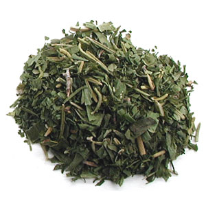

# Fines Herbes

*France's classic herb blend: parsley, chives, tarragon and chervil finely chopped together.*

**Prep Time:** 10 minutes

**Yield:** About 3-4 tablespoons (fresh; adjust to recipe needs)

## Overview
Fines herbes is the building block for delicate French finishing flourishes: a quartet of fresh parsley, chives, tarragon and chervil (or a trio if you can't find chervil) chopped together and scattered over an omelette, a piece of baked white fish, a butter sauce or a bowl of new potatoes at the very last moment. Each of the four herbs is gentle on its own, and together they make a soft layered flavour with parsley's vegetal freshness, chives' mild onion bite, tarragon's anise edge and chervil's subtle liquorice perfume; no one herb dominates. The blend never appears on robust dishes like beef stews or curries because its character disappears beneath stronger flavours, so save it for plates where subtlety is the whole point. Two rules make the difference between a herb scattering that lifts a dish and one that does nothing. First, the herbs must be fresh, not dried; drying flattens fines herbes into hay. Second, chop them at the absolute last moment, because chopped herbs oxidise within minutes and lose colour and flavour fast. Wash and thoroughly dry the parsley, chives and tarragon (moisture hastens discolouration), then stack the parsley and tarragon leaves and chop finely with a sharp knife; the chives slice thinly across the stem with scissors. Combine in a small bowl with a fork. Use immediately, scattered over the finished dish at the moment of plating. A teaspoon or two per portion is plenty; tarragon is strong and a heavier hand of it overpowers the others. Whole unchopped sprigs keep two days in the fridge wrapped in damp paper towel; freezing destroys the delicate character.

## Ingredients
- 1 sprig fresh parsley (flat-leaf preferred; about 6-8 leaves finely chopped)
- 1 sprig fresh chives (about 6 stalks, finely sliced)
- 1 sprig fresh tarragon (about 8-10 small leaves, finely chopped)

## Method

### Stage 1 - Chop Herbs
1. Wash and thoroughly dry all herb leaves using a clean kitchen towel or paper towels.
1. Moisture causes herbs to discolor and oxidize quickly.
1. Remove chives from their bundled state and gather them.
1. Stack parsley and tarragon leaves and chop finely with a sharp knife.

### Stage 2 - Combine & Use
1. Combine all chopped herbs in a small bowl.
1. Mix gently with a fork.
1. Use immediately in your dish (this is crucial for maximum flavor and color).
1. If not using immediately, cover lightly and refrigerate for up to 1 hour.

## Notes
- **Fresh Only:** Fines herbes loses its character when dried; always use fresh herbs.
- **Chop Just Before Use:** Chopped herbs oxidize and turn dark within minutes; work quickly.
- **Chervil Is Classic:** If you have access to fresh chervil, include it (chervil has a subtle anise note that's essential to the classic blend). It's used instead of the tarragon if doing a true French version.
- **Delicate Dishes:** Reserve fines herbes for plates where subtle herb flavor is the point, not for bold curries or heavy stews.
- **Tarragon Potency:** Tarragon is strong; use sparingly or you'll overpower the blend.

## Variations
**Classic French (with Chervil):** Parsley, chives, tarragon, chervil in equal parts.
**Without Tarragon:** Use parsley, chives, and an extra generous amount of chervil.
**Simplified:** Just parsley and chives if other herbs are unavailable.

## Serving
Use with: Omelets, baked fish, potato dishes, consommés, light sauces, green salads
Technique: Add just before serving or as a garnish
Amount: 1-2 teaspoons per serving, depending on dish intensity

## Storage
- Use fresh; these herbs don't store well once chopped
- Whole sprigs can be wrapped in a damp towel and refrigerated for up to 2 days
- Best flavor on the day of purchase
- Do not freeze; frozen herbs lose delicate character

*Fines herbes is a classic French fresh herb blend used to finish delicate dishes, adding brightness without overpowering subtle flavors.*
