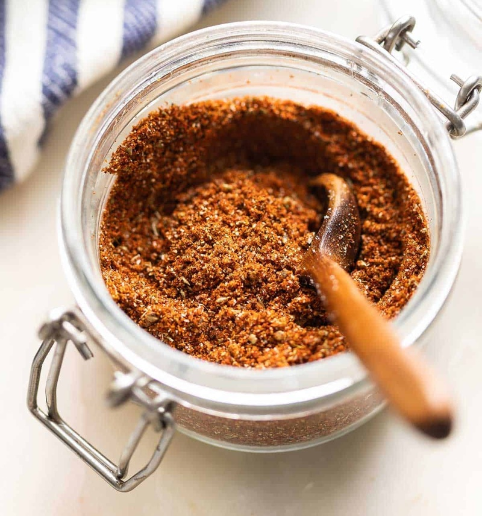

# Fajita Marinade

*A Tex-Mex fajita marinade: lime, oil, garlic, cumin, chilli and oregano. Soaks into skirt steak or chicken before a screaming-hot pan.*

**Prep Time:** 15 minutes

**Yield:** Approximately 100 milliliters (sufficient to marinate 4-6 servings of protein)

## Overview
Fajita marinade is the building block for Tex-Mex skirt-steak, chicken and prawn fajitas: a bright fast liquid of fresh lime juice, olive oil, crushed garlic, ground cumin, chilli powder, salt and pepper that soaks into thin strips of meat in an hour and sears off in a screaming-hot cast iron pan. Three details lift this above a sachet mix. Use fresh lime (bottled is flat and metallic), use fresh crushed garlic (powder gives a dusty note), and use real ground cumin as the earthy backbone. Whisk lime and oil to a loose emulsion, stir in minced garlic, cumin, chilli powder, smoked paprika, salt and pepper. The brightness should hit first, cumin second, heat last. Cut the protein thin against the grain, toss to coat, then marinate chicken 1 to 4 hours, beef 2 to 8, prawns no more than an hour. Sear hard in cast iron till caramelised at the edges.

## Ingredients

### Citrus & Oil
- 4-5 tablespoons fresh lime juice (approximately 3-4 fresh limes)
- 4 tablespoons extra virgin olive oil
- 2 tablespoons vegetable oil (if extra virgin seems too assertive)

### Aromatics & Spices
- 4-5 garlic cloves (crushed or minced)
- 2 teaspoons ground cumin
- 1 teaspoon chilli powder (or ground dried chilli)
- ½ teaspoon smoked paprika (optional, for depth)
- ½ teaspoon fine sea salt (adjust to taste)
- ¼ teaspoon freshly ground black pepper

### Optional Additions
- ½ teaspoon crushed red chilli flakes (for extra heat)
- ½ teaspoon ground coriander (for complexity)
- 1 teaspoon honey (or agave, for slight sweetness balancing heat)
- 1 tablespoon fresh coriander, chopped (optional)

## Method

### Stage 1 - Combine Citrus & Oil
1. Juice the fresh limes (aim for 4-5 tablespoons of juice).
1. Pour the lime juice into a shallow bowl or glass baking dish.
1. Add 4 tablespoons extra virgin olive oil (or a combination of olive and vegetable oil).
1. Whisk vigorously with a fork for 1-2 minutes.
1. The mixture will emulsify slightly, though some separation is normal.

### Stage 2 - Add Aromatic Component
1. Crush 4-5 garlic cloves with the side of a knife to break apart.
1. Mince the garlic finely (not powder, fresh is essential).
1. Add the minced garlic to the lime-oil mixture.
1. Stir very thoroughly to combine.
1. The garlic will begin to flavor the oil and citrus.

### Stage 3 - Add Dry Spices
1. Add 2 teaspoons ground cumin.
1. Add 1 teaspoon chilli powder (or ground dried chilli).
1. Add ½ teaspoon smoked paprika (optional, for depth).
1. Add ½ teaspoon fine sea salt.
1. Add ¼ teaspoon freshly ground black pepper.
1. Whisk or stir very thoroughly for 1-2 minutes.
1. The spices will disperse throughout the liquid.

### Stage 4 - Taste & Adjust
1. Dip a small piece of meat into the marinade and taste (or taste directly if cautious).
1. Assess spice balance:
   - More lime brightness: Add 1 more tablespoon fresh lime juice
   - More cumin earthiness: Add ¼ teaspoon additional cumin
   - More heat: Add ¼ teaspoon additional chilli powder or ½ teaspoon crushed red chilli flakes
   - More salt: Add pinch of salt if needed
1. Optional flavor additions:
   - Sweetness: Add 1 teaspoon honey or agave to balance heat
   - Herbs: Add 1 tablespoon fresh chopped fresh coriander for brightness
1. Whisk once more to fully combine all additions.

### Stage 5 - Application to Protein
1. Prepare your protein by cutting into bite-sized strips or pieces:
   - **Chicken:** Chicken breasts cut into ½-inch strips; or thighs cut into pieces
   - **Beef:** Flank steak or sirloin cut into thin strips; against the grain preferred
   - **Pork:** Pork loin cut into thin strips
   - **Shrimp:** Leave whole or cut in half if large
   - **Vegetables:** Bell peppers cut into strips; onions cut into wedges or strips
1. Pat the protein dry with paper towels.
1. Place into the marinade.
1. Toss gently or use hands to coat all pieces evenly with the marinade.

### Stage 6 - Marinating Times
1. **For thin-cut chicken strips:** Minimum 1 hour; up to 4 hours for deeper flavor
1. **For beef or pork strips:** Minimum 2 hours; up to 8 hours for deeper penetration
1. **For shrimp:** 30 minutes to 1 hour (longer risks acid-denaturing the protein excessively)
1. **For vegetables:** 30-45 minutes is sufficient
1. **Optimal:** 3-4 hours in refrigerator allows flavor penetration without over-marinating

### Stage 7 - Prepare for Cooking
1. Remove marinated protein from refrigerator 15-30 minutes before cooking to bring closer to room temperature.
1. Reserve 2-3 tablespoons of marinade separate for basting during cooking (if desired; optional).
1. Heat a cast-iron skillet or heavy cookware to high heat (the key to good fajitas is heat).
1. Add the marinated protein and any aromatic vegetables to the hot skillet.
1. Cook, stirring frequently, for:
   - **Chicken strips:** 5-8 minutes until internal temp reaches 74°C (165°F)
   - **Beef strips:** 5-7 minutes for medium-doneness
   - **Pork strips:** 7-10 minutes until internal temp reaches 71°C (160°F)
   - **Shrimp:** 3-4 minutes until opaque and cooked through
1. Optional: Baste with reserved marinade during the final minute of cooking for extra flavor.

## Notes
- **Fresh Lime Essential:** Bottled lime juice cannot substitute. Fresh lime juice provides essential brightness and complexity.
- **Raw Garlic Important:** Garlic powder is not acceptable, only fresh crushed/minced garlic.
- **Cumin is Essential:** This earthy spice is the backbone of fajita flavor; don't skip or reduce.
- **Thin Slicing Creates Surface Area:** Cut proteins thinly so they absorb maximum marinade in shorter time (1-4 hours vs. overnight).
- **Acid Doesn't Tenderize Meat:** Contrary to myth, lime juice doesn't tenderize significantly, this marinade relies on flavor, not chemical tenderizing.
- **Heat Critical for Cooking:** Fajitas require high-heat searing in hot skillet to develop flavorful crust.
- **Quick-Cooking Approach:** Thin-cut proteins cook rapidly (5-8 minutes); this is the point of fajitas.
- **Vegetables:** Bell peppers and onions can be cooked with the protein or separately, then tossed together.

## Variations
- **Extra Spicy:** Add ½-1 teaspoon crushed red chilli flakes; use hot chilli powder exclusively.
- **With Fresh coriander:** Add 1-2 tablespoons fresh chopped fresh coriander for herbal brightness.
- **Sweeter:** Add 1-2 teaspoons honey or agave to balance heat and char.
- **With Coriander:** Add ½ teaspoon ground coriander for complexity.
- **Extra Garlic:** Add 2 additional crushed garlic cloves for pungency.

## Serving
- **Use on:** Chicken breast strips, beef strips (flank or sirloin), pork loin strips, large shrimp
- **Marinating time:** Thin-cut meats 1-4 hours; Optimal 3-4 hours in refrigerator
- **Cooking method:** High-heat searing in cast-iron skillet for 5-8 minutes per protein
- **Serving with:** Warm flour or corn tortillas, sautéed bell peppers and onions, guacamole, sour cream, salsa

## Storage
- Unabsorbed marinade keeps refrigerated for 3-4 days in sealed glass jar
- Once applied to raw meat, use meat within 8-24 hours (marinate 1-4 hours, then cook or refrigerate)
- Excess reserved marinade for basting can be stored separately if not in contact with raw meat
- Can be prepared ahead (without meat) 2-3 days in advance and refrigerated
- Does not keep at room temperature due to raw meat contact; always refrigerate
- Fresh lime and garlic components are best used within 2-3 days of preparation

*This bright, citrus-forward marinade captures the essence of Tex-Mex outdoor cooking: the simplicity of lime and garlic balanced with chilli heat and cumin earthiness. "Fajita" comes from the Spanish word "fajita", meaning "little belt", referring to the thin strips of meat that cook quickly in a hot skillet, absorbed in the flavors of this essential marinade.*
