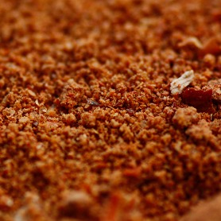

# Peri-Peri Marinade

*A Mozambican-Portuguese piri-piri marinade: bird's-eye chillies, garlic, lemon.*

**Prep Time:** 10 minutes

**Yield:** Approximately 100 milliliters (makes 8-10 tablespoons)

**Cook Time:** 19 minutes

## Overview
Peri-peri marinade is the building block for the grilled chicken, prawns and fish of the Portuguese-African corridor: a light bright marinade of red bird's eye chillies (or piri-piri peppers if you can find them), garlic, smoked paprika, ground coriander, olive oil, lime juice and a quick squeeze of lemon. The history runs from Portuguese traders carrying the African bird's eye chilli around the world to its return as the signature heat of Mozambican and Angolan cooking; the Swahili name "piri piri" literally means "pepper pepper". This is a liquid marinade, not a paste, designed for quick 30-minute to 2-hour absorption rather than overnight saturation. The acid does the work fast, and the olive oil carries the smoky paprika and chilli oils into the meat. Chop the fresh red chilli (seeds in for a proper kick, out for milder), crush the garlic, then combine in a bowl with the smoked paprika (Spanish smoked is non-negotiable; sweet paprika lacks the depth), ground coriander, olive oil, fresh lime juice, salt and black pepper. Whisk vigorously to emulsify slightly, taste and adjust. Pour over your protein: prawns marinate 20 to 30 minutes maximum (any longer and the acid starts to denature the flesh into rubber), fish for 30 to 45 minutes, chicken pieces for 1 to 2 hours. Grill or pan-sear over medium-high heat, basting with the reserved marinade through cooking to build a sticky caramelised crust. Don't waste this on robust meats; it shines on prawns, scallops, white fish and butterflied chicken thighs.

## Ingredients

### Primary Ingredients
- 1 fresh red chilli (large, or 2 medium red chillies)
- 2-3 garlic cloves (crushed)
- ½ teaspoon smoked paprika (Spanish style preferred)
- ½ teaspoon ground coriander
- 4 tablespoons extra virgin olive oil
- 3 tablespoons fresh lime juice (or lemon juice)
- ½ teaspoon fine sea salt (adjust to taste)
- ¼ teaspoon freshly ground black pepper

### Optional Ingredients
- 1 teaspoon fresh lemon juice (in addition to lime, for brightness)
- ¼ teaspoon crushed red chilli flakes (for extra heat)
- ½ teaspoon fresh thyme leaves (optional, minimal)
- 1 teaspoon honey (or agave, optional, for balancing char)

## Method

### Stage 1 - Prepare Chilli
1. Wash the fresh red chilli.
1. Cut off the stem end.
1. For less heat, slice in half and remove all seeds and white membrane inside; finely chop the flesh.
1. For more authentic Portuguese-African heat, leave seeds and membrane intact; finely chop the entire chilli.
1. Transfer the chopped chilli to a small bowl.

### Stage 2 - Add Aromatics & Spices
1. Crush 2-3 garlic cloves with the side of a knife to break apart slightly.
1. Add the garlic to the bowl with chopped chilli.
1. Add ½ teaspoon smoked paprika.
1. Add ½ teaspoon ground coriander.
1. Stir thoroughly with a spoon, mixing for 1-2 minutes.
1. The paprika and coriander will begin to perfume the mixture.

### Stage 3 - Combine Oil & Citrus
1. Pour 4 tablespoons extra virgin olive oil into the bowl.
1. Add 3 tablespoons fresh lime juice.
1. Add ½ teaspoon fine sea salt.
1. Add ¼ teaspoon freshly ground black pepper.
1. Using a fork or whisk, whisk vigorously for 1-2 minutes.
1. The mixture will emulsify slightly and incorporate the spices.

### Stage 4 - Taste & Final Adjustment
1. Taste the marinade.
1. Assess heat: Does it have sufficient chilli punch? Add extra chopped chilli if needed.
1. Assess acid: Is the lime brightness clear? Add 1 more tablespoon lime juice or 1 teaspoon lemon juice if it seems flat.
1. Assess salt/seasoning: Add pinch of salt if needed.
1. Optional additions:
   - Add 1 teaspoon honey or agave for sweetness balancing heat
   - Add ¼ teaspoon crushed red chilli flakes for additional heat
   - Add ½ teaspoon fresh thyme leaves for herbal note (optional, non-traditional)
1. Whisk once more to combine all additions.

### Stage 5 - Application to Proteins
1. Pour the marinade into a shallow dish or glass baking pan.
1. Prepare your protein (shellfish, fish, or chicken):
   - **For shellfish:** Cut large prawns or shrimp in half if desired; leave small shrimp whole. Pat dry.
   - **For fish:** Cut into portions; pat dry. Score skin if present.
   - **For chicken:** Cut into pieces (thighs, breasts); pat dry.
1. Add the protein to the marinade.
1. Toss gently to coat all pieces with marinade.
1. **For shellfish:** Marinate for 20-30 minutes at room temperature (no longer or the acid will "cook" the protein).
1. **For fish:** Marinate for 30-45 minutes in refrigerator.
1. **For chicken:** Marinate for 1-2 hours in refrigerator.

### Stage 6 - Prepare for Cooking
1. Remove protein from marinade.
1. Reserve the marinade in a small bowl for basting during cooking.
1. Heat a grill, grill pan, or skillet to medium-high heat.
1. Cook the protein, periodically basting with the reserved marinade:
   - **Shellfish:** 2-3 minutes per side (just until opaque)
   - **Fish:** 3-4 minutes per side depending on thickness
   - **Chicken:** 8-12 minutes total depending on piece size (until 74°C/165°F internal temp)

## Notes
- **Chilli Choice:** Portuguese "piri piri" peppers are authentic but rare in Western markets. Fresh red chillies are an acceptable substitute.
- **Paprika Quality:** Smoked Spanish paprika provides the characteristic earthy warmth; don't substitute with sweet or hot paprika without adjustment.
- **Acid Important:** The lime juice is essential for cutting through rich shellfish and poultry fats; use fresh lime, not bottled.
- **Light Marinade Approach:** Unlike thick paste marinades, peri-peri is intentionally light and liquid, it's meant for quick absorption, not overnight marinating.
- **Shellfish Timing Critical:** Do not marinate shellfish longer than 30 minutes, the acid will denature the protein excessively and create rubbery texture.
- **Basting During Grilling:** Continuing to baste with the marinade during cooking builds caramelized flavor crust (traditional technique).
- **Oil Quality Matters:** Extra virgin olive oil provides better flavor than refined oil; choose a quality bottle.
- **Emulsification:** The mixture won't fully emulsify like mayonnaise, some separation is normal and fine.

## Variations
**Extra Spicy:** Use 3 chillies with all seeds intact; add ½ teaspoon additional paprika for heat-depth.
**With Lemon:** Replace lime with fresh lemon juice exclusively for different bright acidity.
**Sweeter Version:** Add 1-2 teaspoons honey or agave to balance heat and caramelization.
**Extra Garlic:** Add 1-2 additional crushed garlic cloves for pungency.
**With Herbs:** Add 1 teaspoon fresh thyme or oregano for herbal notes (non-traditional but complementary).

## Serving
Use on: Prawns/shrimp, fish fillets, whole fish, chicken thighs, chicken breasts, scallops
Marinating time: Shellfish 20-30 minutes; Fish 30-45 minutes; Chicken 1-2 hours (can go up to 4 hours)
Cooking method: Grill, grill pan, or skillet over medium-high heat
Basting: Periodically baste with remaining marinade during cooking for caramelized crust

## Storage
- Store unabsorbed marinade in sealed glass jar for up to 3-4 days in refrigerator
- Once marinades seafood or raw poultry, use within 30 minutes (shellfish) or 8-24 hours (chicken) for safety
- Excess reserved marinade for basting can be stored separately; discard if it's been in contact with raw seafood/poultry
- Can be prepared (without meat) 2-3 days ahead and refrigerated until ready to marinate protein
- Does not keep at room temperature due to raw seafood/poultry contact; always refrigerate
- Fresh herb additions (if added) should be used within 1 day; flavors fade

*Peri-peri is a Portuguese-African chilli sauce that represents centuries of cultural fusion. The name comes from "piri piri," meaning "pepper pepper" in Swahili, arriving in Africa via Portuguese traders and settling into the culinary identity of South Africa, Mozambique, and Angola. This bright, acidic marinade sears seafood and poultry with fire-roasted flavor while remaining light enough for delicate proteins.*
