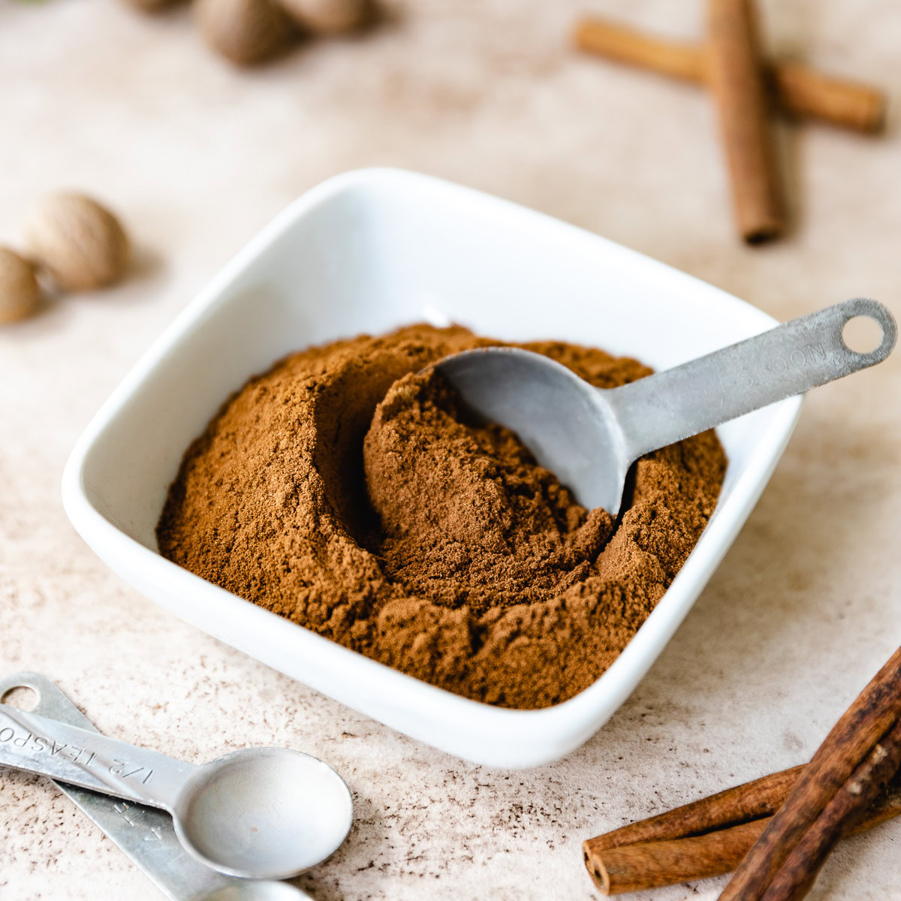

# Apple Pie Spice

*The American autumn blend designed specifically for apple bakes: cinnamon, nutmeg, allspice and cardamom, tilted slightly less ginger-heavy than its pumpkin-pie cousin.*

**Prep Time:** 2 minutes

**Yield:** Approximately 40 grams (makes 15+ portions)

## Overview
Apple pie spice is closely related to pumpkin pie spice but tilts more toward cinnamon and less toward ginger, suited to the natural acidity and sweetness of apples. The blend appears in apple pie, apple cobbler, apple muffin batters, apple-cinnamon oatmeal, cinnamon-apple French toast, and (especially) apple cider warmed on the stove. Some recipes add cardamom for a faintly floral lift; others skip it. Make small batches and use within six months for the freshest result.

## Ingredients

- 3 tablespoons ground cinnamon (the lead note)
- 2 teaspoons ground nutmeg
- 1 ½ teaspoons ground allspice
- 1 teaspoon ground cardamom (optional, lifts the blend)
- ½ teaspoon ground cloves
- ½ teaspoon ground ginger

## Method

1. Measure all ground spices into a wide bowl.
1. Whisk thoroughly until evenly combined.
1. Transfer to an airtight jar.
1. Label with the date and store in a cool dark cupboard.

## Notes
- **Cinnamon lead.** Apple pie spice goes heavier on cinnamon than pumpkin pie spice. Cinnamon is half the blend by volume.
- **Ceylon vs cassia.** Ceylon cinnamon is more delicate and floral; cassia is bolder and sweeter. Either works; cassia is the typical American supermarket variant.
- **No ginger variant.** Some American home cooks omit the ginger entirely for a softer baking blend.

## Serving
- **Use in:** apple pie filling, apple crumble, apple cobbler, apple muffins, apple-cinnamon oatmeal, French toast, mulled cider, apple cake
- **Typical ratio:** 1 to 2 teaspoons per portion
- **Application:** stirred into the apple filling or batter at the start

## Storage
- Store in an airtight glass jar in a cool dark cupboard
- Best within 6 months while all spices are aromatic
- Cinnamon lasts longest; clove and ginger fade fastest

*The American autumn baking blend tilted toward apples. Cinnamon-led, with nutmeg, allspice and cardamom for warmth, the universal seasoning for apple pie, crumble, and warmed apple cider.*
