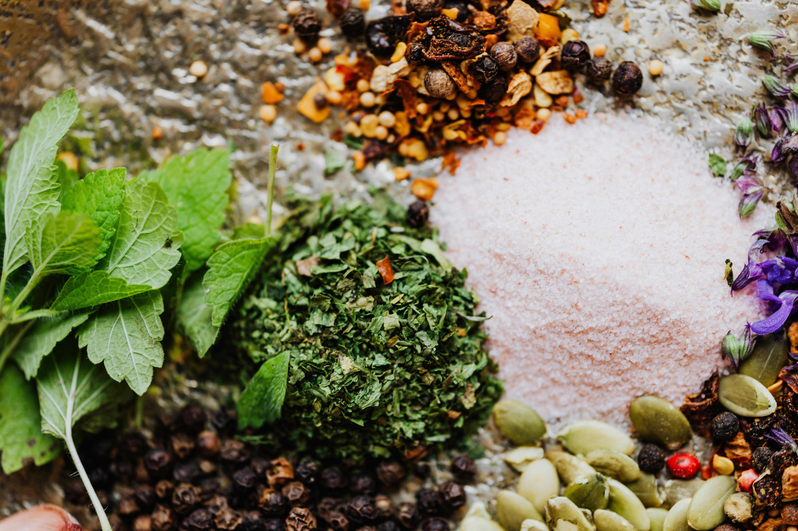

# Aromatic Salt (Two Versions)

*A flavoured finishing salt: flaky salt blended with toasted whole spices, citrus zest or dried herbs.*

**Prep Time:** 10 minutes

**Yield:** Each recipe makes approximately 120-130 grams

## Overview
Aromatic salt is the building block for finishing Balti and British-Indian dishes, the salt you keep in a small jar by the stove for scattering over a finished curry, naan or bowl of rice when you want to add a soft spice note in addition to seasoning. There are two versions worth keeping, both built on coarse sea salt as the base (the larger granule size keeps the spices distributed and stops the blend caking into a brick over time). The light version is just sea salt with ground cinnamon, allspice and an optional pinch of ginger, blended together and used as a gentle warming finish. The spicy version adds ground fenugreek, dried mint, turmeric, chilli powder and ground almond to the same base, and that almond addition is the trick (it adds quiet sweetness and just enough body to make the salt cling to whatever you sprinkle it onto). Tip the coarse sea salt into a bowl, add the chosen spices and herbs, then stir for a full two or three minutes till the colour goes uniform and there are no clumps. The spicy version takes a yellow-gold tint from the turmeric, which is correct. Make sure the dried mint is finely crushed (large mint flakes turn unpleasant in the mouth), and finely grind the fenugreek before adding (whole seeds are too hard to bite). Transfer to an airtight glass jar, label with the version name and date, and store somewhere cool and dry away from direct light; the salt itself is preservative but the spices and the almonds in the spicy version gradually oxidise, so the light version keeps 8 to 10 months and the spicy version 6 to 8.

## Ingredients

### VERSION 1: Lightly Spiced Aromatic Salt

**Base:**
- 100 grams coarsely granulated sea salt

**Aromatics:**
- 1 teaspoon ground cinnamon
- 1 teaspoon ground allspice
- ½ teaspoon ground ginger (optional)

### VERSION 2: Spicy Aromatic Salt with Nuts

**Base:**
- 100 grams coarsely granulated sea salt

**Aromatics & Spices:**
- 1 teaspoon ground cinnamon
- 1 teaspoon ground allspice
- ½ teaspoon ground fenugreek seeds
- 1 teaspoon dried mint (finely crushed)
- ½ teaspoon ground turmeric
- ½ teaspoon chilli powder

**Nuts for Texture & Depth:**
- 1 ½ tablespoons ground almond (finely ground)

## Method

### VERSION 1: Light Aromatic Salt

**Stage 1 - Prepare Base**
1. Pour the coarsely granulated sea salt into a bowl.
1. The larger granule size is important for texture and prevents over-salting.

**Stage 2 - Add Spices**
1. Add ground cinnamon, ground allspice, and optional ginger to the salt.
1. Using a spoon, stir very thoroughly for 2-3 minutes.
1. Ensure the color is uniform and no clumps form.

**Stage 3 - Store**
1. Transfer to an airtight jar.
1. Label "Light Aromatic Salt" and date.
1. Store in cool, dark place away from moisture.

### VERSION 2: Spicy Aromatic Salt with Nuts

**Stage 1 - Toast Spices (If Using Whole)**
1. If starting with whole fenugreek seeds and mint leaves, toast briefly:
   - Dry-fry fenugreek seeds in pan for 30-45 seconds until fragrant
   - Lightly crush dried mint to break up larger pieces
1. Grind toasted fenugreek to powder; crush dried mint finely.

**Stage 2 - Prepare Base Salt**
1. Pour the coarsely granulated sea salt into a bowl.

**Stage 3 - Add Spices**
1. Add ground cinnamon, allspice, fenugreek powder, crushed mint, turmeric, and chilli powder to the salt.
1. Stir very thoroughly for 2-3 minutes.
1. The color should be relatively uniform (slight turmeric tint expected).

**Stage 4 - Add Ground Almonds**
1. Add the ground almond to the spice-salt mixture.
1. Stir for another 1-2 minutes until the almond is evenly distributed.
1. The almond adds texture and subtle richness.

**Stage 5 - Store**
1. Transfer to airtight jar.
1. Label "Spicy Aromatic Salt" and date.
1. Store in cool, dark place away from moisture (almonds can absorb humidity).

## Notes
- **Sea Salt Granule Size:** Larger granules prevent the salt from becoming a dense cake and allow spices to distribute evenly.
- **Fenugreek:** This has a distinct maple-like aroma; some find it challenging. The light version omits it.
- **Dried Mint:** Crush lightly before adding; large pieces are unpleasant in the mouth.
- **Ground Almond:** The spicy version benefits from almond's subtle sweetness and nutrition. Don't substitute nut butters.
- **Turmeric Color:** The spicy version will have a golden-yellow tint from turmeric, this is correct.
- **Moisture Control:** Almonds and herbs can absorb atmospheric moisture. Store in truly airtight containers.

## Variations
**Light Version + Ginger:** Add the optional ginger to enhance warmth without herbs.
**Spicy Version Less Hot:** Reduce chilli powder to ¼ teaspoon or omit entirely.
**Spicy Version More Herbs:** Add 1 additional teaspoon crushed dried mint for more herbaceous character.
**With Fresh Herbs:** Fresh herb versions don't store well; for immediate use, substitute 1 ½ tablespoons fresh coriander or parsley to light or spicy versions.

## Serving
Use in: Balti curries, as a finishing salt for rice and vegetables, sprinkled on bread, used to season yogurt
Typical ratio: ½ teaspoon light version or ¼ teaspoon spicy version replaces standard salt in finishing
Application: Sprinkle over completed dishes or stir in just before serving for best impact
Temperature: Use as finishing salt; not mean for cooking into dishes from the start

## Storage
- Store in airtight jar in cool, dark place away from moisture and humidity
- Properly stored, remains potent for 8-10 months
- The spicy version with almonds is good for 6-8 months max (almonds can go rancid)
- Check the spicy version for musty smell or moisture before using after 2 months
- Does not require refrigeration but should be kept dry
- Salt acts as preservative but spices and nuts gradually oxidize
- Label with preparation date and version name
- Make fresh quarterly for optimal flavor, especially spicy version

*A lot of Balti recipes call for aromatic salt, which is a blend of spices with sea salt. Ordinarily plain salt can be used in its place, but the subtle spicing adds delicacy and nuance to a recipe. Two versions are provided: one light and aromatic, one spicier with toasted nuts.*
