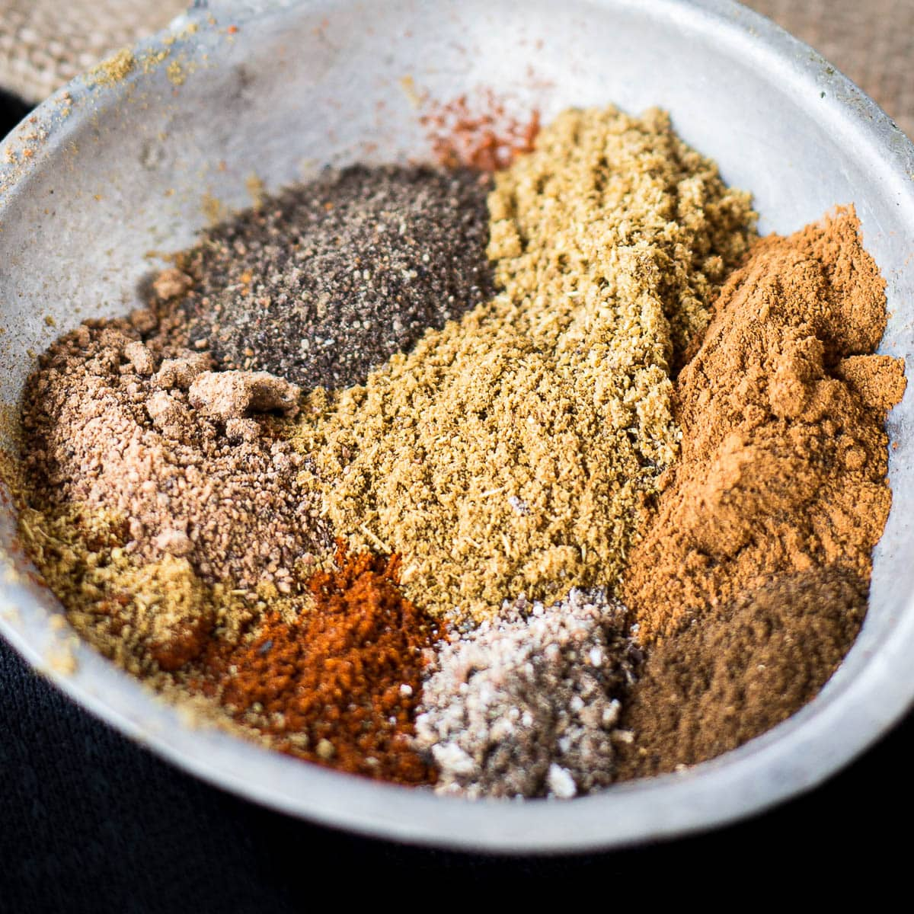

# Baharat

*The Middle Eastern seven-spice mix: black pepper, allspice, cardamom, cinnamon, clove, coriander and cumin toasted and ground.*

**Prep Time:** 10 minutes

**Yield:** Approximately 115 grams (makes 20+ portions)

## Overview
Baharat is the building block of Eastern Mediterranean and Arabian cooking, the classic seven-spice mix you stir into kibbeh, shoulder lamb stews, lamb kofta, spiced rice and slow-braised meat dishes from Lebanon, Jordan, Syria, Egypt and the Gulf. The word "baharat" means "spices" in Arabic, and the blend reflects the historical spice trade running across the region: cinnamon from Sri Lanka, cardamom from India, peppercorns from Indonesia, cloves from Zanzibar, then balanced with local paprika and allspice. The character is warm and aromatic with peppery depth rather than fiery heat; this is a foundational blend cooked into the dish rather than scattered over the finished plate. Build it in three stages. First, grind the cinnamon stick separately because it's harder than the other spices and needs its own treatment; broken into 1 cm pieces and pulsed in a spice grinder till fine, then set aside. Second, dry-roast the coriander seeds, cumin seeds, cardamom seeds, cloves and black peppercorns in a hot dry pan for 4 to 5 minutes till deeply fragrant and visibly darker. Tip onto a cool plate to halt the roast, cool to room temperature, then grind to a fine powder. Third, combine the ground roasted spices with the cinnamon powder, paprika, allspice, freshly grated nutmeg, chilli powder and salt; mix thoroughly for a couple of minutes till the colour is uniform. Use freshly grated nutmeg and freshly opened paprika if you can, both lose potency fast once exposed to air. Store in a sealed glass jar in a cool dark place; the colour fades with light, so a dark jar or cupboard is best. Use 1 to 2 teaspoons per portion, bloomed in hot oil at the start of cooking.

## Ingredients

### Whole Spices to Roast
- 1 cinnamon stick (broken into small pieces)
- 2 tablespoons coriander seeds
- 2 tablespoons cumin seeds
- 6 tablespoons cardamom seeds (or 12 green cardamom pods)
- 2 tablespoons cloves
- 2 tablespoons black peppercorns

### Pre-Ground Spices to Add After Roasting
- 4 tablespoons paprika
- 1 teaspoon ground allspice
- 2 teaspoons freshly grated nutmeg
- 2 teaspoons chilli powder
- 1 ½ teaspoons fine sea salt

## Method

### Stage 1 - Grind Cinnamon Separately
1. Break the cinnamon stick into very small pieces (roughly 1 cm each).
1. Place in a spice mill or coffee grinder.
1. Pulse until reduced to fine powder.
1. Transfer to a bowl and set aside.

### Stage 2 - Dry Roast Whole Spices
1. Place a heavy-bottomed frying pan over medium heat with no oil.
1. Add the coriander seeds, cumin seeds, cardamom seeds (or crushed cardamom pods), cloves, and black peppercorns.
1. Continuously stir and toss the spices as they heat for 4-5 minutes.
1. They will become aromatic and visibly darker.
1. Remove from heat when the aroma is rich and distinctive.
1. Do not allow smoking; that indicates burning and bitterness.
1. Transfer to a cool surface and allow to reach room temperature.

### Stage 3 - Grind Roasted Spices
1. Transfer cooled spices to a mortar or spice grinder.
1. Grind thoroughly to a fine powder.
1. Work in batches if your equipment is small.
1. Sift to remove any large particles.

### Stage 4 - Combine All Components
1. Add the ground cinnamon powder from Stage 1 to the mortar with the roasted spices.
1. Add the paprika, allspice, grated nutmeg, chilli powder, and salt.
1. Mix very thoroughly for 2-3 minutes to blend flavors evenly.
1. The color should be uniform throughout.

### Stage 5 - Store
1. Transfer to an airtight glass jar.
1. Label with the date of preparation.
1. Store in a cool, dark place away from strong light and heat.

## Notes
- **Cinnamon Grinding Separate:** Cinnamon sticks are harder than other spices and grind better alone, then blended at the end for better texture.
- **Cardamom Flexibility:** Using cardamom seeds (from crushed pods) works better than whole pods, which can be gritty if not removed after roasting.
- **Paprika Freshness:** Use freshly opened paprika if possible; it oxidizes quickly and loses color and flavor after opening.
- **Nutmeg Freshness:** Freshly grated nutmeg is far superior to pre-ground; the oils begin oxidizing immediately after grating.
- **Regional Variations:** Some versions add more cinnamon, others increase cloves. Adjust to personal preference.

## Variations
**Spicier:** Increase chilli powder to 2 ½ teaspoons.
**Sweeter:** Add ½ cinnamon stick to the initial roasting, or grind an additional stick and add 1 teaspoon at the end.
**Earthier:** Increase cumin seeds to 3 tablespoons in the roasting stage.
**For Red Meat:** Add 1 additional tablespoon paprika and 1 teaspoon extra nutmeg.

## Serving
Use in: Middle Eastern meat curries, rice pilafs, spiced stews, meat marinades, slow-cooked dishes
Typical ratio: 1-2 teaspoons per portion depending on dish
Application: Toast briefly in oil before adding other ingredients to bloom the spices
Temperature: Works best when fried in hot oil to release aromatic oils

## Storage
- Store in airtight glass jar in a cool, dark place away from light and heat
- Properly stored, remains flavorful for 8-10 months
- Flavor gradually fades after 6 months; check aroma before using in important dishes
- The paprika fades fastest with light exposure; keep in dark jar
- Does not require refrigeration
- Label with preparation date
- Make fresh every 8-10 months for optimal color and potency

*This aromatic spice blend is found throughout the Eastern Mediterranean, spreading from Egypt, Jordan, and Lebanon to Syria, Sudan, and Ethiopia. The Arabic name Baharat literally translates to "spice", a universal blend that spans borders and cultures.*
