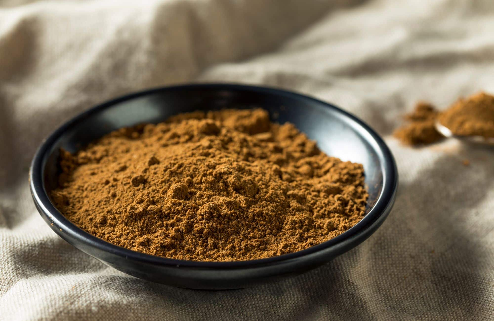

# Chinese Five-Spice Powder

*The five-flavour blend of Chinese cooking: star anise, cloves, cinnamon, fennel and Sichuan pepper, balanced to hit spicy, salty, sweet, sour and bitter all in one teaspoon.*

**Prep Time:** 10 minutes

**Yield:** Approximately 60 grams (makes 30+ portions)

## Overview
Chinese five-spice is the philosophical blend, built to cover all five tastes (spicy, salty, sweet, sour, bitter) in a single mixture. The traditional five are star anise, cloves, Chinese cinnamon (cassia), fennel seeds and Sichuan pepper. Regional versions add white pepper, ginger root, orange peel, or galangal. The blend goes into red-cooked pork belly (lu rou), into roast duck rubs, into char siu marinades, into the famous Cantonese five-spice ribs. A small pinch in roasted nuts, in cocktail glazes, in chocolate truffles works too. Whole spices freshly toasted and ground produce a dramatically more aromatic result than pre-ground supermarket five-spice. Make a small jar; the volatile oils fade within months.

## Ingredients

- 6 whole star anise pods
- 1 tablespoon Sichuan peppercorns
- 1 tablespoon fennel seeds
- 1 teaspoon whole cloves
- 1 cinnamon stick (broken into pieces) or 2 teaspoons cassia bark

## Method

1. Place a dry frying pan over medium heat.
1. Add the star anise (broken into segments), Sichuan peppercorns, fennel seeds, cloves and cinnamon pieces.
1. Toast for 2 to 3 minutes, shaking the pan, until visibly darker and intensely fragrant.
1. Tip onto a cool plate; cool to room temperature.
1. Grind to a fine powder in a spice mill (work in batches if needed).
1. Sift to remove any large fragments, then re-grind those if necessary.
1. Transfer to an airtight jar.

## Notes
- **Star anise vs anise seed.** Star anise (the pod) is essential; common anise seed is a poor substitute.
- **Cassia vs Ceylon cinnamon.** Cassia (the supermarket "cinnamon" in most countries) is the traditional choice. Ceylon cinnamon is too delicate for this blend.
- **Sichuan pepper variants.** Look for vivid red-brown Sichuan pepper with the black seeds removed; some sellers leave seeds in, which makes the ground blend bitter.
- **Ginger variant.** Add 1 teaspoon ground ginger after toasting for a slightly warmer regional version.

## Serving
Use in: red-cooked pork belly, char siu marinade, roast duck rub, Chinese five-spice ribs, braised beef shank, soy-braised eggs, roasted vegetables, sweet baking with chocolate
Typical ratio: 1/2 to 1 teaspoon per portion
Application: rubbed onto meat before roasting, or stirred into marinades and braising liquids

## Storage
- Store in an airtight glass jar in a cool dark cupboard
- Best within 4 months; the star anise oils fade fast
- Make small batches and toast fresh when supplies run low

*The five-flavour blend that anchors Chinese braising and roasting. Star anise, cloves, cinnamon, fennel and Sichuan pepper combined to cover all five tastes the Chinese palate recognises.*
