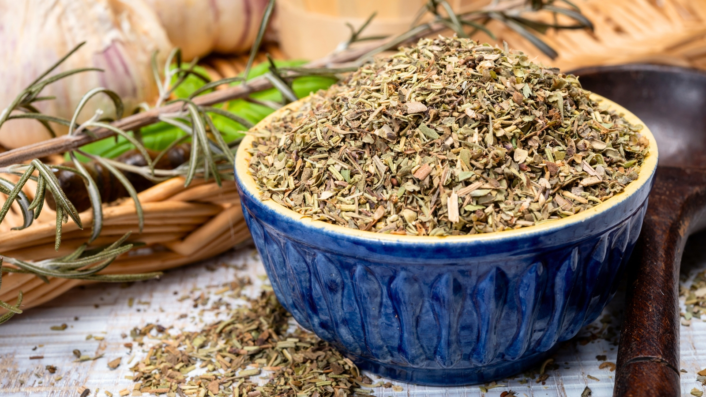

# Herbes de Provence

*The dried herb blend of southern France: rosemary, thyme, savory, marjoram, oregano and lavender, packed into a small jar that perfumes any roasted meat, vegetable or stew the French country kitchen turns out.*

**Prep Time:** 5 minutes

**Yield:** Approximately 60 grams (makes 30+ portions)

## Overview
Herbes de Provence is the herb blend of Provence, the sunny southern French region whose limestone hills are dense with wild rosemary, thyme, savory and oregano. The combination took shape over centuries; the formalised dried-jar version arrived in the 1970s. American versions often include lavender (sometimes a lot of it); traditional French versions skip it or use only a pinch — the lavender note is contentious in France itself, with the south split on whether it belongs. Either way, the blend's job is to season slow-roasted meat, stuffed vegetables, ratatouille, and the simplest roast chicken. Crumble some between your palms and rub into a leg of lamb, scatter over potatoes before roasting, or stir a teaspoon into olive oil for dipping bread. Lavender lovers add half a teaspoon to the blend; purists leave it out. Make small batches and use within six months; the volatile oils fade with light and air.

## Ingredients

- 3 tablespoons dried rosemary
- 3 tablespoons dried thyme
- 2 tablespoons dried savory
- 2 tablespoons dried marjoram
- 2 tablespoons dried oregano
- 1 teaspoon dried lavender buds (optional)

## Method

1. Measure all dried herbs into a wide bowl.
1. Rub between your palms briefly to bruise the larger leaves and release the oils.
1. Mix thoroughly until evenly distributed.
1. Transfer to a small airtight jar.
1. Label with the date and store in a cool dark cupboard.

## Notes
- **Rosemary preparation.** Whole-needle rosemary is too coarse for the blend; crumble or chop briefly to break the needles into smaller pieces.
- **Lavender split.** Traditional Provençal versions skip lavender entirely. American supermarket blends often have a noticeable lavender note. Choose your camp.
- **Savory substitute.** If you can't find savory, an extra teaspoon each of thyme and oregano covers the gap reasonably.
- **Fresh vs dried.** This blend is specifically for the dried-herb pantry use; fresh herbs are a different dish entirely.

## Serving
Use in: roast lamb, roast chicken, ratatouille, slow-cooked beef stews, herb-roasted potatoes, marinades for grilled meat
Typical ratio: 1 to 2 teaspoons per portion
Application: rubbed onto meat before roasting, or sprinkled into the pan with olive oil at the start

## Storage
- Store in an airtight glass jar in a cool dark cupboard
- Best within 6 months; aroma fades thereafter
- Crumble between palms before using to wake up the oils

*The dried herb blend that anchors Provençal cooking, named for the sun-baked southern French region where every kitchen garden grows rosemary, thyme and savory.*
