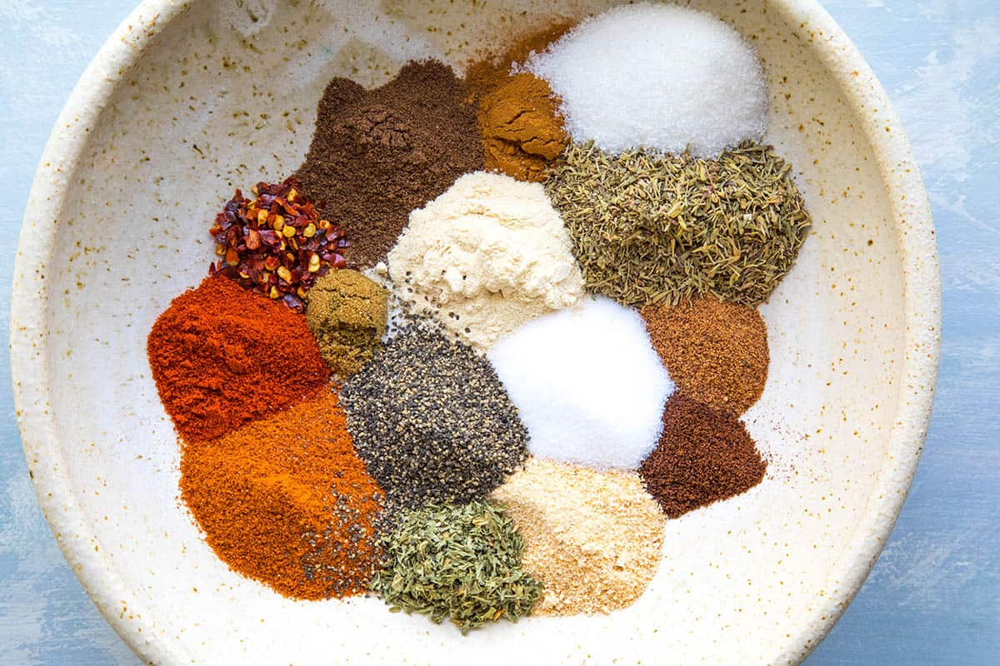

# Jerk Seasoning

*The dry-rub version of Jamaican jerk: allspice, scotch bonnet, thyme, garlic and warm spices ground together for rubbing onto chicken, pork or fish before grilling.*

**Prep Time:** 10 minutes

**Yield:** Approximately 70 grams (makes 15+ portions)

## Overview
Jerk seasoning is the Jamaican spice rub for grilled meat, traceable through Maroon (escaped-slave) communities in the Jamaican mountains to indigenous Arawak techniques crossed with West African seasonings. Allspice is the foundational note, Jamaica grows most of the world's allspice and pimento (allspice) wood is the traditional fuel for jerk smoking. Scotch bonnet provides the trademark fierce heat. Thyme is the herbal layer. Plus a warm-spice supporting cast of cinnamon, cloves, nutmeg, ginger and pepper, with brown sugar to caramelise during grilling. This dry-rub version stores in the cupboard; the wet jerk marinade (with onion, garlic, soy sauce, vinegar, oil) is a different recipe built from this base.

## Ingredients

- 2 tablespoons ground allspice (the load-bearing spice)
- 1 tablespoon brown sugar
- 1 tablespoon dried thyme
- 1 tablespoon onion powder
- 1 tablespoon garlic powder
- 2 teaspoons ground black pepper
- 2 teaspoons cayenne (or scotch bonnet powder if available)
- 1 ½ teaspoons fine sea salt
- 1 teaspoon ground cinnamon
- 1 teaspoon ground nutmeg
- 1 teaspoon ground cloves
- 1 teaspoon ground ginger

## Method

1. Measure all ingredients into a wide bowl.
1. Mix thoroughly until evenly distributed and the colour is uniform deep brown.
1. Transfer to an airtight jar.
1. Label with the date and store in a cool dark cupboard.

## Notes
- **Scotch bonnet.** Authentic jerk uses scotch bonnet chillies. Dried scotch bonnet powder is rare outside Caribbean grocers; cayenne is the everyday substitute.
- **Allspice freshness.** This blend lives or dies on allspice. If your jar is more than 6 months old, grind whole berries fresh for the best result.
- **Brown sugar.** Some traditional recipes skip the sugar; it caramelises during grilling and is what gives jerk the slightly sweet edge that distinguishes it from chilli rubs.
- **For wet jerk marinade.** Add 4 tablespoons of this dry blend to a blender with 2 chopped onions, a head of garlic, 4 scotch bonnets, 1 thumb fresh ginger, 4 tablespoons soy sauce, 4 tablespoons vinegar and 4 tablespoons vegetable oil. Process to a wet paste.

## Serving
- Use in: jerk chicken, jerk pork, jerk fish, Jamaican beef patty filling, marinades for grilled meat, dry rub for slow-roast pork
- Typical ratio: 2 tablespoons of dry rub per kilo of meat
- Application: rubbed onto meat 4 to 24 hours before grilling

## Storage
- Store in an airtight glass jar in a cool dark cupboard
- Best within 6 months while the allspice is fresh
- Allspice and clove fade fastest; the sniff test is reliable

*The dry-rub version of the Jamaican jerk seasoning. Built on allspice and scotch bonnet, traceable through Maroon mountain communities to indigenous Arawak techniques crossed with West African seasonings.*
