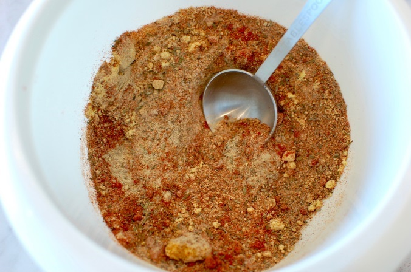

# KFC-Style Herbs and Spices

*The home-cook take on KFC's eleven herbs and spices: a closely-guessed blend of paprika, garlic, ginger, thyme, oregano and white pepper.*

**Prep Time:** 10 minutes

**Yield:** Approximately 85-90 grams (makes 15-20 portions)

## Overview
KFC-style spice mix is the building block for the home cook's attempt at replicating the famous 11-herbs-and-spices breading: a blended seasoning powder you stir into flour to coat chicken pieces before deep-frying for that signature peppery-herbaceous fried chicken crust. Nobody outside the company knows the exact original recipe, but this version captures the characteristic warm peppery profile through heavy white pepper (which carries heat without adding red colour the way cayenne would), the savoury umami of garlic salt and celery salt, the bright bite of dry mustard and ginger, the herbal lift of thyme, basil and oregano, and the colour and gentle paprika sweetness that ties it all together. This blend is unusual in that it skips the roast-and-grind step that most spice mixes need; the components all go in pre-ground because the finished blend doesn't sit on the meat as a rub, it sits inside flour as a breading mixture that cooks at very high heat in the fryer. Tip white pepper, black pepper, garlic salt and celery salt into a bowl and stir to blend. Add the thyme, basil and oregano, breaking up any larger leaf pieces with your fingers. Add paprika, ground ginger, dry mustard and additional sea salt, and stir very thoroughly for two or three minutes till the colour is uniform with no streaks or clumps. Sieve through fine mesh for an even finer texture if you want; the smoother the powder, the more evenly it coats the flour. To use, mix one tablespoon of the blend into one cup of plain flour, dredge chicken pieces through, then deep-fry at 175 C till the coating is gold and crisp. Stores 12 months airtight.

## Ingredients

### Powdered & Salt Bases
- 2 tablespoons white pepper
- 1 tablespoon black pepper
- 2 tablespoons garlic salt
- 1 teaspoon celery salt

### Dried Herbs
- ½ tablespoon dried thyme
- ½ tablespoon dried basil
- ⅓ tablespoon dried oregano

### Ground Spices & Powders
- ⅔ tablespoon fine sea salt (in addition to salts above)
- 4 tablespoons paprika
- 1 tablespoon ground ginger
- 1 tablespoon dry mustard

## Method

### Stage 1 - Combine Powders & Salts
1. Pour the white pepper, black pepper, garlic salt, and celery salt into a medium bowl.
1. Stir to blend evenly.

### Stage 2 - Add Herbs
1. Add dried thyme, basil, and oregano to the bowl.
1. Stir thoroughly, breaking up any larger herb pieces with your fingers.
1. Ensure herbs are evenly distributed.

### Stage 3 - Add Remaining Spices
1. Add paprika, ground ginger, dry mustard, and the sea salt (if using in addition to garlic and celery salts).
1. Stir very thoroughly for 2-3 minutes.
1. The mixture should be completely uniform with no visible clumps.

### Stage 4 - Sift for Consistency
1. Sift the mixture through a fine mesh sieve to create a more uniform texture and remove larger herb pieces (optional but recommended).
1. Re-sift any remaining pieces.

### Stage 5 - Store
1. Transfer to an airtight jar or container with a tight-fitting lid.
1. Label with preparation date.
1. Store in a cool, dark place away from light and heat.

## Notes
- **No Roasting Required:** Unlike traditional spice blends, this uses ground spices and doesn't benefit from roasting.
- **White Pepper Dominance:** This creates heat without the red color chile powder would add.
- **Salt Ratio:** This formula is intentionally high in salt for a breading application. Adjust downward if using as a cooking spice rather than a coating.
- **Herb Texture:** Finer herbs are better for coatings; break up larger pieces as much as possible.
- **For Coating:** Mix 1 tablespoon of this blend with 1 cup flour and coat your protein before frying.

## Variations
**Spicier:** Increase white pepper to 3 tablespoons and black pepper to 1 ½ tablespoons.
**Less Salty:** Reduce garlic salt to 1 tablespoon and celery salt to ½ teaspoon.
**Lighter:** Increase paprika to 5-6 tablespoons for more color and less pepper intensity.
**Smoky:** Add 1 teaspoon smoked paprika (reduce regular paprika to 3 ½ tablespoons).

## Serving
Use in: Breading for fried chicken, fish, vegetables, onion rings, and similar fried items
Typical ratio: 1-2 tablespoons mixed into 1 cup flour for coating
Application: Combine with flour, dredge protein, then deep-fry until coating is golden and crispy
Temperature: Use in hot oil (350°F/175°C) for best coating development

## Storage
- Store in airtight jar in cool, dark place away from light and heat
- Properly stored, remains flavorful for 12 months
- The salt content acts as a preservative, making this stable long-term
- Check for moisture or clumping before each use
- Does not require refrigeration
- The potato starch or thickeners in real KFC flour won't be present here; adjust flour ratio as needed
- Label with preparation date 

*This is a reverse-engineered blend attempting to replicate the famous KFC breading spice mix. While no one outside the company knows the exact recipe, this combination captures the characteristic warm, peppery, and herbaceous profile of the iconic fried chicken coating.*
