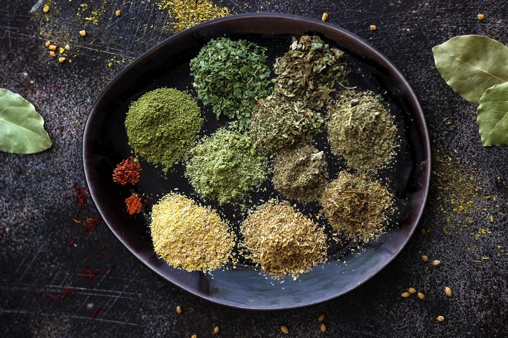

# Khmeli Suneli

*The Georgian "housewife spices" blend: coriander, fenugreek, marigold, savory and a dozen others, the foundation of countless Caucasian stews, walnut sauces and pkhali pastes.*

**Prep Time:** 5 minutes

**Yield:** Approximately 70 grams (makes 25+ portions)

## Overview
Khmeli suneli is the Georgian for "dried spices", the blend at the heart of Caucasian cooking. Every region of Georgia and practically every family makes a different version. The recurring core is coriander seed, fenugreek (especially blue fenugreek, the Georgian variant), marigold (Imeretian saffron), summer savory and dill. Layered on top can be cinnamon, cloves, basil, bay leaf, mint, parsley, hot pepper and sumac. The blend reads deep, earthy, faintly bitter, slightly grassy, the foundational note in walnut sauces (satsivi), in chicken and beef stews (chakhokhbili), in kharcho soup, in pkhali (vegetable-and-walnut spreads). Imeretian saffron (dried marigold petals, not real saffron) gives it the golden colour. Without marigold the blend works but the colour reads dull.

## Ingredients

- 2 tablespoons coriander seeds, toasted and ground
- 1 ½ tablespoons fenugreek seeds, ground (blue fenugreek if you can find it)
- 1 tablespoon dried marigold petals (Imeretian saffron), crushed
- 1 tablespoon dried summer savory
- 1 tablespoon dried dill
- 2 teaspoons dried basil
- 2 teaspoons dried mint
- 1 teaspoon dried parsley
- 1 teaspoon dried thyme
- 1 teaspoon ground cinnamon
- ½ teaspoon ground cloves
- ½ teaspoon ground bay leaf
- ½ teaspoon sumac
- ¼ teaspoon ground black pepper

## Method

1. Toast the whole coriander and fenugreek seeds in a dry pan over medium heat for 2 to 3 minutes, until visibly darker and fragrant.
1. Cool, then grind to a fine powder.
1. In a wide bowl, combine the ground toasted seeds with all the other ingredients.
1. Crush the marigold petals between your palms before adding to release the colour.
1. Mix thoroughly until the colour and texture are uniform.
1. Transfer to an airtight jar.

## Notes
- **Marigold petals.** Dried calendula or marigold petals (Imeretian saffron) are the colour signature. Sold at Russian and Caucasian grocers; substituting real saffron is too expensive and the flavour differs.
- **Blue fenugreek.** Georgian blue fenugreek (Utskho suneli) is milder and earthier than the standard yellow fenugreek; if you can find it, it makes a difference. Yellow fenugreek substitutes acceptably.
- **Wild herb regional variants.** Some Georgian versions add ground nettle, lovage, or hyssop. The exact recipe varies by family.

## Serving
- **Use in:** satsivi (chicken in walnut sauce), chakhokhbili (chicken and tomato stew), kharcho (beef soup with walnuts and rice), pkhali (vegetable-and-walnut pastes), Georgian roasted meat marinades, lamb stews
- **Typical ratio:** 1 to 2 teaspoons per portion
- **Application:** stirred into stews and sauces near the end of cooking; mixed with walnut paste for satsivi

## Storage
- Store in an airtight glass jar in a cool dark cupboard
- Best within 6 months while the marigold colour is vivid
- The fenugreek aroma is the most reliable freshness indicator

*The "housewife spices" blend of Georgia, the foundational note in Caucasian walnut sauces, slow-cooked stews and the famous satsivi.*
