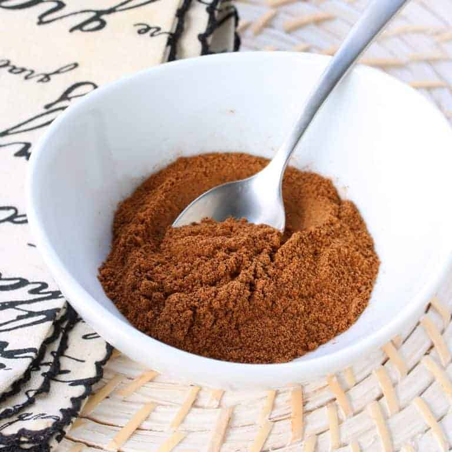

# Mixed Spice

*The British baker's mixed spice: cinnamon, coriander, caraway, nutmeg, ginger and clove ground together.*

**Prep Time:** 10 minutes

**Yield:** Approximately 63-70 grams (makes 20-25 portions)

## Overview
Mixed spice is the building block of British autumn and winter baking: a warm aromatic spice blend that turns up in apple pies, Christmas puddings, fruitcakes, hot cross buns, treacle tart, gingerbread and any baked thing meant to taste of cold weather. It's also called pudding spice or cake spice, and the profile leans heavily on cinnamon, allspice and nutmeg backed by cloves, mace, ginger and coriander; warming and complex, without the heat of a curry blend or the savoury depth of garam masala. The same blend works in savoury dishes too (try a teaspoon in a beef and mushroom stew or a lamb tagine) but most cooks make it once and use it through the festive season for sweet baking. The technique is the simplest of any spice blend because everything goes in pre-ground; there's no roasting and no grinding from whole. Tip ground allspice, ground cinnamon, ground nutmeg, ground mace (or extra nutmeg if you can't find mace), ground cloves, ground coriander, ground ginger and a pinch of cayenne into a bowl. For savoury versions, add a teaspoon and a half of fine sea salt; for baking, leave the salt out so you control the salt in the dough or batter itself. Stir very thoroughly for two or three minutes with a small whisk till the colour goes uniform and there are no streaks of brighter cinnamon or darker clove showing. Sieve through a fine mesh for the finest texture if you want; baked goods benefit from a really even dispersion. Store in an airtight glass jar in a cool dark place for 8 to 10 months; the cinnamon and nutmeg fade fastest, so check the aroma after six months before using in important bakes. Use 1 to 2 teaspoons per 2 to 3 cups of flour.

## Ingredients

### Pre-Ground Spices
- 1 tablespoon ground allspice
- 1 tablespoon ground cinnamon
- 1 tablespoon ground nutmeg
- 2 teaspoons ground mace (or additional nutmeg if unavailable)
- 1 teaspoon ground cloves
- 1 teaspoon ground coriander
- 1 teaspoon ground ginger
- ¼ teaspoon cayenne pepper (optional, for subtle heat)
- 1 ½ teaspoons fine sea salt (optional, for savory applications)

## Method

### Stage 1 - Combine All Spices
1. Pour all pre-ground spices into a medium mixing bowl.
1. Include the cayenne pepper if desired for subtle background heat.
1. If preparing a savory version, add the salt.

### Stage 2 - Mix Thoroughly
1. Using a spoon or small whisk, stir very thoroughly for 2-3 minutes.
1. Mix until the color is completely uniform throughout, no streaks or patches.
1. Break up any small clumps of spice that have formed during storage.

### Stage 3 - Sift for Consistency (Optional)
1. Sift the mixture through a fine mesh sieve into a clean bowl (optional but recommended).
1. This creates a more uniform, finer texture.
1. Return any larger particles to the original mixture.

### Stage 4 - Store
1. Transfer to an airtight glass jar with a tight-fitting lid.
1. Label with preparation date.
1. Store in a cool, dark place away from direct light and heat.

## Notes
- **Pre-Ground Spices:** This blend uses pre-ground spices, unlike roasted-whole-spice blends. Quality grinds matter; use fresh spice powders.
- **Mace Alternative:** If mace is unavailable, use additional nutmeg (1 ½ teaspoons nutmeg, omit mace).
- **Sweetness Assumption:** This blend assumes use in sweet applications; reduce or omit salt for baking.
- **Savory Adaptation:** For stews and braised meats, include the salt and consider adding 1 teaspoon additional ginger.
- **Nutmeg Potency:** This ingredient dominates the blend; it's the most assertive flavor. Start with less if uncertain.

## Variations
**For Baking:** Omit salt and cayenne; this emphasizes warmth and sweetness.
**For Savory Cooking:** Include salt and cayenne; increase ginger to 1 ½ teaspoons and coriander to 1 ½ teaspoons.
**Spicier:** Add ½ teaspoon cayenne instead of ¼ teaspoon.
**Without Cloves:** Reduce cloves to ½ teaspoon if clove flavor is overpowering.
**Extra Sweet:** Add ¼ teaspoon additional cinnamon for chai-like warmth.

## Serving
Use in: Apple pies and fruit compotes, cakes and cookies, Christmas puddings, braised meats, stewed fruits, masala chai
Typical ratio: 1-2 teaspoons in baking recipes per 2-3 cups flour
Application: Mix into dry ingredients for baking; add to stews during cooking
Temperature: Works in both raw and cooked applications

## Storage
- Store in airtight glass jar in a cool, dark place away from light and heat
- Properly stored, remains flavorful for 8-10 months
- The lighter spices (cinnamon) fade faster than darker ones (cloves); check aroma after 6 months
- Does not require refrigeration
- Monitor for moisture or clumping
- Make fresh every 8-10 months for optimal flavor
- Label with preparation date
- Nutmeg loses potency fastest; check that warmth is still apparent before using in important desserts

*This blend of ground spices has a whole host of uses, both in sweet and savory dishes. It typically features cinnamon, nutmeg, and allspice as the core, but also contains cloves, cayenne pepper, coriander, ginger, and mace. This is the spice of autumn baking and winter stews.*
