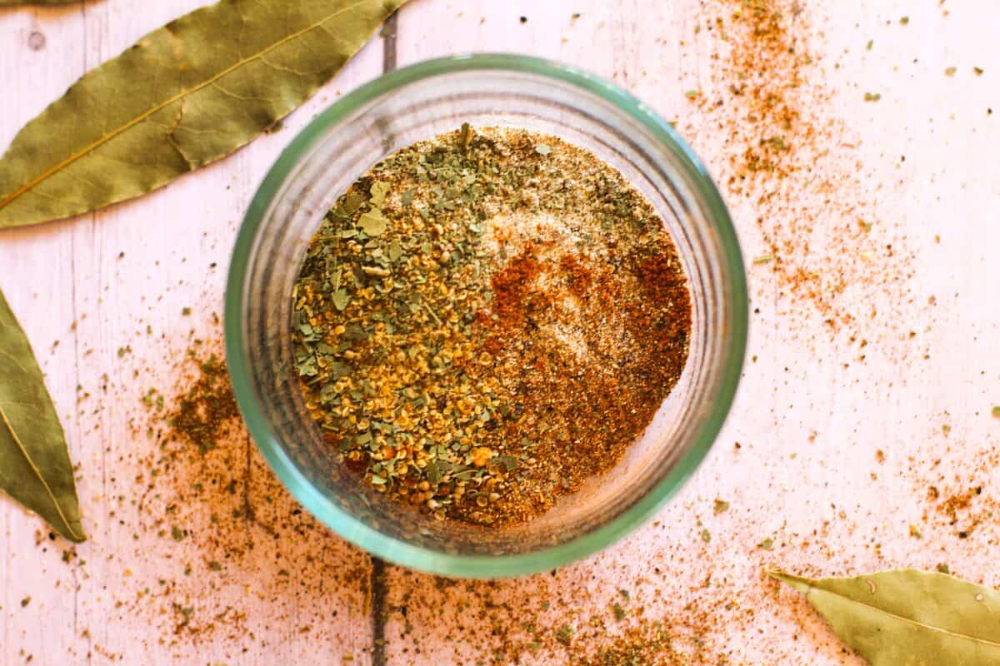

# Old Bay Seasoning

*The Maryland seafood spice, celery salt, paprika, bay leaf, mustard and a dozen warm spices, invented in Baltimore in 1939 by a German Jewish refugee and now the universal American seasoning for crab, shrimp and Bloody Marys.*

**Prep Time:** 5 minutes

**Yield:** Approximately 80 grams (makes 25+ portions)

## Overview
Old Bay was invented in 1939 by Gustav Brunn, a German Jewish refugee who fled Nazi Germany and set up a spice business in Baltimore. The blend was designed for the Chesapeake Bay blue crab boil tradition; it spread from there to shrimp, oysters, popcorn, fries, hard-boiled eggs and (controversially among purists) absolutely anything else. The exact commercial recipe is proprietary, but the dozen-ish recognisable spices are celery salt (the load-bearing flavour), paprika, mustard, black pepper, bay leaf, cloves, allspice, ginger, nutmeg, cardamom, mace and cinnamon. The yellow-and-blue Baltimore tin is unmistakable in any American supermarket, but the homemade version with fresh spices is dramatically more aromatic.

## Ingredients

- 2 tablespoons celery salt (or 1 tablespoon celery seed + 1 tablespoon fine sea salt, ground together)
- 1 tablespoon sweet paprika
- 1 ½ teaspoons ground black pepper
- 1 ½ teaspoons mustard powder
- 1 teaspoon ground bay leaf (or 4 bay leaves ground fine)
- 1 teaspoon ground allspice
- 1 teaspoon ground ginger
- ½ teaspoon ground cloves
- ½ teaspoon ground nutmeg
- ½ teaspoon ground cardamom
- ¼ teaspoon ground mace
- ¼ teaspoon ground cinnamon

## Method

1. Measure all ingredients into a wide bowl.
1. Whisk thoroughly until evenly combined and the colour is uniform.
1. Transfer to an airtight jar.
1. Label with the date and store in a cool dark cupboard.

## Notes
- **Celery salt.** This is the load-bearing flavour; do not skip. If you can't find pre-mixed, grind celery seed with salt 1:1.
- **Ground bay leaf.** Whole bay leaves are too coarse; either buy pre-ground or whizz dried bay in a spice grinder until fine.
- **Less salty version.** Some home cooks halve the celery salt and add a teaspoon of dried lemon zest for a less aggressive blend.

## Serving
- **Use in:** Maryland crab boils, shrimp boils, deep-fried shrimp, oyster crackers, popcorn, French fries, hard-boiled eggs, Bloody Mary cocktails, crab cake mix
- **Typical ratio:** 1 to 2 teaspoons per portion (much more for crab boils, by the tablespoon)
- **Application:** scattered straight from the jar, or stirred into melted butter for steaming shellfish

## Storage
- Store in an airtight glass jar in a cool dark cupboard
- Best within 6 months while the celery salt is fresh
- Refresh annually for the brightest finish

*The Maryland seafood spice, invented in 1939 in Baltimore by Gustav Brunn. Now the universal American seasoning for blue crab, shrimp, popcorn, French fries and Bloody Marys.*
