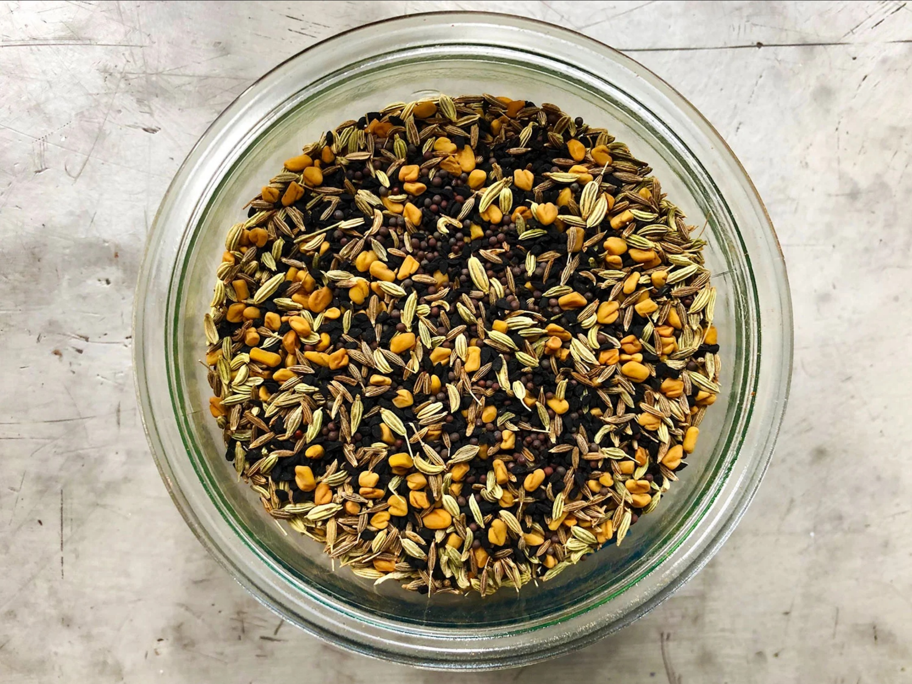

# Panch Phoram (Bengali Five-Spice)

*This is a Bengali mixture of five (panch) spices, one of India's fundamental spice blends. Panch phoram is traditionally tempered in hot oil and the fragrant seeds scattered over vegetables, lentils, or rice. It's a Bengali staple with a history stretching back centuries.*

**Yield:** Approximately 10-15 grams (makes 8-12 portions as a tempering blend)

**Prep Time:** 5 minutes

## Overview
Panch phoram is the building block of Bengali tempering, a five-seed (panch = five) blend that's unusual in the Indian spice repertoire because the seeds stay whole rather than being ground; instead they get briefly fried in hot oil at the moment of cooking, popping and crackling as they bloom their aromatic oils into the fat, which then carries those oils into the finished dish. The flavour layering each seed brings is what makes this work: cumin for earthiness, fennel for soft sweetness, fenugreek for a faintly bitter back-note, mustard for pungency and pop, and nigella (kalonji, used as the substitute for the harder-to-find wild onion seed) for a sharp savoury edge. Together in oil they create something more than the sum of their parts, and tip onto vegetables, lentils or rice as the tempering pour (tadka) that finishes a Bengali meal. Mixing the blend itself is the easiest spice job in the kitchen: combine equal parts (typically one teaspoon each) of white cumin, fennel, fenugreek, black mustard and nigella seeds in a small jar, stir to distribute, label and date. That's it. The technique is everything. To use, heat a tablespoon of oil in a small pan over medium-high till shimmering, drop in a teaspoon of the seed mix all at once, and within 30 seconds to a minute the mustard seeds start popping and the kitchen fills with toasted spice aroma. The moment the popping slows, pour the entire contents (oil and all) over a finished bowl of dal, sautéed greens, basmati rice or yoghurt; the contrast between the hot crackling oil and the cool dish is the whole point. Don't go over a minute or the fenugreek scorches and turns bitter.

## Ingredients

### Five Equal Parts (By Weight)
- 1 teaspoon white cumin seeds
- 1 teaspoon fennel seeds (saunf)
- 1 teaspoon fenugreek seeds (methi)
- 1 teaspoon black mustard seeds (rai)
- 1 teaspoon wild onion seeds (nigella seeds or kalonji, as substitute if wild onion unavailable)

## Method

### Stage 1 - Measure & Mix
1. Measure one teaspoon each of white cumin seeds, fennel seeds, fenugreek seeds, mustard seeds, and wild onion/kalonji seeds.
1. Pour all five into a small bowl.
1. Stir gently to combine, ensuring each seed type is distributed throughout.

### Stage 2 - Store or Use
1. Transfer to an airtight spice jar if storing.
1. Label with the date and "Panch Phoram" so it's clear these are not roasted/ground.

### Stage 3 - To Use: Tempering in Oil (Most Traditional Method)
1. Heat 1 tablespoon oil in a pan over medium-high heat until shimmering.
1. Add the entire panch phoram mixture (or desired amount if making for multiple dishes).
1. The seeds will immediately begin popping and releasing aroma (30 seconds to 1 minute).
1. As soon as the mustard seeds stop popping and the aroma is intense, pour the entire contents, oil and seeds, over vegetables, lentils, rice, or yogurt.
1. This is called "tempering" or "tadka."

## Notes
- **Whole Seeds, Not Ground:** This is fundamentally different from ground spice blends. The seeds are kept whole and fried.
- **Equal Parts:** The traditional formula uses equal quantities of each seed. Adjust to personal preference (more mustard for heat, more fennel for sweetness, etc.).
- **Tempering Technique:** The magic is in the hot oil frying. This wakes up the seeds and creates the characteristic flavor.
- **Timing Critical:** Thirty seconds to one minute in hot oil is perfect. Over one minute and you'll burn the seeds; under thirty seconds and they won't release their full aroma.
- **Wild Onion vs. Kalonji:** True panch phoram uses wild onion seeds (extremely hard to find). Kalonji (nigella seeds) is the standard substitute and works beautifully.
- **Bengali Staple:** This is more associated with Bengali (East Indian) cooking than other regions, though it appears throughout India.

## Variations
**Emphasis on Heat:** Increase mustard seeds to 1 ½ teaspoons; decrease fennel to ½ teaspoon.
**Emphasis on Sweetness:** Increase fennel to 1 ½ teaspoons; decrease mustard to ½ teaspoon.
**Extra Earthiness:** Add ½ teaspoon asafoetida (hing) to the seed mixture.
**For Vegetables:** Double the fennel for sweeter emphasis when using over root vegetables or squash.

## Serving
Use in: Tempering (tadka) over lentils, leafy greens, rice dishes, yogurt, roasted vegetables
Typical ratio: 1 teaspoon panch phoram seeds fried in 1 tablespoon oil per 4 servings
Application: Fry seeds in hot oil until popping (30-60 seconds), immediately pour over finished dish
Temperature: Must be used in hot oil for tempering; traditional method, not dry-roasted

## Storage
- Store in airtight jar in cool, dark place away from light and heat
- Properly stored, remains viable for 10-12 months
- The seeds maintain their oils and vitality better than ground spices
- Check for any moisture or musty smell before using
- Does not require refrigeration
- The longer panch phoram is stored, the more vital it becomes as seeds mature
- Label with preparation date
- Make fresh quarterly if using intensively; these seeds are hardy and long-lasting
