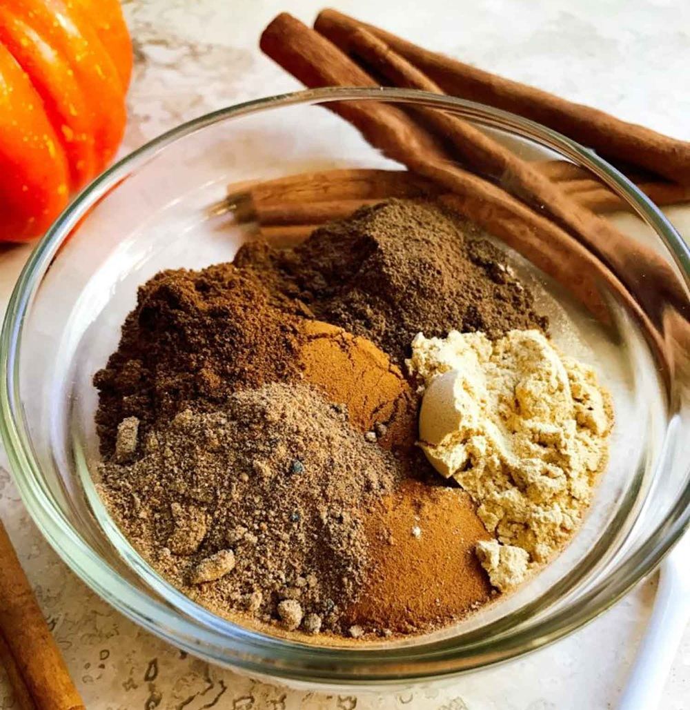

# Pumpkin Pie Spice

*The American autumn baking blend: cinnamon, ginger, nutmeg, allspice and cloves. There's no pumpkin in it, just the spice mix that goes into pumpkin pie.*

**Prep Time:** 2 minutes

**Yield:** Approximately 40 grams (makes 15+ portions)

## Overview
Pumpkin pie spice contains no pumpkin. It's the warm-spice combination that's been the foundational pumpkin-pie filling seasoning across American kitchens since the colonial era; the commercial pre-mixed jar dates to the early twentieth century. Starbucks's 2003 launch of the Pumpkin Spice Latte made the blend a seasonal pop-culture marker. Beyond pumpkin pie, it works on apple cobbler, banana bread, oatmeal cookies, butternut squash soup, sweet potato casserole, anything autumnal that wants the universal warm-baking-spice note. British "mixed spice" is the closest relative; the British version leans more on coriander and caraway, the American on cinnamon and ginger.

## Ingredients

- 3 tablespoons ground cinnamon (the lead note)
- 2 teaspoons ground ginger
- 2 teaspoons ground nutmeg
- 1 ½ teaspoons ground allspice
- 1 teaspoon ground cloves

## Method

1. Measure all ground spices into a wide bowl.
1. Whisk thoroughly until evenly combined and the colour is uniform.
1. Transfer to an airtight jar.
1. Label with the date and store in a cool dark cupboard.

## Notes
- **Cinnamon proportions.** Cinnamon should be the lead, roughly half the blend by volume. American supermarket blends sometimes go even heavier on cinnamon.
- **Cardamom variant.** A teaspoon of ground cardamom added to the blend lifts it into something more interesting than the basic pumpkin-pie default.
- **Freshly grated nutmeg.** Grating fresh whole nutmeg into the blend produces a noticeably more aromatic result than pre-ground.

## Serving
Use in: pumpkin pie filling, pumpkin spice latte, pumpkin bread, pumpkin muffins, butternut squash soup, sweet potato casserole, apple pie variant, oatmeal cookies, French toast batter, banana bread
Typical ratio: 1 to 2 teaspoons per portion
Application: stirred into the filling, batter or drink at the start

## Storage
- Store in an airtight glass jar in a cool dark cupboard
- Best within 6 months while all five spices are still aromatic
- The cinnamon lasts longest; nutmeg and clove fade fastest

*The American autumn baking blend that goes into pumpkin pie. No actual pumpkin, just cinnamon, ginger, nutmeg, allspice and cloves combined into the universal warm-baking-spice signature.*
